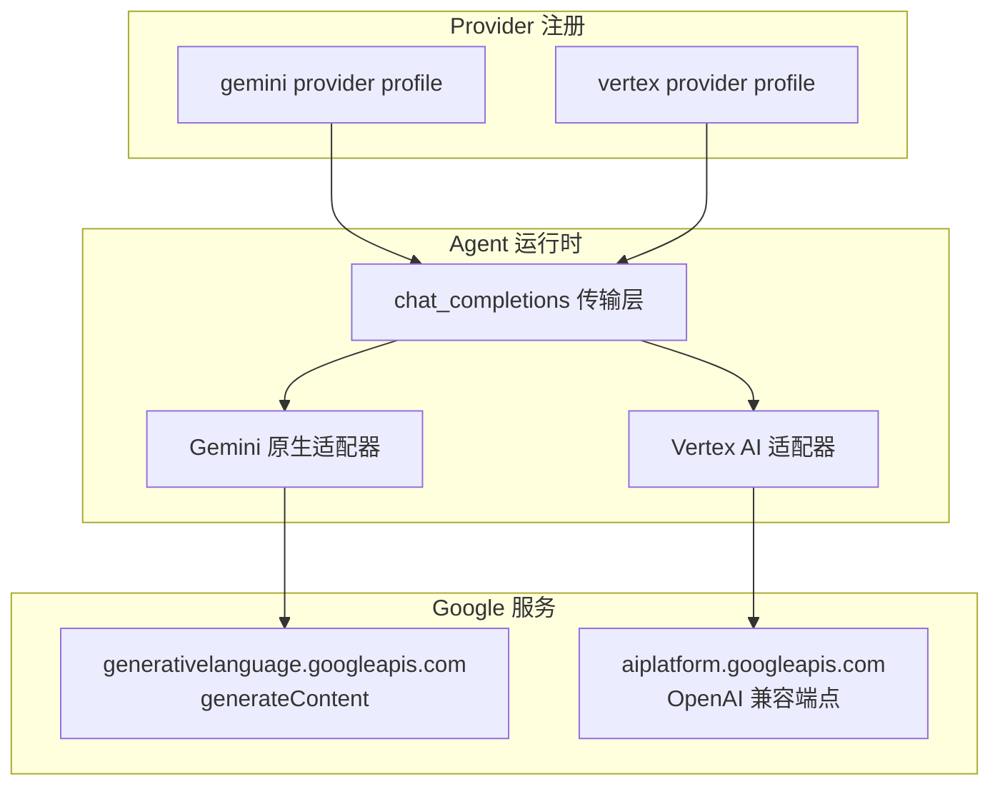
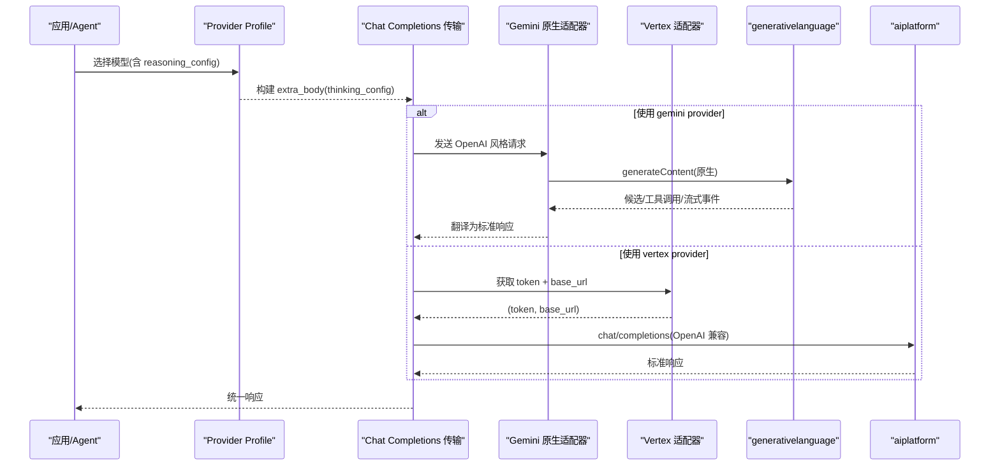
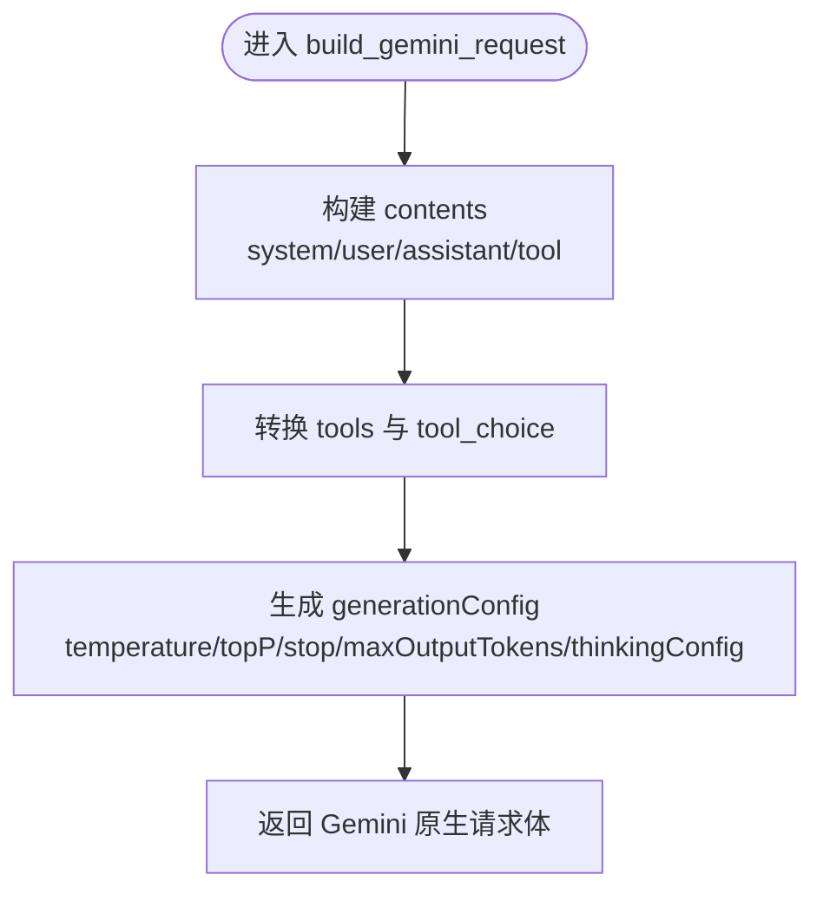
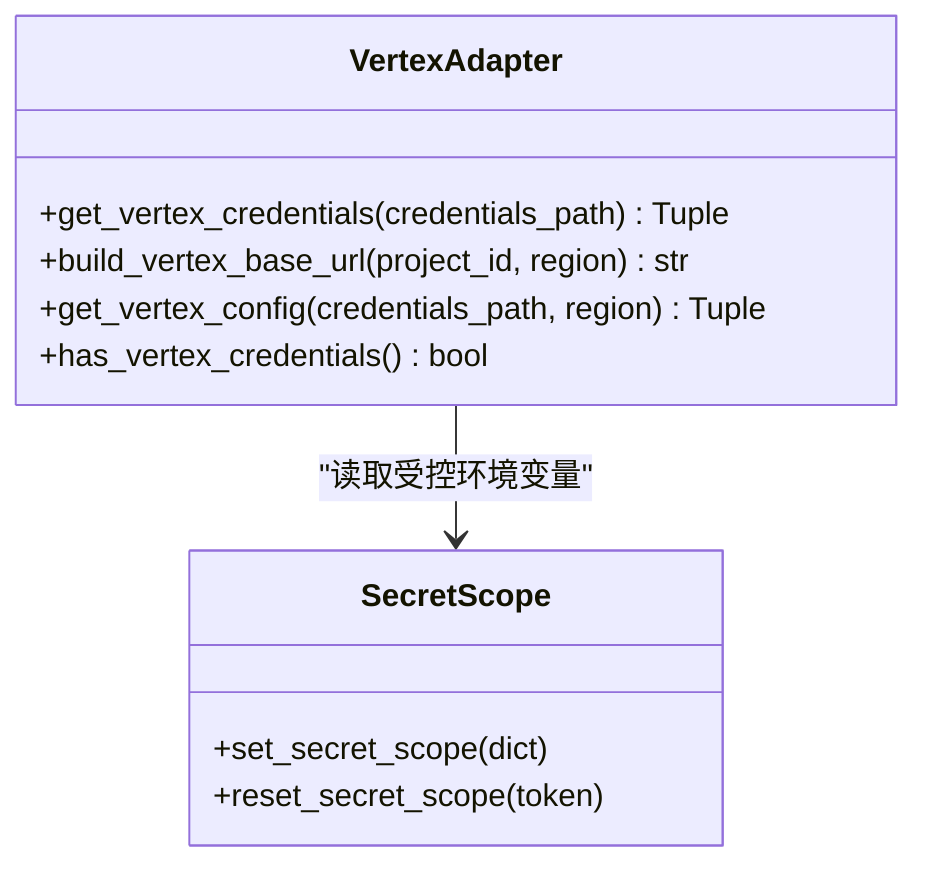
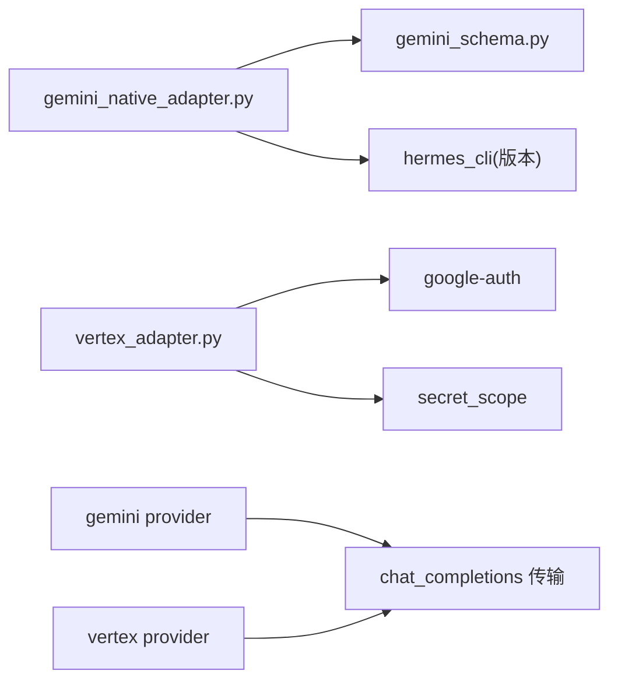

# Google 系列提供商

<cite>
**本文引用的文件**
- [agent/gemini_native_adapter.py](file://agent/gemini_native_adapter.py)
- [agent/vertex_adapter.py](file://agent/vertex_adapter.py)
- [plugins/model-providers/gemini/__init__.py](file://plugins/model-providers/gemini/__init__.py)
- [plugins/model-providers/vertex/__init__.py](file://plugins/model-providers/vertex/__init__.py)
- [agent/gemini_schema.py](file://agent/gemini_schema.py)
- [hermes_cli/config_defaults.py](file://hermes_cli/config_defaults.py)
- [tests/agent/test_gemini_native_adapter.py](file://tests/agent/test_gemini_native_adapter.py)
- [tests/agent/test_vertex_adapter.py](file://tests/agent/test_vertex_adapter.py)
</cite>

## 目录
1. [简介](#简介)
2. [项目结构](#项目结构)
3. [核心组件](#核心组件)
4. [架构总览](#架构总览)
5. [详细组件分析](#详细组件分析)
6. [依赖关系分析](#依赖关系分析)
7. [性能与优化](#性能与优化)
8. [故障排除指南](#故障排除指南)
9. [结论](#结论)
10. [附录：配置与环境变量速查](#附录：配置与环境变量速查)

## 简介
本文件面向在 Hermes Agent 中使用 Google 系列模型（Gemini 与 Vertex AI）的开发者与运维人员，系统说明两种服务的接入方式、认证与权限、多模态与工具调用支持、长上下文与思考模式、配置示例、性能优化建议以及常见问题的排查方法。文档严格基于仓库源码实现进行归纳，确保可落地与可验证。

## 项目结构
围绕 Google 系列提供商的关键代码分布在以下位置：
- Gemini 原生适配层：将 OpenAI 风格的请求转换为 Gemini 原生 generateContent 请求，并处理流式响应、工具调用、多模态内容等。
- Vertex AI 适配层：通过 OAuth2（服务账号或 ADC）获取短期访问令牌，构建 OpenAI 兼容端点 URL，复用标准 chat/completions 通道。
- Provider Profile：注册 gemini 与 vertex 两个 provider，定义环境变量、默认 base_url、鉴权类型及 thinking_config 透传策略。
- Schema 清洗：将工具参数 schema 裁剪为 Gemini 接受的子集，避免请求被拒。

图表来源
- [plugins/model-providers/gemini/__init__.py:18-61](file://plugins/model-providers/gemini/__init__.py#L18-L61)
- [plugins/model-providers/vertex/__init__.py:26-75](file://plugins/model-providers/vertex/__init__.py#L26-L75)
- [agent/gemini_native_adapter.py:1-15](file://agent/gemini_native_adapter.py#L1-L15)
- [agent/vertex_adapter.py:1-17](file://agent/vertex_adapter.py#L1-L17)

章节来源
- [plugins/model-providers/gemini/__init__.py:1-61](file://plugins/model-providers/gemini/__init__.py#L1-L61)
- [plugins/model-providers/vertex/__init__.py:1-75](file://plugins/model-providers/vertex/__init__.py#L1-L75)
- [agent/gemini_native_adapter.py:1-15](file://agent/gemini_native_adapter.py#L1-L15)
- [agent/vertex_adapter.py:1-17](file://agent/vertex_adapter.py#L1-L17)

## 核心组件
- Gemini 原生适配器
  - 职责：将 OpenAI 风格消息与工具调用映射到 Gemini 原生 generateContent；处理多模态输入、工具调用往返、思考输出、SSE 流式事件；提供免费额度探测与错误分类。
  - 关键能力：
    - 多模态：文本与内联图片（data URL）自动转为 inlineData。
    - 工具调用：函数声明、强制选择、结果聚合与交替约束修复。
    - 思考模式：thinkingConfig 标准化与透传。
    - 配额与鉴权：免费层级探测、标准密钥弃用提示。
- Vertex AI 适配器
  - 职责：从服务账号文件或 ADC 获取短期访问令牌，解析 project_id 与 region，构造 OpenAI 兼容 base_url；缓存并刷新凭证。
  - 关键能力：
    - 企业级身份与权限：OAuth2 短令牌，支持项目覆盖与区域路由。
    - 安全隔离：在多进程多 profile 场景下拒绝跨 profile 泄露的环境变量。
    - 模型发现：不暴露 /models 列表，使用内置清单。
- Provider Profile
  - gemini：api_mode=chat_completions，但实际走原生客户端；env_vars 支持 GOOGLE_API_KEY/GEMINI_API_KEY；base_url 指向 generativelanguage。
  - vertex：auth_type=vertex，无静态 key env；base_url 由运行时计算；thinking_config 以 extra_body.google.thinking_config 形式透传。
- Schema 清洗
  - 将工具参数 schema 裁剪为 Gemini 接受字段集合，修正 enum 值类型、required 合法性，避免 400 错误。

章节来源
- [agent/gemini_native_adapter.py:1-15](file://agent/gemini_native_adapter.py#L1-L15)
- [agent/gemini_native_adapter.py:72-146](file://agent/gemini_native_adapter.py#L72-L146)
- [agent/gemini_native_adapter.py:241-276](file://agent/gemini_native_adapter.py#L241-L276)
- [agent/gemini_native_adapter.py:302-355](file://agent/gemini_native_adapter.py#L302-L355)
- [agent/gemini_native_adapter.py:460-569](file://agent/gemini_native_adapter.py#L460-L569)
- [agent/gemini_schema.py:1-141](file://agent/gemini_schema.py#L1-L141)
- [agent/vertex_adapter.py:1-17](file://agent/vertex_adapter.py#L1-L17)
- [agent/vertex_adapter.py:111-213](file://agent/vertex_adapter.py#L111-L213)
- [plugins/model-providers/gemini/__init__.py:18-61](file://plugins/model-providers/gemini/__init__.py#L18-L61)
- [plugins/model-providers/vertex/__init__.py:26-75](file://plugins/model-providers/vertex/__init__.py#L26-L75)

## 架构总览
Hermes 对 Google 系列提供两条路径：
- Gemini 原生路径：通过 GeminiNativeClient 直接调用 generativelanguage API，绕过 OpenAI 兼容层，解决多轮工具调用与签名问题。
- Vertex AI 路径：通过 OAuth2 获取短期令牌，调用 aiplatform 的 OpenAI 兼容端点，复用标准 chat/completions 协议。

图表来源
- [plugins/model-providers/gemini/__init__.py:21-48](file://plugins/model-providers/gemini/__init__.py#L21-L48)
- [plugins/model-providers/vertex/__init__.py:29-50](file://plugins/model-providers/vertex/__init__.py#L29-L50)
- [agent/gemini_native_adapter.py:518-569](file://agent/gemini_native_adapter.py#L518-L569)
- [agent/vertex_adapter.py:190-213](file://agent/vertex_adapter.py#L190-L213)

## 详细组件分析

### Gemini 原生适配器
- 请求构建
  - 将 messages 中的 system/user/assistant/tool 角色与多模态 parts 转换为 Gemini contents；合并相邻同角色 content，并在 functionResponse 与用户文本之间插入占位以保证交替合法。
  - tools 声明与 tool_choice 映射为 Gemini 的 functionDeclarations 与 functionCallingConfig。
  - generationConfig 中设置 temperature、topP、stopSequences、maxOutputTokens（未指定时采用默认上限），以及 thinkingConfig。
- 响应与流式
  - 将 candidates.parts 中的 text/functionCall/thought 翻译为标准 message 与 tool_calls；SSE 事件按 part 增量产出。
- 多模态
  - data URL 图片自动解码并转为 inlineData。
- 工具调用
  - 函数名、参数 JSON 与 thoughtSignature 透传；并行工具结果合并为单条 user content。
- 配额与鉴权
  - 提供 free tier 探测与“标准密钥”弃用提示，便于快速定位问题。

图表来源
- [agent/gemini_native_adapter.py:358-457](file://agent/gemini_native_adapter.py#L358-L457)
- [agent/gemini_native_adapter.py:460-569](file://agent/gemini_native_adapter.py#L460-L569)

章节来源
- [agent/gemini_native_adapter.py:241-276](file://agent/gemini_native_adapter.py#L241-L276)
- [agent/gemini_native_adapter.py:302-355](file://agent/gemini_native_adapter.py#L302-L355)
- [agent/gemini_native_adapter.py:358-457](file://agent/gemini_native_adapter.py#L358-L457)
- [agent/gemini_native_adapter.py:518-569](file://agent/gemini_native_adapter.py#L518-L569)
- [agent/gemini_native_adapter.py:616-682](file://agent/gemini_native_adapter.py#L616-L682)
- [agent/gemini_native_adapter.py:735-800](file://agent/gemini_native_adapter.py#L735-L800)

### Vertex AI 适配器
- 凭证解析
  - 优先读取显式路径，其次 VERTEX_CREDENTIALS_PATH/GOOGLE_APPLICATION_CREDENTIALS；若启用 multiplex，则拒绝来自其他 profile 的环境变量污染。
  - 支持 service account 文件与 ADC 两种方式，缓存 Credentials 并在过期前 5 分钟刷新。
- 路由与端点
  - 根据 region 决定主机名（global 或 {region}-aiplatform.googleapis.com），拼接 projects/{project}/locations/{region}/endpoints/openapi。
  - 可通过 VERTEX_PROJECT_ID 覆盖项目 ID。
- 模型发现
  - 不提供 /models 列表，需使用内置清单。

图表来源
- [agent/vertex_adapter.py:90-187](file://agent/vertex_adapter.py#L90-L187)
- [agent/vertex_adapter.py:190-229](file://agent/vertex_adapter.py#L190-L229)

章节来源
- [agent/vertex_adapter.py:1-17](file://agent/vertex_adapter.py#L1-L17)
- [agent/vertex_adapter.py:66-103](file://agent/vertex_adapter.py#L66-L103)
- [agent/vertex_adapter.py:111-187](file://agent/vertex_adapter.py#L111-L187)
- [agent/vertex_adapter.py:190-229](file://agent/vertex_adapter.py#L190-L229)
- [tests/agent/test_vertex_adapter.py:94-162](file://tests/agent/test_vertex_adapter.py#L94-L162)

### Provider Profile 与 thinking_config 透传
- gemini provider
  - 当 base_url 为 OpenAI 兼容子路径时，将 thinking_config 放入 extra_body.google.thinking_config；否则直接作为 thinking_config。
- vertex provider
  - 始终将 thinking_config 放入 extra_body.google.thinking_config，以匹配 Vertex 的 OpenAI 兼容端点约定。

章节来源
- [plugins/model-providers/gemini/__init__.py:21-48](file://plugins/model-providers/gemini/__init__.py#L21-L48)
- [plugins/model-providers/vertex/__init__.py:29-50](file://plugins/model-providers/vertex/__init__.py#L29-L50)

### 工具参数 Schema 清洗
- 仅保留 Gemini 允许的字段，递归清理 properties/items/anyOf。
- 对 integer/number/boolean 类型的 enum 值进行字符串化，满足 Gemini 校验。
- 过滤 required 列表中不存在于当前 properties 的名称，避免 400 错误。

章节来源
- [agent/gemini_schema.py:1-141](file://agent/gemini_schema.py#L1-L141)

## 依赖关系分析
- Gemini 原生适配器依赖 httpx 发起 REST/SSE 请求；依赖 hermes_cli 版本信息用于上报；依赖 gemini_schema 做参数清洗。
- Vertex 适配器依赖 google-auth（按需安装），并通过 secret_scope 安全读取环境变量。
- Provider Profile 依赖 transports/chat_completions 中的 thinking_config 构建与命名规范。

图表来源
- [agent/gemini_native_adapter.py:17-31](file://agent/gemini_native_adapter.py#L17-L31)
- [agent/vertex_adapter.py:26-41](file://agent/vertex_adapter.py#L26-L41)
- [plugins/model-providers/gemini/__init__.py:27-31](file://plugins/model-providers/gemini/__init__.py#L27-L31)
- [plugins/model-providers/vertex/__init__.py:35-38](file://plugins/model-providers/vertex/__init__.py#L35-L38)

章节来源
- [agent/gemini_native_adapter.py:17-31](file://agent/gemini_native_adapter.py#L17-L31)
- [agent/vertex_adapter.py:26-41](file://agent/vertex_adapter.py#L26-L41)
- [plugins/model-providers/gemini/__init__.py:27-31](file://plugins/model-providers/gemini/__init__.py#L27-L31)
- [plugins/model-providers/vertex/__init__.py:35-38](file://plugins/model-providers/vertex/__init__.py#L35-L38)

## 性能与优化
- 输出长度控制
  - 未显式设置 max_tokens 时，原生 Gemini 会采用较低内部默认值导致提前截断；适配器已默认设置为模型上限，避免工具调用中途中断。
- 流式处理
  - SSE 事件按 part 增量产出，减少首字节延迟；注意在下游消费侧正确处理 tool_call_delta 与 reasoning 增量。
- 工具调用与内容合并
  - 并行工具结果合并为单条 user content，降低请求数与上下文碎片；避免连续同角色导致的 400 错误。
- 凭证缓存与刷新
  - Vertex 适配器缓存 Credentials 并在过期前 5 分钟刷新，减少令牌端点压力。
- 模型选择策略
  - 轻量任务/高吞吐：优先 flash 系列；复杂推理/长上下文：考虑 pro 系列；企业合规/高限额：优先 Vertex。

[本节为通用指导，不直接分析具体文件]

## 故障排除指南
- 免费额度耗尽
  - 现象：429 或包含 free_tier 的错误信息；每日请求量受限。
  - 处理：启用计费并重新生成密钥；或使用 Vertex 提升限额。
  - 参考：免费层级探测与提示逻辑。
- 标准密钥弃用
  - 现象：401 且提示期望 OAuth2 access token。
  - 处理：创建新的 Gemini API Key 或在受限范围内临时桥接；更新环境变量后重启会话。
  - 参考：标准密钥错误识别与引导文案。
- 工具参数 Schema 报错
  - 现象：400 非法参数或缺失属性。
  - 处理：确认工具参数 schema 已被清洗；检查 required 与 properties 一致性。
  - 参考：schema 清洗逻辑。
- Vertex 凭证不可用
  - 现象：无法获取 token 或项目 ID。
  - 处理：检查服务账号文件路径、ADC 是否可用；在多 profile 环境下确保未混用环境变量；必要时显式设置 VERTEX_PROJECT_ID。
  - 参考：凭证解析与 multiplex 保护逻辑。
- 多模态图片无效
  - 现象：图片未被识别。
  - 处理：确保使用 data URL 格式；适配器会自动解码并转为 inlineData。
  - 参考：多模态提取逻辑。

章节来源
- [agent/gemini_native_adapter.py:72-146](file://agent/gemini_native_adapter.py#L72-L146)
- [agent/gemini_native_adapter.py:166-199](file://agent/gemini_native_adapter.py#L166-L199)
- [agent/gemini_schema.py:78-131](file://agent/gemini_schema.py#L78-L131)
- [agent/vertex_adapter.py:90-187](file://agent/vertex_adapter.py#L90-L187)
- [agent/gemini_native_adapter.py:241-276](file://agent/gemini_native_adapter.py#L241-L276)

## 结论
Hermes 对 Google 系列提供了双通道支持：Gemini 原生适配器适合追求稳定多轮工具调用与细粒度控制的场景；Vertex AI 适合企业级部署、需要 OAuth2 与企业治理的场景。两者均支持多模态、工具调用与思考模式，并通过 Provider Profile 统一透传 thinking_config。合理选择模型与通道、遵循配置与排错指引，可获得更稳定的体验与更高的吞吐。

[本节为总结性内容，不直接分析具体文件]

## 附录：配置与环境变量速查
- Gemini（Google AI Studio）
  - 环境变量：GOOGLE_API_KEY 或 GEMINI_API_KEY
  - Base URL：generativelanguage.googleapis.com/v1beta
  - 特性：原生 generateContent、免费层级探测、标准密钥弃用提示
  - 参考：Provider 注册与默认 base_url
- Vertex AI（Google Cloud）
  - 认证：OAuth2（服务账号文件或 ADC）
  - 环境变量：VERTEX_CREDENTIALS_PATH 或 GOOGLE_APPLICATION_CREDENTIALS；可选 VERTEX_PROJECT_ID、VERTEX_REGION
  - Base URL：由 project_id 与 region 动态构建
  - 特性：企业级限额、项目/区域路由、multiplex 安全隔离
  - 参考：凭证解析与 URL 构建

章节来源
- [plugins/model-providers/gemini/__init__.py:51-59](file://plugins/model-providers/gemini/__init__.py#L51-L59)
- [hermes_cli/config_defaults.py:3230-3239](file://hermes_cli/config_defaults.py#L3230-L3239)
- [agent/vertex_adapter.py:9-16](file://agent/vertex_adapter.py#L9-L16)
- [agent/vertex_adapter.py:66-87](file://agent/vertex_adapter.py#L66-L87)
- [agent/vertex_adapter.py:190-213](file://agent/vertex_adapter.py#L190-L213)