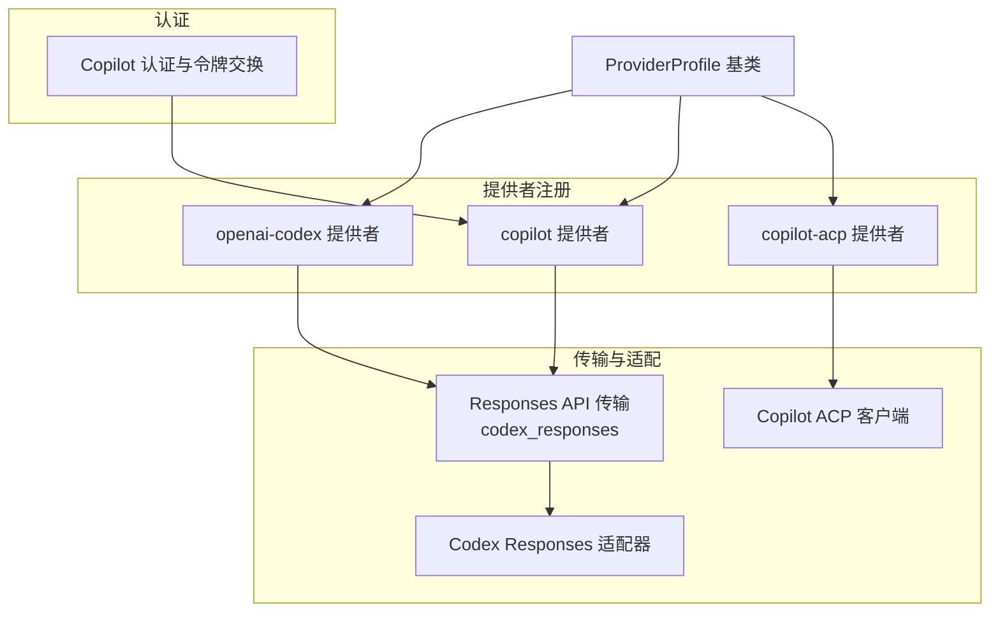
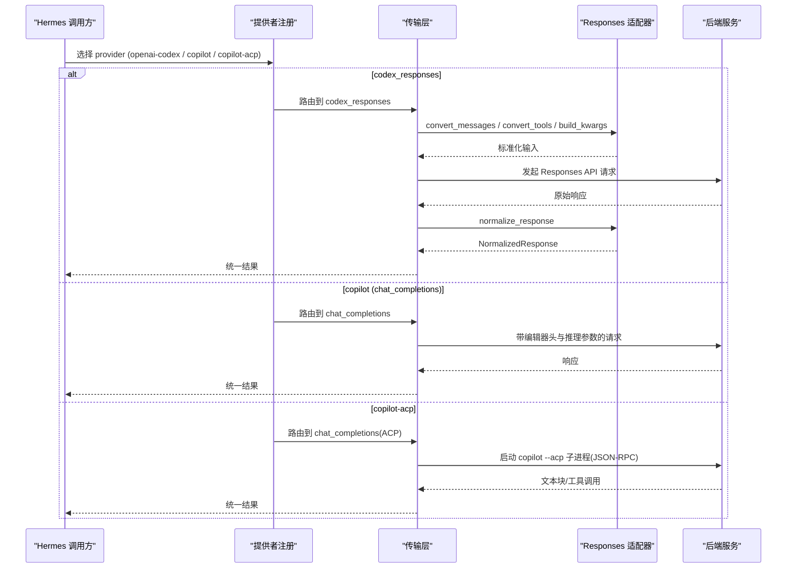
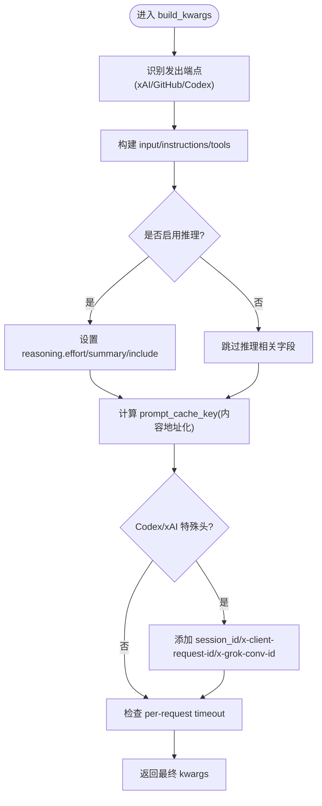
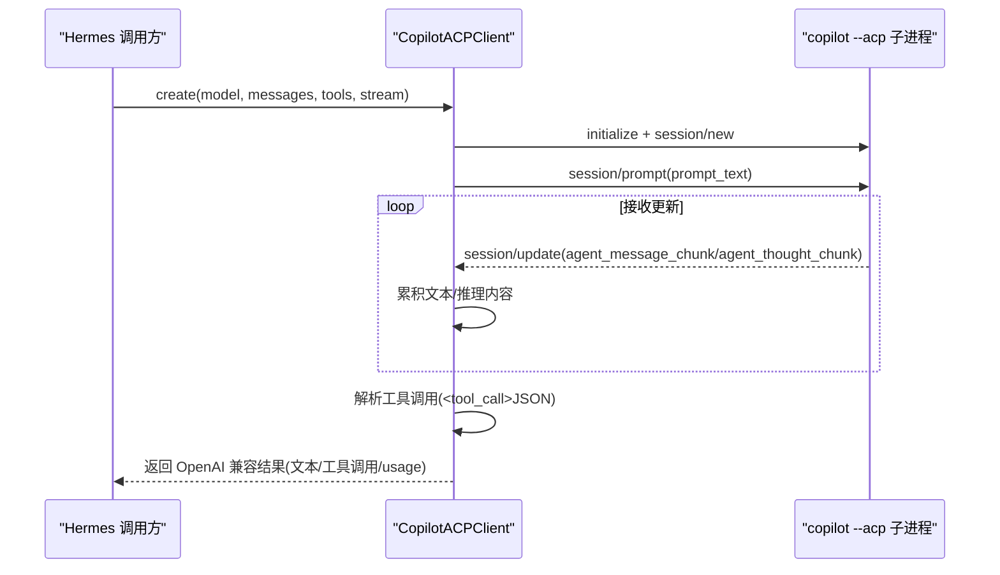
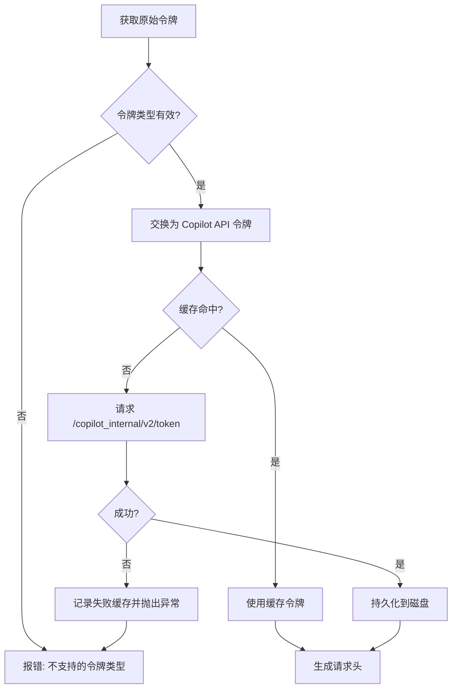
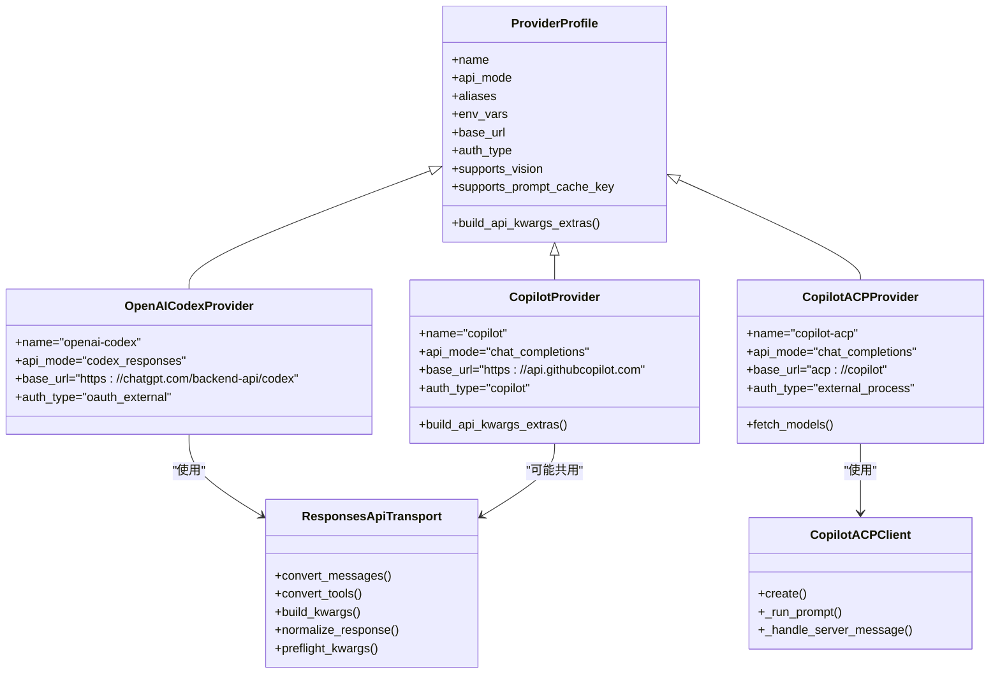

# OpenAI 系列提供商

<cite>
**本文引用的文件**
- [plugins/model-providers/openai-codex/__init__.py](file://plugins/model-providers/openai-codex/__init__.py)
- [plugins/model-providers/copilot/__init__.py](file://plugins/model-providers/copilot/__init__.py)
- [plugins/model-providers/copilot-acp/__init__.py](file://plugins/model-providers/copilot-acp/__init__.py)
- [agent/transports/codex.py](file://agent/transports/codex.py)
- [agent/codex_responses_adapter.py](file://agent/codex_responses_adapter.py)
- [agent/copilot_acp_client.py](file://agent/copilot_acp_client.py)
- [hermes_cli/copilot_auth.py](file://hermes_cli/copilot_auth.py)
- [providers/base.py](file://providers/base.py)
</cite>

## 目录
1. [简介](#简介)
2. [项目结构](#项目结构)
3. [核心组件](#核心组件)
4. [架构总览](#架构总览)
5. [详细组件分析](#详细组件分析)
6. [依赖关系分析](#依赖关系分析)
7. [性能与限制](#性能与限制)
8. [故障排除指南](#故障排除指南)
9. [结论](#结论)
10. [附录：配置示例与最佳实践](#附录：配置示例与最佳实践)

## 简介
本文件面向在 Hermes Agent 中集成和使用 OpenAI 系列模型提供商，重点覆盖三类能力与路径：
- OpenAI Codex（Responses API）：通过 codex_responses 传输层对接 ChatGPT/Codex 后端。
- GitHub Copilot（chat_completions 子集）：通过 copilot 提供者配置，附加编辑器归属头、推理参数等。
- GitHub Copilot ACP：通过外部进程（copilot --acp）以 JSON-RPC 方式驱动，Hermes 将其封装为 OpenAI 兼容的 chat 接口。

文档将说明各提供商的配置要点、认证流程（API Key/OAuth/外部进程）、功能特性与使用限制，并给出与 Hermes Agent 的集成方式、常见问题排查与最佳实践。

## 项目结构
围绕 OpenAI 系列提供商的关键代码分布在以下位置：
- 提供者注册与元数据：plugins/model-providers/*
- Responses API 传输与适配：agent/transports/codex.py、agent/codex_responses_adapter.py
- Copilot ACP 客户端：agent/copilot_acp_client.py
- Copilot 认证与令牌交换：hermes_cli/copilot_auth.py
- 提供者基类与通用能力：providers/base.py

图表来源
- [plugins/model-providers/openai-codex/__init__.py:1-16](file://plugins/model-providers/openai-codex/__init__.py#L1-L16)
- [plugins/model-providers/copilot/__init__.py:1-75](file://plugins/model-providers/copilot/__init__.py#L1-L75)
- [plugins/model-providers/copilot-acp/__init__.py:1-36](file://plugins/model-providers/copilot-acp/__init__.py#L1-L36)
- [agent/transports/codex.py:176-673](file://agent/transports/codex.py#L176-L673)
- [agent/codex_responses_adapter.py:1-200](file://agent/codex_responses_adapter.py#L1-L200)
- [agent/copilot_acp_client.py:1-757](file://agent/copilot_acp_client.py#L1-L757)
- [hermes_cli/copilot_auth.py:1-694](file://hermes_cli/copilot_auth.py#L1-L694)
- [providers/base.py:1-200](file://providers/base.py#L1-L200)

章节来源
- [plugins/model-providers/openai-codex/__init__.py:1-16](file://plugins/model-providers/openai-codex/__init__.py#L1-L16)
- [plugins/model-providers/copilot/__init__.py:1-75](file://plugins/model-providers/copilot/__init__.py#L1-L75)
- [plugins/model-providers/copilot-acp/__init__.py:1-36](file://plugins/model-providers/copilot-acp/__init__.py#L1-L36)
- [providers/base.py:1-200](file://providers/base.py#L1-L200)

## 核心组件
- Providers 基类 ProviderProfile：集中声明提供者的身份、认证类型、端点、能力标志（如 vision、prompt_cache_key）以及请求级钩子（build_api_kwargs_extras）。
- openai-codex 提供者：声明 api_mode=“codex_responses”，base_url 指向 ChatGPT/Codex 后端，auth_type=“oauth_external”（无 API Key）。
- copilot 提供者：声明 auth_type=“copilot”，base_url 指向 Copilot API，并在 build_api_kwargs_extras 中注入 reasoning.effort 等额外参数。
- copilot-acp 提供者：声明 api_mode=“chat_completions”，但实际由外部 ACP 进程处理；不暴露 /models 列表。
- Responses API 传输（codex_responses）：负责消息/工具转换、构建请求体、缓存键、推理开关、xAI/GitHub/Codex 后端差异处理、响应归一化与完成原因映射。
- Copilot ACP 客户端：启动 copilot --acp 子进程，通过 JSON-RPC 会话发送 prompt，解析文本流与工具调用，返回 OpenAI 兼容的流式或非流式结果。
- Copilot 认证：设备码 OAuth 流程、令牌验证、从 gh CLI 或环境变量获取令牌、交换短期 Copilot API 令牌并持久化缓存。

章节来源
- [providers/base.py:1-200](file://providers/base.py#L1-L200)
- [plugins/model-providers/openai-codex/__init__.py:1-16](file://plugins/model-providers/openai-codex/__init__.py#L1-L16)
- [plugins/model-providers/copilot/__init__.py:1-75](file://plugins/model-providers/copilot/__init__.py#L1-L75)
- [plugins/model-providers/copilot-acp/__init__.py:1-36](file://plugins/model-providers/copilot-acp/__init__.py#L1-L36)
- [agent/transports/codex.py:176-673](file://agent/transports/codex.py#L176-L673)
- [agent/copilot_acp_client.py:1-757](file://agent/copilot_acp_client.py#L1-L757)
- [hermes_cli/copilot_auth.py:1-694](file://hermes_cli/copilot_auth.py#L1-L694)

## 架构总览
OpenAI 系列提供商在 Hermes 中的调用链路如下：
- 选择提供者后，根据 api_mode 路由到对应传输层。
- codex_responses 传输层调用 Responses API 适配器进行消息/工具转换、构建请求、处理推理与缓存、归一化响应。
- copilot 提供者通过 chat_completions 路由，附带编辑器归属头与推理参数。
- copilot-acp 提供者通过外部进程实现，Hermes 将其包装为 OpenAI 兼容的 chat 接口。

图表来源
- [agent/transports/codex.py:176-673](file://agent/transports/codex.py#L176-L673)
- [agent/codex_responses_adapter.py:1-200](file://agent/codex_responses_adapter.py#L1-L200)
- [agent/copilot_acp_client.py:1-757](file://agent/copilot_acp_client.py#L1-L757)
- [plugins/model-providers/copilot/__init__.py:1-75](file://plugins/model-providers/copilot/__init__.py#L1-L75)

## 详细组件分析

### OpenAI Codex（Responses API）
- 提供者配置：api_mode=“codex_responses”，base_url 指向 ChatGPT/Codex 后端，auth_type=“oauth_external”。
- 传输层职责：
  - 消息与工具转换：将 chat 消息与工具定义转换为 Responses API 输入项与函数定义。
  - 构建请求体：设置 instructions、input、tools/tool_choice/parallel_tool_calls、reasoning、include、extra_headers/extra_body、prompt_cache_key、timeout 等。
  - 后端差异处理：区分 xAI/GitHub/Codex 后端，处理 web_search 冲突、service_tier 字段、缓存路由键、会话 ID 头。
  - 响应归一化：提取 content、tool_calls、finish_reason、reasoning、provider_data（含编码推理项、消息项等）。
  - 预检与校验：清理保留 Harmony 令牌、校验输出结构、处理内容过滤导致的 incomplete。
- 关键行为：
  - 推理开关与努力级别：根据模型与后端调整 reasoning.effort，必要时降级或移除。
  - 提示缓存：基于指令与工具集的哈希生成稳定缓存键，支持跨 cron 任务复用。
  - 工具调用：对 xAI 场景重命名 web_search 以避免服务端劫持，并在响应时还原。

图表来源
- [agent/transports/codex.py:223-534](file://agent/transports/codex.py#L223-L534)
- [agent/codex_responses_adapter.py:1-200](file://agent/codex_responses_adapter.py#L1-L200)

章节来源
- [agent/transports/codex.py:176-673](file://agent/transports/codex.py#L176-L673)
- [agent/codex_responses_adapter.py:1-200](file://agent/codex_responses_adapter.py#L1-L200)

### GitHub Copilot（chat_completions 子集）
- 提供者配置：auth_type=“copilot”，base_url 指向 Copilot API，env_vars 包含 COPILOT_GITHUB_TOKEN/GH_TOKEN/GITHUB_TOKEN。
- 请求增强：
  - 编辑器归属头：通过默认头或运行时注入，标识编辑器来源。
  - 推理参数：根据模型目录动态判断支持的 effort 级别，写入 extra_body.reasoning.effort。
- 适用场景：适用于走 chat_completions 路由的 Copilot 模型（非 Codex/Claude 分支）。

章节来源
- [plugins/model-providers/copilot/__init__.py:1-75](file://plugins/model-providers/copilot/__init__.py#L1-L75)

### GitHub Copilot ACP（外部进程）
- 提供者配置：api_mode=“chat_completions”，但实际由外部进程处理；base_url 使用内部方案 acp://copilot；不暴露 /models。
- 客户端实现：
  - 启动 copilot --acp 子进程，建立 JSON-RPC 会话。
  - 将消息序列化为 prompt 文本，收集 agent_message_chunk 与 agent_thought_chunk。
  - 解析工具调用（XML 块或 JSON），构造 OpenAI 兼容的工具调用对象。
  - 安全控制：限制文件系统访问至工作目录，敏感信息脱敏。
  - 超时与错误：检测旧版 gh-copilot 扩展并提示升级；捕获进程退出与网络异常。

图表来源
- [agent/copilot_acp_client.py:396-757](file://agent/copilot_acp_client.py#L396-L757)

章节来源
- [plugins/model-providers/copilot-acp/__init__.py:1-36](file://plugins/model-providers/copilot-acp/__init__.py#L1-L36)
- [agent/copilot_acp_client.py:1-757](file://agent/copilot_acp_client.py#L1-L757)

### Copilot 认证与令牌交换
- 令牌来源优先级：COPILOT_GITHUB_TOKEN > GH_TOKEN > GITHUB_TOKEN > gh auth token。
- 令牌验证：拒绝经典 PAT（ghp_*），要求 gho_*/github_pat_*/ghu_*。
- 设备码 OAuth：通过 GitHub 设备授权流程获取 access_token。
- 令牌交换：将原始 GitHub 令牌交换为短期 Copilot API 令牌，支持重试与失败缓存，持久化到磁盘以减少冷启动开销。
- 请求头：注入 Editor-Version、User-Agent、Copilot-Integration-Id、Openai-Intent、x-initiator 等。

图表来源
- [hermes_cli/copilot_auth.py:54-121](file://hermes_cli/copilot_auth.py#L54-L121)
- [hermes_cli/copilot_auth.py:183-303](file://hermes_cli/copilot_auth.py#L183-L303)
- [hermes_cli/copilot_auth.py:480-647](file://hermes_cli/copilot_auth.py#L480-L647)
- [hermes_cli/copilot_auth.py:674-694](file://hermes_cli/copilot_auth.py#L674-L694)

章节来源
- [hermes_cli/copilot_auth.py:1-694](file://hermes_cli/copilot_auth.py#L1-L694)

## 依赖关系分析
- 提供者注册依赖 ProviderProfile 基类，声明名称、别名、api_mode、认证类型、端点与能力。
- codex_responses 传输依赖 Responses 适配器进行格式转换与规范化。
- copilot 提供者通过 chat_completions 路由，注入编辑器头与推理参数。
- copilot-acp 提供者依赖外部进程通信，封装为 OpenAI 兼容接口。
- 认证模块为 copilot 提供者提供令牌来源、验证、交换与请求头生成。

图表来源
- [providers/base.py:1-200](file://providers/base.py#L1-L200)
- [plugins/model-providers/openai-codex/__init__.py:1-16](file://plugins/model-providers/openai-codex/__init__.py#L1-L16)
- [plugins/model-providers/copilot/__init__.py:1-75](file://plugins/model-providers/copilot/__init__.py#L1-L75)
- [plugins/model-providers/copilot-acp/__init__.py:1-36](file://plugins/model-providers/copilot-acp/__init__.py#L1-L36)
- [agent/transports/codex.py:176-673](file://agent/transports/codex.py#L176-L673)
- [agent/copilot_acp_client.py:396-757](file://agent/copilot_acp_client.py#L396-L757)

章节来源
- [providers/base.py:1-200](file://providers/base.py#L1-L200)
- [plugins/model-providers/openai-codex/__init__.py:1-16](file://plugins/model-providers/openai-codex/__init__.py#L1-L16)
- [plugins/model-providers/copilot/__init__.py:1-75](file://plugins/model-providers/copilot/__init__.py#L1-L75)
- [plugins/model-providers/copilot-acp/__init__.py:1-36](file://plugins/model-providers/copilot-acp/__init__.py#L1-L36)
- [agent/transports/codex.py:176-673](file://agent/transports/codex.py#L176-L673)
- [agent/copilot_acp_client.py:396-757](file://agent/copilot_acp_client.py#L396-L757)

## 性能与限制
- 提示缓存：
  - 基于指令与工具集的内容地址化缓存键，避免 cron 任务时间戳导致缓存失效。
  - 对 xAI/GitHub/Codex 后端分别处理缓存键与头部，确保路由一致性。
- 推理参数：
  - 根据模型与后端动态调整 reasoning.effort，必要时降级或移除，避免 HTTP 400。
- 工具调用：
  - 对 xAI 场景重命名 web_search 以避免服务端劫持，并在响应时还原。
- 超时与重试：
  - 支持 per-request timeout，Codex 传输层会转发到 SDK。
  - Copilot 令牌交换具备重试与失败缓存，减少冷启动阻塞。
- 速率限制：
  - 具体速率限制由上游提供商决定；Hermes 未在此层实现全局限速器，建议结合网关或外部限流策略。

章节来源
- [agent/transports/codex.py:223-534](file://agent/transports/codex.py#L223-L534)
- [hermes_cli/copilot_auth.py:480-647](file://hermes_cli/copilot_auth.py#L480-L647)

## 故障排除指南
- Copilot 令牌无效或不支持：
  - 现象：无法交换令牌或请求被拒绝。
  - 排查：确认令牌类型为 gho_*/github_pat_*/ghu_*，避免 ghp_*；检查环境变量与 gh CLI 状态；查看失败缓存与重试日志。
- ACP 模式使用旧版 gh-copilot 扩展：
  - 现象：子进程退出或报错提示已弃用。
  - 解决：安装新版 @github/copilot CLI，或通过 HERMES_COPILOT_ACP_COMMAND 指定新二进制路径。
- Responses API 内容过滤导致 incomplete：
  - 现象：响应 status=incomplete 且 reason=content_filter。
  - 处理：视为提供商拒绝信号，进入内容策略/回退路径，而非无效响应重试。
- web_search 冲突（xAI 后端）：
  - 现象：工具名冲突导致不完整轮次或 HTTP 400。
  - 处理：自动重命名为 hermes_web_search 或切换为原生 web_search，确保正确分发。
- 提示缓存键过长或不稳定：
  - 现象：缓存命中率低或路由不一致。
  - 处理：使用内容地址化键并截断，确保 cron 任务共享逻辑范围。

章节来源
- [hermes_cli/copilot_auth.py:54-121](file://hermes_cli/copilot_auth.py#L54-L121)
- [hermes_cli/copilot_auth.py:480-647](file://hermes_cli/copilot_auth.py#L480-L647)
- [agent/copilot_acp_client.py:504-618](file://agent/copilot_acp_client.py#L504-L618)
- [agent/transports/codex.py:589-613](file://agent/transports/codex.py#L589-L613)
- [agent/transports/codex.py:330-345](file://agent/transports/codex.py#L330-L345)

## 结论
Hermes Agent 对 OpenAI 系列提供商提供了统一的抽象与多路径接入：
- Codex（Responses API）适合需要结构化输入/输出、工具调用与推理控制的场景。
- Copilot（chat_completions）适合编辑器集成与推理参数微调的场景。
- Copilot ACP 适合需要通过本地 CLI 驱动复杂工作流的场景。
通过 ProviderProfile 与传输层解耦，Hermes 能灵活适配不同后端的行为差异，并提供缓存、推理、工具调用与认证等关键能力。

## 附录：配置示例与最佳实践
- 配置要点：
  - openai-codex：无需 API Key，使用 OAuth 外部认证；base_url 指向 ChatGPT/Codex 后端。
  - copilot：设置 COPILOT_GITHUB_TOKEN/GH_TOKEN/GITHUB_TOKEN；启用推理参数时注意模型支持级别。
  - copilot-acp：确保安装新版 @github/copilot CLI；可通过环境变量指定命令与参数。
- 最佳实践：
  - 使用内容地址化的提示缓存键，提升 cron 任务与重复请求的命中率。
  - 针对 xAI 后端避免 web_search 冲突，遵循自动重命名或原生切换策略。
  - 合理设置 per-request timeout，避免长轮次阻塞。
  - 定期刷新或驱逐过期的 Copilot 令牌缓存，防止凭证陈旧导致的服务不可用。

章节来源
- [plugins/model-providers/openai-codex/__init__.py:1-16](file://plugins/model-providers/openai-codex/__init__.py#L1-L16)
- [plugins/model-providers/copilot/__init__.py:1-75](file://plugins/model-providers/copilot/__init__.py#L1-L75)
- [plugins/model-providers/copilot-acp/__init__.py:1-36](file://plugins/model-providers/copilot-acp/__init__.py#L1-L36)
- [hermes_cli/copilot_auth.py:183-303](file://hermes_cli/copilot_auth.py#L183-L303)
- [agent/transports/codex.py:223-534](file://agent/transports/codex.py#L223-L534)