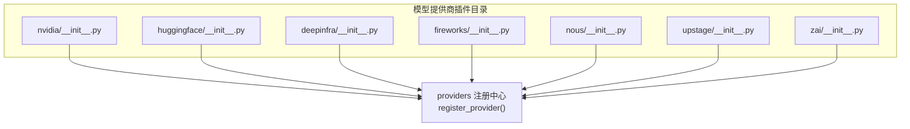
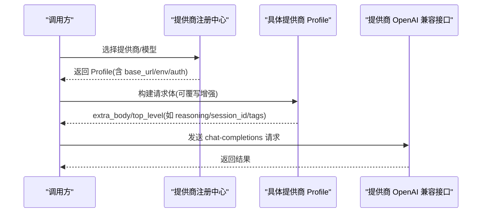
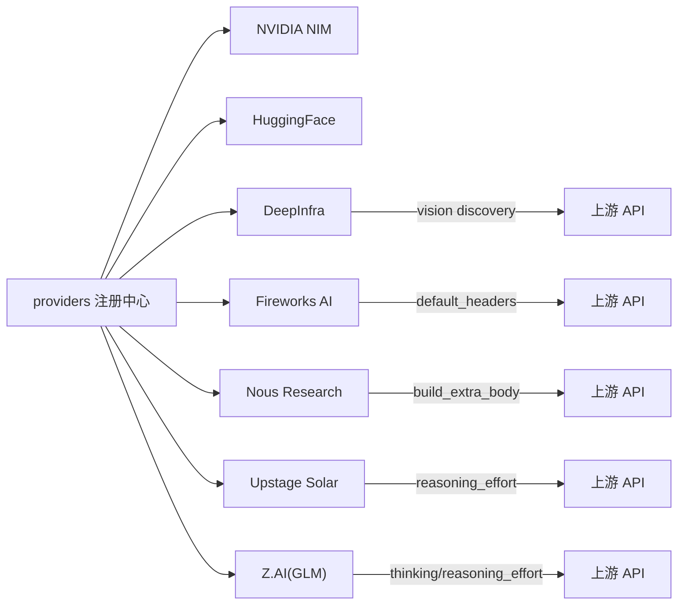

# 专业领域提供商

<cite>
**本文引用的文件**
- [plugins/model-providers/README.md](file://plugins/model-providers/README.md)
- [plugins/model-providers/nvidia/__init__.py](file://plugins/model-providers/nvidia/__init__.py)
- [plugins/model-providers/huggingface/__init__.py](file://plugins/model-providers/huggingface/__init__.py)
- [plugins/model-providers/deepinfra/__init__.py](file://plugins/model-providers/deepinfra/__init__.py)
- [plugins/model-providers/fireworks/__init__.py](file://plugins/model-providers/fireworks/__init__.py)
- [plugins/model-providers/nous/__init__.py](file://plugins/model-providers/nous/__init__.py)
- [plugins/model-providers/upstage/__init__.py](file://plugins/model-providers/upstage/__init__.py)
- [plugins/model-providers/zai/__init__.py](file://plugins/model-providers/zai/__init__.py)
</cite>

## 目录
1. [简介](#简介)
2. [项目结构](#项目结构)
3. [核心组件](#核心组件)
4. [架构总览](#架构总览)
5. [详细组件分析](#详细组件分析)
6. [依赖关系分析](#依赖关系分析)
7. [性能考量](#性能考量)
8. [故障排除指南](#故障排除指南)
9. [结论](#结论)
10. [附录](#附录)

## 简介
本文件面向企业级与专业场景，系统梳理并对比 Hermes Agent 中集成的多家专业 AI 服务提供商：NVIDIA NIM、Hugging Face、DeepInfra、Fireworks AI、Nous Research、Upstage、Z.ai。内容涵盖各提供商的接入方式、能力特色（如 GPU 加速推理、开源模型托管、高性能推理服务）、特定功能（如推理控制、视觉默认模型发现、辅助模型选择）、与企业私有化部署相关的配置要点，以及最佳实践与常见问题排查建议。文档严格基于仓库内“模型提供商插件”实现进行说明，避免臆测。

## 项目结构
Hermes 通过“模型提供商插件”机制统一管理不同供应商的接入。每个子目录是一个自包含的 ProviderProfile 注册单元，由 providers 框架自动发现与装配。用户可在 $HERMES_HOME/plugins/model-providers/<name>/ 覆盖内置配置，实现“最后写入者胜出”的替换策略。

图表来源
- [plugins/model-providers/README.md:17-26](file://plugins/model-providers/README.md#L17-L26)
- [plugins/model-providers/nvidia/__init__.py:1-22](file://plugins/model-providers/nvidia/__init__.py#L1-L22)
- [plugins/model-providers/huggingface/__init__.py:1-21](file://plugins/model-providers/huggingface/__init__.py#L1-L21)
- [plugins/model-providers/deepinfra/__init__.py:1-82](file://plugins/model-providers/deepinfra/__init__.py#L1-L82)
- [plugins/model-providers/fireworks/__init__.py:1-47](file://plugins/model-providers/fireworks/__init__.py#L1-L47)
- [plugins/model-providers/nous/__init__.py:1-89](file://plugins/model-providers/nous/__init__.py#L1-L89)
- [plugins/model-providers/upstage/__init__.py:1-116](file://plugins/model-providers/upstage/__init__.py#L1-L116)
- [plugins/model-providers/zai/__init__.py:1-128](file://plugins/model-providers/zai/__init__.py#L1-L128)

章节来源
- [plugins/model-providers/README.md:1-71](file://plugins/model-providers/README.md#L1-L71)

## 核心组件
- ProviderProfile 注册：每个提供商通过 register_provider(profile) 暴露 name、aliases、env_vars、base_url、auth_type、fallback_models、default_aux_model、default_headers 等元数据，供上层统一调度。
- 请求体增强：部分提供商通过覆写 build_extra_body / build_api_kwargs_extras 注入厂商特有字段（如 reasoning 控制、会话粘性路由、标签等）。
- 辅助模型与回退模型：为压缩、标题生成、视觉等轻量任务提供默认或回退模型，保障主流程稳定。
- 鉴权与环境变量：通过 env_vars 声明所需密钥与可选 base_url，便于企业私有化部署时替换端点。

章节来源
- [plugins/model-providers/nvidia/__init__.py:1-22](file://plugins/model-providers/nvidia/__init__.py#L1-L22)
- [plugins/model-providers/huggingface/__init__.py:1-21](file://plugins/model-providers/huggingface/__init__.py#L1-L21)
- [plugins/model-providers/deepinfra/__init__.py:1-82](file://plugins/model-providers/deepinfra/__init__.py#L1-L82)
- [plugins/model-providers/fireworks/__init__.py:1-47](file://plugins/model-providers/fireworks/__init__.py#L1-L47)
- [plugins/model-providers/nous/__init__.py:1-89](file://plugins/model-providers/nous/__init__.py#L1-L89)
- [plugins/model-providers/upstage/__init__.py:1-116](file://plugins/model-providers/upstage/__init__.py#L1-L116)
- [plugins/model-providers/zai/__init__.py:1-128](file://plugins/model-providers/zai/__init__.py#L1-L128)

## 架构总览
下图展示从应用侧到各提供商的请求路径，以及提供商特有的推理控制与辅助模型选择逻辑。

图表来源
- [plugins/model-providers/README.md:17-26](file://plugins/model-providers/README.md#L17-L26)
- [plugins/model-providers/nvidia/__init__.py:1-22](file://plugins/model-providers/nvidia/__init__.py#L1-L22)
- [plugins/model-providers/deepinfra/__init__.py:1-82](file://plugins/model-providers/deepinfra/__init__.py#L1-L82)
- [plugins/model-providers/fireworks/__init__.py:1-47](file://plugins/model-providers/fireworks/__init__.py#L1-L47)
- [plugins/model-providers/nous/__init__.py:1-89](file://plugins/model-providers/nous/__init__.py#L1-L89)
- [plugins/model-providers/upstage/__init__.py:1-116](file://plugins/model-providers/upstage/__init__.py#L1-L116)
- [plugins/model-providers/zai/__init__.py:1-128](file://plugins/model-providers/zai/__init__.py#L1-L128)

## 详细组件分析

### NVIDIA NIM
- 能力与特色
  - 提供 GPU 加速推理的 OpenAI 兼容端点，适合对延迟和吞吐敏感的生产负载。
  - 支持指定 fallback_models，便于在目录不可用时快速回退。
- 关键配置
  - 环境变量：NVIDIA_API_KEY
  - base_url：集成端点地址
  - default_max_tokens：默认最大生成长度
- 适用场景
  - 高并发、低延迟推理；企业私有化部署时可替换 base_url 指向内部网关。

章节来源
- [plugins/model-providers/nvidia/__init__.py:1-22](file://plugins/model-providers/nvidia/__init__.py#L1-L22)

### Hugging Face
- 能力与特色
  - 通过路由器访问多种开源模型，便于快速试验与切换。
  - 使用 HF_TOKEN 鉴权，base_url 指向官方路由端点。
- 关键配置
  - 环境变量：HF_TOKEN
  - base_url：路由器端点
  - fallback_models：预置回退模型列表
- 适用场景
  - 开源模型评测、多模型对比、快速原型验证。

章节来源
- [plugins/model-providers/huggingface/__init__.py:1-21](file://plugins/model-providers/huggingface/__init__.py#L1-L21)

### DeepInfra
- 能力与特色
  - 聚合 100+ 开源模型的 OpenAI 兼容网关，并提供图像生成/TTS/STT/Embedding 等多模态能力（通过对应子系统接入）。
  - 具备“按标签动态发现视觉聊天模型”的能力，无密钥时不发起网络探测。
  - 明确设置 default_aux_model 用于低成本辅助任务；fallback_models 留空以强制走实时目录。
- 关键配置
  - 环境变量：DEEPINFRA_API_KEY、DEEPINFRA_BASE_URL
  - base_url：OpenAI 兼容端点
  - default_max_tokens：未设全局默认，交由模型自身上限
- 适用场景
  - 需要丰富模型生态与多模态能力的生产环境；可按需启用视觉模型自动发现。

章节来源
- [plugins/model-providers/deepinfra/__init__.py:1-82](file://plugins/model-providers/deepinfra/__init__.py#L1-L82)

### Fireworks AI
- 能力与特色
  - 直接以目录 ID 访问模型的高性能推理服务，OpenAI 兼容。
  - 每次请求附带 attribution headers，便于追踪与合规。
  - 提供 default_aux_model 与 fallback_models，提升鲁棒性。
- 关键配置
  - 环境变量：FIREWORKS_API_KEY
  - base_url：inference 端点
  - default_headers：HTTP-Referer/X-Title/User-Agent
- 适用场景
  - 追求稳定吞吐与可控成本的企业推理；适合代码/通用对话等高频场景。

章节来源
- [plugins/model-providers/fireworks/__init__.py:1-47](file://plugins/model-providers/fireworks/__init__.py#L1-L47)

### Nous Research
- 能力与特色
  - 产品化 Portal，支持会话粘性路由（session_id）与标签（tags），利于缓存命中与审计。
  - 推理控制：当 supports_reasoning 开启且 reasoning_config 有效时注入 reasoning；禁用时省略以避免无效字段。
  - auth_type 使用 OAuth Device Code，适合交互式登录。
- 关键配置
  - 环境变量：NOUS_API_KEY
  - base_url：inference 端点
  - fallback_models：预设 Hermes 系列模型
- 适用场景
  - 需要会话级缓存优化、可观测性与安全审计的企业工作流。

章节来源
- [plugins/model-providers/nous/__init__.py:1-89](file://plugins/model-providers/nous/__init__.py#L1-L89)

### Upstage (Solar)
- 能力与特色
  - 通过 top-level reasoning_effort 控制推理强度（minimal/low/medium/high），默认开启 medium 以适配智能体工作负载。
  - 针对不支持 reasoning 的 Solar 家族（如 solar-mini/syn-pro）做显式拒绝名单处理。
  - 未设置 reasoning_config 时默认开启推理；显式关闭则省略字段以遵循服务端默认。
- 关键配置
  - 环境变量：UPSTAGE_API_KEY、UPSTAGE_BASE_URL
  - base_url：v1 端点
  - fallback_models：当前旗舰模型
- 适用场景
  - 需要精细推理强度控制的复杂推理任务；适合长上下文、深度思考型场景。

章节来源
- [plugins/model-providers/upstage/__init__.py:1-116](file://plugins/model-providers/upstage/__init__.py#L1-L116)

### Z.ai（GLM）
- 能力与特色
  - 将 Hermes 的 reasoning_config 映射为 thinking.type（enabled/disabled），并在 GLM-5.2 上额外映射 reasoning_effort（high/max）。
  - 仅对支持的模型族（glm-4.5+）与特定版本（GLM-5.2）生效，其他模型保持透明。
  - 未设置 reasoning_config 时保留服务端默认（thinking 开启）。
- 关键配置
  - 环境变量：GLM_API_KEY/ZAI_API_KEY/Z_AI_API_KEY
  - base_url：paas v4 端点
  - default_aux_model：轻量模型用于辅助任务
  - fallback_models：多代模型回退
- 适用场景
  - 需要显式开关“思考模式”与强度映射的中文/多语言场景；适合对推理过程有强管控需求的应用。

章节来源
- [plugins/model-providers/zai/__init__.py:1-128](file://plugins/model-providers/zai/__init__.py#L1-L128)

## 依赖关系分析
- 注册与发现：所有提供商均通过 register_provider 向 providers 注册，运行时由框架统一发现与加载。
- 请求增强：Nous/Upstage/Zai 通过覆写方法注入推理控制与会话粘性；Fireworks 注入 attribution headers；DeepInfra 提供视觉模型动态发现。
- 鉴权与端点：各提供商通过 env_vars 声明密钥与可选 base_url，便于企业私有化部署时替换。

图表来源
- [plugins/model-providers/README.md:17-26](file://plugins/model-providers/README.md#L17-L26)
- [plugins/model-providers/nvidia/__init__.py:1-22](file://plugins/model-providers/nvidia/__init__.py#L1-L22)
- [plugins/model-providers/huggingface/__init__.py:1-21](file://plugins/model-providers/huggingface/__init__.py#L1-L21)
- [plugins/model-providers/deepinfra/__init__.py:1-82](file://plugins/model-providers/deepinfra/__init__.py#L1-L82)
- [plugins/model-providers/fireworks/__init__.py:1-47](file://plugins/model-providers/fireworks/__init__.py#L1-L47)
- [plugins/model-providers/nous/__init__.py:1-89](file://plugins/model-providers/nous/__init__.py#L1-L89)
- [plugins/model-providers/upstage/__init__.py:1-116](file://plugins/model-providers/upstage/__init__.py#L1-L116)
- [plugins/model-providers/zai/__init__.py:1-128](file://plugins/model-providers/zai/__init__.py#L1-L128)

章节来源
- [plugins/model-providers/README.md:1-71](file://plugins/model-providers/README.md#L1-L71)

## 性能考量
- 推理强度控制
  - Upstage：通过 reasoning_effort 精细调节推理深度，平衡质量与时延。
  - Z.ai：将 effort 映射为 high/max，确保意图不被静默丢弃。
- 辅助模型与回退
  - DeepInfra/Fireworks/Nous 等提供 default_aux_model 与 fallback_models，降低主链路压力并提高可用性。
- 会话粘性与缓存
  - Nous 通过 session_id 与 tags 提升上游缓存命中率，减少冷启动开销。
- 头部与追踪
  - Fireworks 固定 attribution headers，便于流量治理与问题定位。

[本节为通用指导，不直接分析具体文件]

## 故障排除指南
- 鉴权失败
  - 检查对应 env_vars 是否已正确设置（如 NVIDIA_API_KEY、HF_TOKEN、DEEPINFRA_API_KEY、FIREWORKS_API_KEY、NOUS_API_KEY、UPSTAGE_API_KEY、GLM_API_KEY/ZAI_API_KEY/Z_AI_API_KEY）。
- 模型不可用或目录拉取失败
  - DeepInfra：当实时目录获取失败时，picker 可能无选项；可临时调整 fallback_models 或修复网络/DNS。
  - Fireworks：若目录异常，可使用 fallback_models 中的候选模型继续运行。
- 推理行为不符合预期
  - Upstage：确认 reasoning_config 是否被显式关闭；否则默认开启 medium。
  - Z.ai：确认模型族是否支持 thinking 与 reasoning_effort 映射；旧版 GLM 不受影响。
  - Nous：确认 supports_reasoning 与 reasoning_config.enabled 的组合，避免发送空 reasoning。
- 私有化部署端点替换
  - 通过 env_vars 中的 *_BASE_URL 替换 base_url，确保与内部网关一致。

章节来源
- [plugins/model-providers/deepinfra/__init__.py:1-82](file://plugins/model-providers/deepinfra/__init__.py#L1-L82)
- [plugins/model-providers/fireworks/__init__.py:1-47](file://plugins/model-providers/fireworks/__init__.py#L1-L47)
- [plugins/model-providers/nous/__init__.py:1-89](file://plugins/model-providers/nous/__init__.py#L1-L89)
- [plugins/model-providers/upstage/__init__.py:1-116](file://plugins/model-providers/upstage/__init__.py#L1-L116)
- [plugins/model-providers/zai/__init__.py:1-128](file://plugins/model-providers/zai/__init__.py#L1-L128)

## 结论
Hermes 的模型提供商插件体系以 ProviderProfile 为核心，统一了多供应商的接入、鉴权、推理控制与辅助模型管理。对于企业级与专业场景，可根据业务需求选择合适的提供商：
- 追求极致吞吐与 GPU 加速：NVIDIA NIM
- 开源模型生态与快速实验：Hugging Face
- 多模态与丰富模型目录：DeepInfra
- 高性能直连与可追踪：Fireworks AI
- 会话粘性与可观测性：Nous Research
- 精细推理强度控制：Upstage Solar
- 思考模式与强度映射：Z.ai（GLM）

结合私有化部署的 base_url 替换与合理的 fallback/default_aux 配置，可在稳定性、性能与成本之间取得良好平衡。

[本节为总结性内容，不直接分析具体文件]

## 附录
- 配置项速查（按提供商）
  - NVIDIA NIM
    - 环境变量：NVIDIA_API_KEY
    - base_url：集成端点
    - default_max_tokens：默认最大长度
  - Hugging Face
    - 环境变量：HF_TOKEN
    - base_url：路由器端点
    - fallback_models：回退模型
  - DeepInfra
    - 环境变量：DEEPINFRA_API_KEY、DEEPINFRA_BASE_URL
    - base_url：OpenAI 兼容端点
    - default_aux_model：轻量模型
    - fallback_models：为空，强制走实时目录
  - Fireworks AI
    - 环境变量：FIREWORKS_API_KEY
    - base_url：inference 端点
    - default_headers：attribution 头
    - default_aux_model/fallback_models：辅助与回退
  - Nous Research
    - 环境变量：NOUS_API_KEY
    - base_url：inference 端点
    - auth_type：OAuth Device Code
    - build_extra_body：tags + session_id 粘性
    - build_api_kwargs_extras：reasoning 注入
  - Upstage Solar
    - 环境变量：UPSTAGE_API_KEY、UPSTAGE_BASE_URL
    - base_url：v1 端点
    - reasoning_effort：默认 medium，支持 minimal/low/medium/high
  - Z.ai（GLM）
    - 环境变量：GLM_API_KEY/ZAI_API_KEY/Z_AI_API_KEY
    - base_url：paas v4 端点
    - thinking.type：enabled/disabled
    - reasoning_effort（GLM-5.2）：high/max

章节来源
- [plugins/model-providers/nvidia/__init__.py:1-22](file://plugins/model-providers/nvidia/__init__.py#L1-L22)
- [plugins/model-providers/huggingface/__init__.py:1-21](file://plugins/model-providers/huggingface/__init__.py#L1-L21)
- [plugins/model-providers/deepinfra/__init__.py:1-82](file://plugins/model-providers/deepinfra/__init__.py#L1-L82)
- [plugins/model-providers/fireworks/__init__.py:1-47](file://plugins/model-providers/fireworks/__init__.py#L1-L47)
- [plugins/model-providers/nous/__init__.py:1-89](file://plugins/model-providers/nous/__init__.py#L1-L89)
- [plugins/model-providers/upstage/__init__.py:1-116](file://plugins/model-providers/upstage/__init__.py#L1-L116)
- [plugins/model-providers/zai/__init__.py:1-128](file://plugins/model-providers/zai/__init__.py#L1-L128)