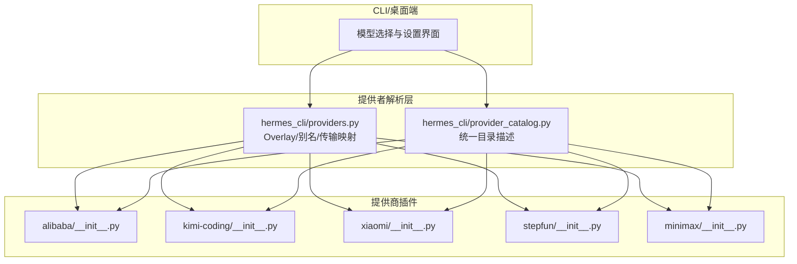
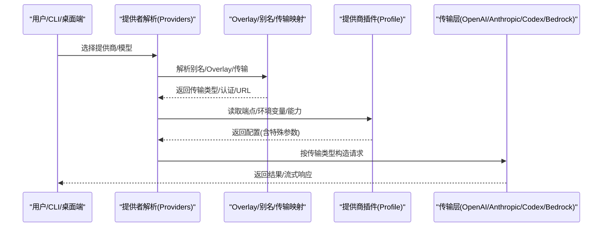
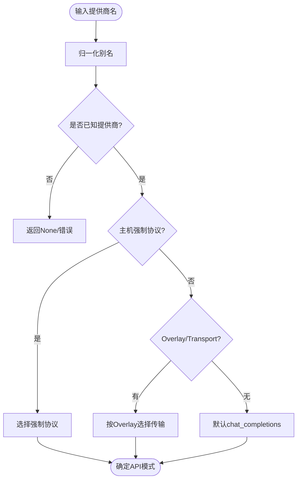

# 中文模型提供商

<cite>
**本文引用的文件**
- [hermes_cli/providers.py](file://hermes_cli/providers.py)
- [hermes_cli/provider_catalog.py](file://hermes_cli/provider_catalog.py)
- [plugins/model-providers/alibaba/__init__.py](file://plugins/model-providers/alibaba/__init__.py)
- [plugins/model-providers/kimi-coding/__init__.py](file://plugins/model-providers/kimi-coding/__init__.py)
- [plugins/model-providers/xiaomi/__init__.py](file://plugins/model-providers/xiaomi/__init__.py)
- [plugins/model-providers/stepfun/__init__.py](file://plugins/model-providers/stepfun/__init__.py)
- [plugins/model-providers/minimax/__init__.py](file://plugins/model-providers/minimax/__init__.py)
- [tests/test_minimax_model_validation.py](file://tests/test_minimax_model_validation.py)
</cite>

## 目录
1. [简介](#简介)
2. [项目结构](#项目结构)
3. [核心组件](#核心组件)
4. [架构总览](#架构总览)
5. [详细组件分析](#详细组件分析)
6. [依赖关系分析](#依赖关系分析)
7. [性能与可用性考量](#性能与可用性考量)
8. [故障排除指南](#故障排除指南)
9. [结论](#结论)
10. [附录：配置与使用要点](#附录：配置与使用要点)

## 简介
本文件面向国内主流 AI 服务提供商（阿里云通义千问、Kimi、小米大模型、阶跃星辰、MiniMax）在 Hermes Agent 中的接入方式，覆盖认证配置、API 模式、功能特性、使用限制、中文优化特点与差异化能力，并提供网络环境优化与故障排除建议。文档基于仓库内“模型提供商”插件与统一提供者解析逻辑进行说明，确保与实际实现一致。

## 项目结构
Hermes Agent 将“模型提供商”以插件形式组织，每个提供商提供 Profile（端点、环境变量、能力标记等），并通过统一注册机制暴露给 CLI/TUI 与桌面端设置页。同时，providers.py 维护了 Hermes Overlay（传输类型、认证方式、Base URL 覆盖、聚合器标识等），用于补齐 catalog 未覆盖的元信息。

图表来源
- [hermes_cli/providers.py:46-248](file://hermes_cli/providers.py#L46-L248)
- [hermes_cli/provider_catalog.py:83-176](file://hermes_cli/provider_catalog.py#L83-L176)
- [plugins/model-providers/alibaba/__init__.py:1-14](file://plugins/model-providers/alibaba/__init__.py#L1-L14)
- [plugins/model-providers/kimi-coding/__init__.py:1-122](file://plugins/model-providers/kimi-coding/__init__.py#L1-L122)
- [plugins/model-providers/xiaomi/__init__.py:1-17](file://plugins/model-providers/xiaomi/__init__.py#L1-L17)
- [plugins/model-providers/stepfun/__init__.py:1-15](file://plugins/model-providers/stepfun/__init__.py#L1-L15)
- [plugins/model-providers/minimax/__init__.py:1-98](file://plugins/model-providers/minimax/__init__.py#L1-L98)

章节来源
- [hermes_cli/providers.py:46-248](file://hermes_cli/providers.py#L46-L248)
- [hermes_cli/provider_catalog.py:83-176](file://hermes_cli/provider_catalog.py#L83-L176)

## 核心组件
- 提供者解析与叠加层（Providers Overlay）
  - 定义各提供商的传输类型（openai_chat / anthropic_messages / codex_responses / bedrock_converse）、认证方式（api_key / oauth_* / external_process / aws_sdk）、Base URL 覆盖与环境变量。
  - 提供别名归一化、显示标签、是否聚合器等元数据。
- 统一目录（Provider Catalog）
  - 将 CLI/TUI 与桌面端“账户/密钥”两个 Tab 的可见性统一到同一份描述，避免不同入口不一致。
- 提供商插件（Provider Profiles）
  - 每个提供商通过 ProviderProfile 声明端点、环境变量、默认辅助模型、能力开关（如视觉支持）等。

章节来源
- [hermes_cli/providers.py:31-248](file://hermes_cli/providers.py#L31-L248)
- [hermes_cli/provider_catalog.py:56-176](file://hermes_cli/provider_catalog.py#L56-L176)

## 架构总览
下图展示了从用户选择到实际请求发送的关键路径，包括传输协议选择、认证方式、以及针对特定提供商的特殊处理（如 Kimi 推理控制、MiniMax 的 Anthropic 兼容路由）。

图表来源
- [hermes_cli/providers.py:433-704](file://hermes_cli/providers.py#L433-L704)
- [plugins/model-providers/kimi-coding/__init__.py:36-122](file://plugins/model-providers/kimi-coding/__init__.py#L36-L122)
- [plugins/model-providers/minimax/__init__.py:29-98](file://plugins/model-providers/minimax/__init__.py#L29-L98)

## 详细组件分析

### 阿里云通义千问（Alibaba/DashScope）
- 接入方式
  - 提供商 ID：alibaba；别名包含 dashscope、aliyun、qwen 等。
  - 传输类型：openai_chat（OpenAI 兼容）。
  - Base URL：国际端点 https://dashscope-intl.aliyuncs.com/compatible-mode/v1。
  - 认证：通过环境变量 DASHSCOPE_API_KEY。
  - 可通过 Overlay 指定自定义 Base URL（DASHSCOPE_BASE_URL）。
- 功能与限制
  - 遵循 OpenAI Chat Completions 协议；具体模型能力由上游 DashScope 决定。
- 适用场景
  - 通用对话、代码生成、多模态（取决于所选模型）；企业级稳定服务。

章节来源
- [plugins/model-providers/alibaba/__init__.py:1-14](file://plugins/model-providers/alibaba/__init__.py#L1-L14)
- [hermes_cli/providers.py:137-144](file://hermes_cli/providers.py#L137-L144)

### Kimi（月之暗面/Kimi Coding）
- 接入方式
  - 提供商 ID：kimi-coding；别名 kimi、moonshot、kimi-for-coding。
  - 传输类型：openai_chat；当 Base URL 为 api.kimi.com/coding 时强制使用 anthropic_messages。
  - Base URL：默认国际端点 https://api.moonshot.ai/v1；另有中国区端点 https://api.moonshot.cn/v1。
  - 认证：KIMI_API_KEY / KIMI_CODING_API_KEY（国际），KIMI_CN_API_KEY（中国）。
- 中文优化与特性
  - 推理控制：thinking 与 reasoning_effort 互斥，根据配置自动选择；默认启用 thinking。
  - 模型发现：对 /coding 路径自动追加 /v1；过滤掉不推荐模型（如 k3）。
- 适用场景
  - 长上下文、深度推理任务；中英文混合场景表现良好。

章节来源
- [plugins/model-providers/kimi-coding/__init__.py:1-122](file://plugins/model-providers/kimi-coding/__init__.py#L1-L122)
- [hermes_cli/providers.py:110-118](file://hermes_cli/providers.py#L110-L118)

### 小米大模型（Xiaomi MiMo）
- 接入方式
  - 提供商 ID：xiaomi；别名 mimo、xiaomi-mimo。
  - 传输类型：openai_chat。
  - Base URL：https://api.xiaomimimo.com/v1。
  - 认证：XIAOMI_API_KEY。
- 功能与限制
  - 支持视觉能力（supports_vision=True）。
  - 不支持工具消息列表格式（supports_vision_tool_messages=False），调用时需避免 list-type tool content。
  - 健康检查：/v1/models 可能返回 401，因此关闭健康检查。
- 适用场景
  - 多模态理解（图文）、轻量对话与创作。

章节来源
- [plugins/model-providers/xiaomi/__init__.py:1-17](file://plugins/model-providers/xiaomi/__init__.py#L1-L17)
- [hermes_cli/providers.py:184-187](file://hermes_cli/providers.py#L184-L187)

### 阶跃星辰（StepFun）
- 接入方式
  - 提供商 ID：stepfun；别名 step、stepfun-coding-plan。
  - 传输类型：openai_chat。
  - Base URL：https://api.stepfun.ai/step_plan/v1。
  - 认证：STEPFUN_API_KEY。
  - 默认辅助模型：step-3.5-flash。
- 适用场景
  - 编程计划、结构化推理与规划类任务。

章节来源
- [plugins/model-providers/stepfun/__init__.py:1-15](file://plugins/model-providers/stepfun/__init__.py#L1-L15)
- [hermes_cli/providers.py:114-119](file://hermes_cli/providers.py#L114-L119)

### MiniMax（国际与中国区）
- 接入方式
  - 提供商 ID：minimax、minimax-cn、minimax-oauth。
  - 传输类型：anthropic_messages（默认 Anthropic 兼容路由）。
  - Base URL：国际 https://api.minimax.io/anthropic；中国 https://api.minimaxi.com/anthropic；OAuth 版本同国际。
  - 认证：MINIMAX_API_KEY / MINIMAX_CN_API_KEY；OAuth 版本无需 API Key。
  - 特殊：当 Base URL 为 https://api.minimax.io/v1 且模型为 minimax-m3 时，启用 OpenAI 兼容推理控制（reasoning_split、thinking）。
- 功能与限制
  - 模型校验：由于不提供 /v1/models，系统采用静态目录进行模型识别与建议。
- 适用场景
  - 多语言对话、推理任务；企业级稳定性要求高的场景。

章节来源
- [plugins/model-providers/minimax/__init__.py:1-98](file://plugins/model-providers/minimax/__init__.py#L1-L98)
- [tests/test_minimax_model_validation.py:1-85](file://tests/test_minimax_model_validation.py#L1-L85)
- [hermes_cli/providers.py:120-132](file://hermes_cli/providers.py#L120-L132)

## 依赖关系分析
- 别名与归一化
  - 通过 ALIASES 将常见名称映射到标准 ID（如 qwen→alibaba、kimi→kimi-coding、mimo→xiaomi 等）。
- 传输协议选择
  - host_mandated_api_mode 强制某些主机仅接受特定协议（如 Kimi /coding → anthropic_messages；官方 OpenAI 主机 → codex_responses；Bedrock → bedrock_converse）。
- 目录一致性
  - provider_catalog 保证 CLI/TUI 与桌面端“账户/密钥”Tab 的提供商集合一致，避免遗漏。

图表来源
- [hermes_cli/providers.py:445-704](file://hermes_cli/providers.py#L445-L704)

章节来源
- [hermes_cli/providers.py:270-406](file://hermes_cli/providers.py#L270-L406)
- [hermes_cli/providers.py:614-704](file://hermes_cli/providers.py#L614-L704)
- [hermes_cli/provider_catalog.py:83-176](file://hermes_cli/provider_catalog.py#L83-L176)

## 性能与可用性考量
- 传输协议选择
  - 优先使用主机强制协议（减少 400/401 错误），其次按 Overlay 的传输类型选择。
- 推理控制
  - Kimi：thinking 与 reasoning_effort 互斥，避免重复或冲突导致 HTTP 400。
  - MiniMax-M3（OpenAI 兼容端点）：显式开启 reasoning_split 以获得分离的思考块。
- 健康检查
  - 部分提供商（如 Xiaomi）/v1/models 可能返回 401，需关闭健康检查以避免误判。
- 模型发现
  - 对于不提供 /v1/models 的提供商（如 MiniMax），采用静态目录进行识别与建议，提升可用性。

[本节为通用指导，不直接分析具体文件]

## 故障排除指南
- 认证失败（401/403）
  - 确认对应环境变量已正确设置（如 DASHSCOPE_API_KEY、KIMI_API_KEY、XIAOMI_API_KEY、STEPFUN_API_KEY、MINIMAX_API_KEY/MINIMAX_CN_API_KEY）。
  - 若使用 OAuth（如 MiniMax-OAuth），请确保已通过浏览器流程完成授权并写入 auth.json。
- 协议不匹配（400）
  - Kimi /coding 必须使用 anthropic_messages；官方 OpenAI 主机需使用 codex_responses；Bedrock 使用 bedrock_converse。
  - 若手动设置了 base_url，请确保与目标主机要求的协议一致。
- 模型不存在或不识别
  - 对于不提供 /v1/models 的提供商（如 MiniMax），系统将基于静态目录进行识别；若提示未知模型，可参考建议的相似模型名称。
- 健康检查误报
  - 若 /v1/models 返回 401，属于预期行为（如 Xiaomi），应忽略健康检查失败。

章节来源
- [plugins/model-providers/xiaomi/__init__.py:1-17](file://plugins/model-providers/xiaomi/__init__.py#L1-L17)
- [tests/test_minimax_model_validation.py:1-85](file://tests/test_minimax_model_validation.py#L1-L85)
- [hermes_cli/providers.py:614-704](file://hermes_cli/providers.py#L614-L704)

## 结论
Hermes Agent 通过统一的提供者解析层与插件化的提供商 Profile，为国内主流 AI 服务提供商提供了标准化接入。针对不同提供商的协议差异、认证方式与能力限制，系统实现了自动化的传输协议选择、推理控制适配与模型校验策略。结合国内网络环境的 Base URL 与环境变量配置，可在生产环境中获得稳定、高效的中文模型调用体验。

[本节为总结性内容，不直接分析具体文件]

## 附录：配置与使用要点
- 环境变量清单
  - 阿里云通义千问：DASHSCOPE_API_KEY；可选 Base URL：DASHSCOPE_BASE_URL。
  - Kimi：KIMI_API_KEY / KIMI_CODING_API_KEY（国际），KIMI_CN_API_KEY（中国）。
  - 小米大模型：XIAOMI_API_KEY。
  - 阶跃星辰：STEPFUN_API_KEY。
  - MiniMax：MINIMAX_API_KEY（国际），MINIMAX_CN_API_KEY（中国）；OAuth 版本无需 Key。
- Base URL 覆盖
  - 多数提供商支持通过环境变量覆盖 Base URL（如 DASHSCOPE_BASE_URL、KIMI_BASE_URL、MINIMAX_BASE_URL、MINIMAX_CN_BASE_URL 等）。
- 传输协议
  - 大多数提供商使用 openai_chat；Kimi /coding 与 MiniMax 默认使用 anthropic_messages；官方 OpenAI 主机与 Bedrock 分别使用 codex_responses 与 bedrock_converse。
- 能力与限制
  - Xiaomi 支持视觉但不支持工具消息列表格式；MiniMax 不提供 /v1/models，采用静态目录校验模型。

章节来源
- [hermes_cli/providers.py:46-248](file://hermes_cli/providers.py#L46-L248)
- [plugins/model-providers/alibaba/__init__.py:1-14](file://plugins/model-providers/alibaba/__init__.py#L1-L14)
- [plugins/model-providers/kimi-coding/__init__.py:1-122](file://plugins/model-providers/kimi-coding/__init__.py#L1-L122)
- [plugins/model-providers/xiaomi/__init__.py:1-17](file://plugins/model-providers/xiaomi/__init__.py#L1-L17)
- [plugins/model-providers/stepfun/__init__.py:1-15](file://plugins/model-providers/stepfun/__init__.py#L1-L15)
- [plugins/model-providers/minimax/__init__.py:1-98](file://plugins/model-providers/minimax/__init__.py#L1-L98)