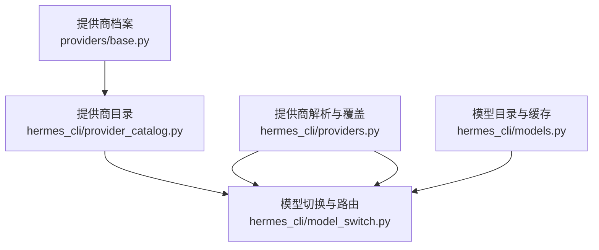
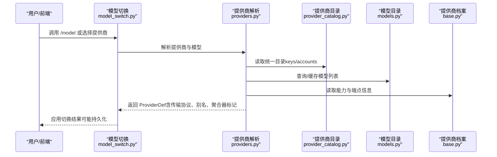
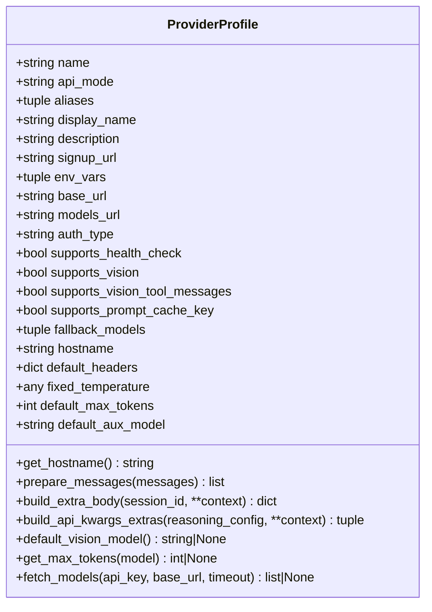
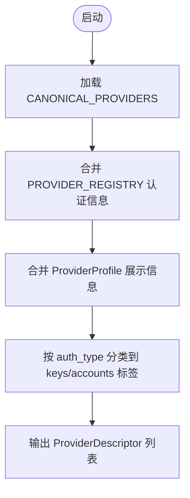
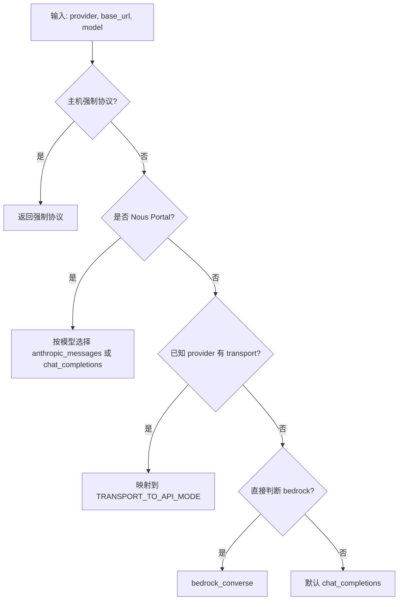
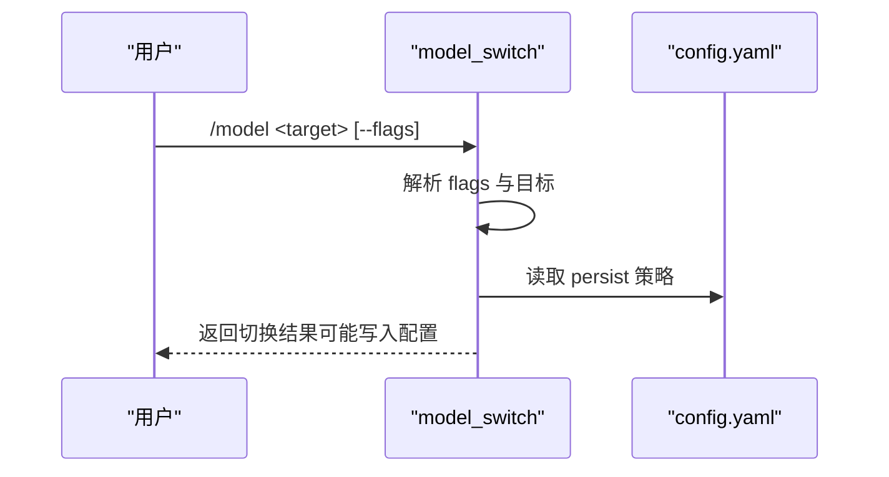
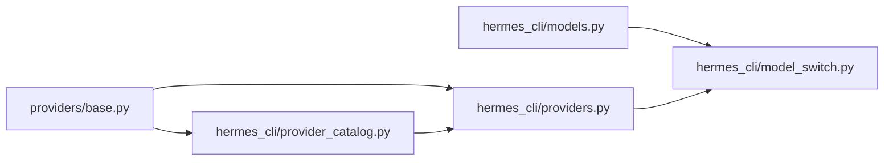

# 提供商管理与配置

<cite>
**本文引用的文件**
- [hermes_cli/providers.py](file://hermes_cli/providers.py)
- [hermes_cli/provider_catalog.py](file://hermes_cli/provider_catalog.py)
- [hermes_cli/model_switch.py](file://hermes_cli/model_switch.py)
- [providers/base.py](file://providers/base.py)
- [plugins/model-providers/README.md](file://plugins/model-providers/README.md)
- [hermes_cli/models.py](file://hermes_cli/models.py)
</cite>

## 目录
1. [简介](#简介)
2. [项目结构](#项目结构)
3. [核心组件](#核心组件)
4. [架构总览](#架构总览)
5. [详细组件分析](#详细组件分析)
6. [依赖关系分析](#依赖关系分析)
7. [性能与可用性考虑](#性能与可用性考虑)
8. [故障排除指南](#故障排除指南)
9. [结论](#结论)
10. [附录：配置示例与最佳实践](#附录：配置示例与最佳实践)

## 简介
本文件面向 Hermes Agent 的“模型提供商管理与配置”，系统性说明统一提供商抽象层的设计、动态加载机制、发现与兼容性检查、功能特性检测、提供商切换策略、负载均衡与故障转移、降级机制，以及性能监控、使用统计与成本控制等管理功能。文档同时提供扩展新提供商支持与优化现有提供商性能的实践建议，并给出完整的配置示例与故障排除指引。

## 项目结构
Hermes Agent 将“提供商”概念解耦为三层：
- 声明式提供商档案（ProviderProfile）：描述认证方式、端点、能力、请求级特性和模型目录获取方式。
- 提供商注册与目录（provider_catalog）：从内置插件和用户插件中扫描、合并，形成统一的提供商清单，驱动 CLI/TUI 和桌面端设置页。
- 运行时解析与选择（providers + model_switch）：基于 models.dev 目录、Hermes Overlay、用户配置，解析出最终 ProviderDef，并决定传输协议（API mode）、别名、聚合器行为与路由策略。

**图表来源**
- [providers/base.py:38-239](file://providers/base.py#L38-L239)
- [hermes_cli/provider_catalog.py:83-182](file://hermes_cli/provider_catalog.py#L83-L182)
- [hermes_cli/providers.py:31-248](file://hermes_cli/providers.py#L31-L248)
- [hermes_cli/model_switch.py:1-19](file://hermes_cli/model_switch.py#L1-L19)
- [hermes_cli/models.py:42-133](file://hermes_cli/models.py#L42-L133)

**章节来源**
- [providers/base.py:38-239](file://providers/base.py#L38-L239)
- [hermes_cli/provider_catalog.py:83-182](file://hermes_cli/provider_catalog.py#L83-L182)
- [hermes_cli/providers.py:31-248](file://hermes_cli/providers.py#L31-L248)
- [hermes_cli/model_switch.py:1-19](file://hermes_cli/model_switch.py#L1-L19)
- [hermes_cli/models.py:42-133](file://hermes_cli/models.py#L42-L133)

## 核心组件
- 提供商档案 ProviderProfile：声明式描述提供商身份、认证类型、端点、能力（如视觉支持、提示词缓存键）、默认参数、模型目录拉取逻辑等。
- 提供商目录 provider_catalog：统一导出 CLI/TUI 与桌面端一致的提供商清单，按认证类型自动分入“密钥”或“账户”标签页。
- 提供商解析 providers：合并 models.dev、Hermes Overlay、用户配置，生成 ProviderDef；负责别名归一化、聚合器识别、强制 API 模式判定。
- 模型切换 model_switch：解析 /model 命令、持久化策略、别名到真实模型 ID、直连别名、能力警告、显示名格式化等。
- 模型目录与缓存 models：维护 OpenRouter/Vercel AI Gateway/xAI 等目录快照与缓存，保障离线与网络不可用时的可用体验。

**章节来源**
- [providers/base.py:38-239](file://providers/base.py#L38-L239)
- [hermes_cli/provider_catalog.py:83-182](file://hermes_cli/provider_catalog.py#L83-L182)
- [hermes_cli/providers.py:445-704](file://hermes_cli/providers.py#L445-L704)
- [hermes_cli/model_switch.py:460-743](file://hermes_cli/model_switch.py#L460-L743)
- [hermes_cli/models.py:42-133](file://hermes_cli/models.py#L42-L133)

## 架构总览
提供商体系采用“声明式档案 + 动态注册 + 运行时解析”的分层架构：
- 声明层：每个提供商以 ProviderProfile 描述自身能力与行为，便于跨模块复用。
- 注册层：通过插件机制扫描 plugins/model-providers 与用户目录，构建统一目录。
- 解析层：在运行时根据 models.dev、Overlay 与用户配置，解析出最终 ProviderDef，并确定传输协议、别名、聚合器行为与路由策略。
- 选择层：/model 命令与网关路由共享同一套解析与持久化逻辑，确保多入口一致性。

**图表来源**
- [hermes_cli/model_switch.py:460-743](file://hermes_cli/model_switch.py#L460-L743)
- [hermes_cli/providers.py:445-704](file://hermes_cli/providers.py#L445-L704)
- [hermes_cli/provider_catalog.py:83-182](file://hermes_cli/provider_catalog.py#L83-L182)
- [hermes_cli/models.py:42-133](file://hermes_cli/models.py#L42-L133)
- [providers/base.py:181-239](file://providers/base.py#L181-L239)

## 详细组件分析

### 提供商档案 ProviderProfile
- 职责：声明提供商身份、认证类型、端点、能力（vision、prompt_cache_key）、默认参数、模型目录获取逻辑等。
- 关键能力：
  - fetch_models：按优先级（models_url > base_url + "/models"）拉取模型列表，带鉴权头与 UA 伪装，兼容不同响应格式。
  - build_extra_body/build_api_kwargs_extras：按提供商差异注入额外字段或顶层参数。
  - supports_vision/supports_vision_tool_messages：控制多模态消息与工具结果中的图片支持。
- 复杂度：fetch_models 为 O(1) 网络请求，异常时返回 None 供上层回退。

**图表来源**
- [providers/base.py:38-239](file://providers/base.py#L38-L239)

**章节来源**
- [providers/base.py:38-239](file://providers/base.py#L38-L239)

### 提供商目录 provider_catalog
- 职责：统一导出 CLI/TUI 与桌面端一致的提供商清单，按认证类型自动分入“密钥”或“账户”标签页。
- 数据来源：CANONICAL_PROVIDERS（CLI 选择器）、PROVIDER_REGISTRY（认证与环境变量）、ProviderProfile（展示元数据），必要时回退到 OPTIONAL_ENV_VARS。
- 输出：ProviderDescriptor（slug、label、description、auth_type、tab、api_key_env_vars、base_url_env_var、signup_url、order）。

**图表来源**
- [hermes_cli/provider_catalog.py:83-182](file://hermes_cli/provider_catalog.py#L83-L182)

**章节来源**
- [hermes_cli/provider_catalog.py:83-182](file://hermes_cli/provider_catalog.py#L83-L182)

### 提供商解析 providers
- 职责：合并 models.dev、Hermes Overlay、用户配置，生成 ProviderDef；负责别名归一化、聚合器识别、强制 API 模式判定。
- 关键点：
  - get_provider：优先 models.dev，再叠加 Hermes Overlay；合并环境变量与基础 URL。
  - determine_api_mode：按主机强制协议（如 OpenAI Responses、Anthropic Messages、Bedrock Converse）、Nous Portal 双协议、已知 transport 映射、默认 chat_completions。
  - is_aggregator/is_routing_aggregator：区分“扁平命名空间转售商”与“真正路由聚合器”。
  - host_mandated_api_mode：对特定主机强制协议，避免会话携带过时 api_mode。

**图表来源**
- [hermes_cli/providers.py:614-704](file://hermes_cli/providers.py#L614-L704)

**章节来源**
- [hermes_cli/providers.py:445-704](file://hermes_cli/providers.py#L445-L704)

### 模型切换 model_switch
- 职责：解析 /model 命令、持久化策略、别名到真实模型 ID、直连别名、能力警告、显示名格式化等。
- 关键点：
  - parse_model_switch_args：统一解析 flags（--global/--session/--once/--refresh/--provider），校验冲突。
  - resolve_persist_behavior：决定切换是否持久化到 config.yaml。
  - DIRECT_ALIASES：支持从配置加载直连别名，绕过目录解析。
  - format_model_for_display：对代理提供的冗长模型 ID 进行显示裁剪。

**图表来源**
- [hermes_cli/model_switch.py:494-743](file://hermes_cli/model_switch.py#L494-L743)

**章节来源**
- [hermes_cli/model_switch.py:460-743](file://hermes_cli/model_switch.py#L460-L743)

### 模型目录与缓存 models
- 职责：维护 OpenRouter/Vercel AI Gateway/xAI 等目录快照与缓存，保障离线与网络不可用时的可用体验。
- 关键点：
  - OPENROUTER_MODELS、VERCEL_AI_GATEWAY_MODELS：静态快照作为回退。
  - _xai_curated_models：从本地缓存读取 xAI 目录，必要时合并 curated extras。
  - 用户代理与超时控制：避免被 WAF 拦截，提升稳定性。

**章节来源**
- [hermes_cli/models.py:42-133](file://hermes_cli/models.py#L42-L133)

## 依赖关系分析
- 提供商档案（base.py）被 provider_catalog 与 providers 共同引用，用于能力与端点描述。
- provider_catalog 依赖 CLI 的 CANONICAL_PROVIDERS 与认证注册表，保证 GUI 与 CLI 一致。
- providers 依赖 models_dev（外部目录）、Hermes Overlay、用户配置，生成 ProviderDef。
- model_switch 依赖 providers 与 models，完成模型解析与切换。
- 插件机制（plugins/model-providers）允许用户覆盖内置提供商，实现热插拔。

**图表来源**
- [providers/base.py:38-239](file://providers/base.py#L38-L239)
- [hermes_cli/provider_catalog.py:83-182](file://hermes_cli/provider_catalog.py#L83-L182)
- [hermes_cli/providers.py:445-704](file://hermes_cli/providers.py#L445-L704)
- [hermes_cli/model_switch.py:460-743](file://hermes_cli/model_switch.py#L460-L743)
- [hermes_cli/models.py:42-133](file://hermes_cli/models.py#L42-L133)

**章节来源**
- [providers/base.py:38-239](file://providers/base.py#L38-L239)
- [hermes_cli/provider_catalog.py:83-182](file://hermes_cli/provider_catalog.py#L83-L182)
- [hermes_cli/providers.py:445-704](file://hermes_cli/providers.py#L445-L704)
- [hermes_cli/model_switch.py:460-743](file://hermes_cli/model_switch.py#L460-L743)
- [hermes_cli/models.py:42-133](file://hermes_cli/models.py#L42-L133)

## 性能与可用性考虑
- 模型目录缓存：OpenRouter/Vercel/xAI 等目录使用本地缓存与静态快照，减少网络抖动影响。
- 传输协议强制：对特定主机强制协议（如 OpenAI Responses、Anthropic Messages、Bedrock Converse），避免无效请求与错误回退。
- 聚合器识别：区分“扁平命名空间转售商”与“真正路由聚合器”，避免误判导致的选择去重问题。
- 健康检查与回退：ProviderProfile.fetch_models 失败时返回 None，上层可回退到静态列表或缓存。
- 并发与超时：fetch_models 支持超时参数，避免阻塞；UA 伪装降低被 WAF 拦截概率。

[本节为通用指导，不直接分析具体文件]

## 故障排除指南
- 提供商未出现在 GUI：确认 provider_catalog 能正确加载 CANONICAL_PROVIDERS 与 PROVIDER_REGISTRY；检查插件目录是否存在且已注册。
- 模型列表为空：检查 fetch_models 是否能访问 models_url 或 base_url + "/models”；确认鉴权头与 UA；必要时启用缓存或静态快照。
- 协议不匹配：使用 determine_api_mode 与 host_mandated_api_mode 检查是否应强制特定协议；调整 base_url 或 api_mode。
- 别名解析失败：确认 normalize_provider 与 ALIASES 是否包含所需别名；必要时添加自定义别名。
- 切换未持久化：检查 resolve_persist_behavior 的 flags 与配置项；确认 config.yaml 的 model.persist_switch_by_default。

**章节来源**
- [hermes_cli/provider_catalog.py:83-182](file://hermes_cli/provider_catalog.py#L83-L182)
- [providers/base.py:181-239](file://providers/base.py#L181-L239)
- [hermes_cli/providers.py:614-704](file://hermes_cli/providers.py#L614-L704)
- [hermes_cli/model_switch.py:580-743](file://hermes_cli/model_switch.py#L580-L743)

## 结论
Hermes Agent 通过声明式提供商档案、统一目录与运行时解析，实现了高度可扩展、可配置的模型提供商管理。结合模型目录缓存、协议强制、聚合器识别与切换持久化，系统在不同网络与后端环境下具备良好可用性与稳定性。遵循本文档的配置与实践，可有效扩展新提供商、优化现有提供商性能，并建立完善的监控与成本控制体系。

[本节为总结性内容，不直接分析具体文件]

## 附录：配置示例与最佳实践

### 配置要点
- 提供商档案：在 providers/base.py 中定义或继承 ProviderProfile，设置认证类型、端点、能力与模型目录获取逻辑。
- 插件注册：在 plugins/model-providers/<your_provider>/__init__.py 中注册 ProviderProfile，并在 plugin.yaml 中声明元数据。
- 用户配置：在 config.yaml 的 providers/custom_providers 中添加自定义端点与密钥环境变量；在 model_aliases 中定义直连别名。
- 切换策略：使用 /model 命令与 flags（--global/--session/--once/--refresh/--provider）控制切换范围与持久化。

**章节来源**
- [providers/base.py:38-239](file://providers/base.py#L38-L239)
- [plugins/model-providers/README.md:17-71](file://plugins/model-providers/README.md#L17-L71)
- [hermes_cli/model_switch.py:494-743](file://hermes_cli/model_switch.py#L494-L743)

### 最佳实践
- 使用 provider_catalog 统一管理提供商清单，避免 GUI 与 CLI 不一致。
- 利用 determine_api_mode 与 host_mandated_api_mode 确保协议正确，减少无效请求。
- 对聚合器与转售商进行区分，避免误判导致的选择去重问题。
- 启用模型目录缓存与静态快照，提升离线与弱网环境下的可用性。
- 通过 ProviderProfile.fetch_models 的健康检查与回退机制，增强鲁棒性。

[本节为通用指导，不直接分析具体文件]