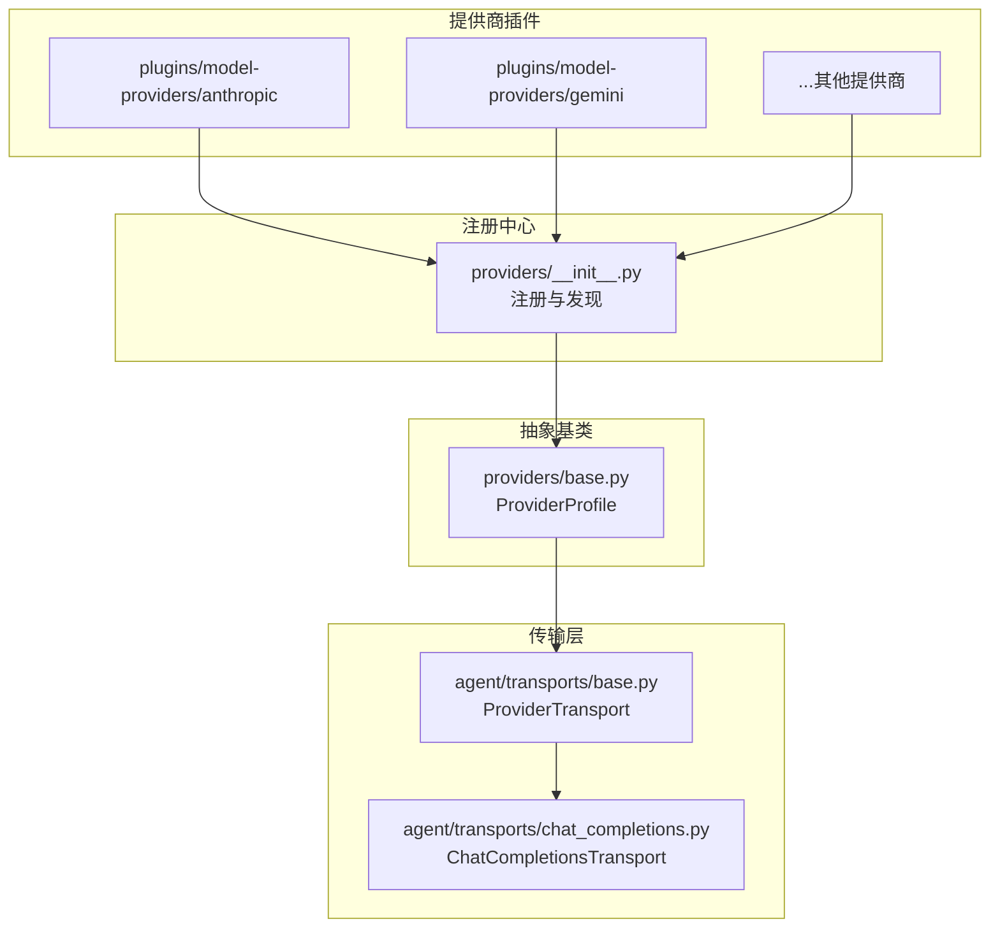
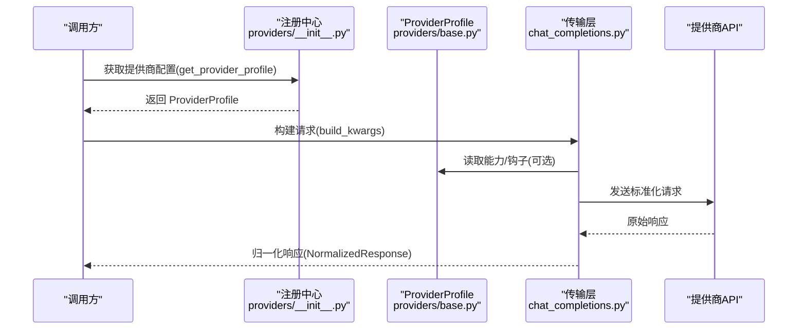
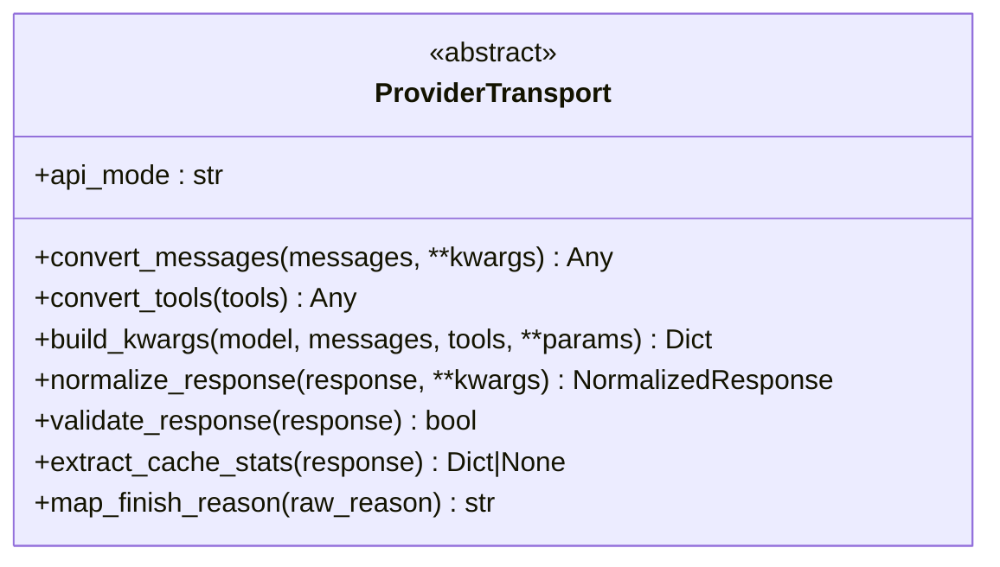
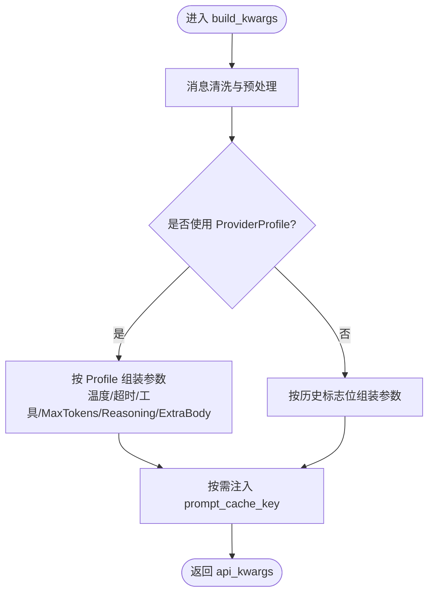
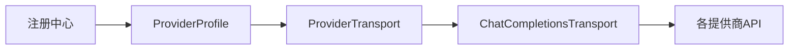

# 模型提供商支持

<cite>
**本文引用的文件**
- [providers/base.py](file://providers/base.py)
- [providers/__init__.py](file://providers/__init__.py)
- [plugins/model-providers/README.md](file://plugins/model-providers/README.md)
- [plugins/model-providers/anthropic/__init__.py](file://plugins/model-providers/anthropic/__init__.py)
- [plugins/model-providers/gemini/__init__.py](file://plugins/model-providers/gemini/__init__.py)
- [agent/transports/base.py](file://agent/transports/base.py)
- [agent/transports/chat_completions.py](file://agent/transports/chat_completions.py)
</cite>

## 目录
1. [简介](#简介)
2. [项目结构](#项目结构)
3. [核心组件](#核心组件)
4. [架构总览](#架构总览)
5. [详细组件分析](#详细组件分析)
6. [依赖关系分析](#依赖关系分析)
7. [性能与成本优化](#性能与成本优化)
8. [故障转移与负载均衡](#故障转移与负载均衡)
9. [配置与认证指南](#配置与认证指南)
10. [模型选择策略与降级](#模型选择策略与降级)
11. [故障排查](#故障排查)
12. [结论](#结论)

## 简介
本文件面向 Hermes Agent 的“模型提供商支持”能力，系统性说明如何以统一抽象层接入多种 AI 后端（如 OpenAI、Anthropic、Google Gemini、Azure OpenAI、本地模型等），并给出配置方法、认证流程、功能特性与限制。文档还涵盖模型选择策略、负载均衡、故障转移、成本优化、版本管理、兼容性检查与降级策略等高级主题，帮助在不同提供商之间无缝切换并保持稳定的推理体验。

## 项目结构
Hermes 通过“声明式 ProviderProfile + Transport 适配层 + 插件注册表”的方式组织模型提供商支持：
- 插件目录 plugins/model-providers/<provider>/ 提供每个提供商的 Profile 定义与元数据；
- providers/base.py 定义 ProviderProfile 抽象基类，描述鉴权、端点、能力与请求级钩子；
- agent/transports/* 实现不同 API 模式的传输适配（如 chat_completions、anthropic_messages）；
- providers/__init__.py 负责懒加载发现与注册，支持内置插件与用户自定义覆盖。

图表来源
- [providers/__init__.py:147-199](file://providers/__init__.py#L147-L199)
- [providers/base.py:38-152](file://providers/base.py#L38-L152)
- [agent/transports/base.py:16-90](file://agent/transports/base.py#L16-L90)
- [agent/transports/chat_completions.py:207-597](file://agent/transports/chat_completions.py#L207-L597)

章节来源
- [plugins/model-providers/README.md:1-71](file://plugins/model-providers/README.md#L1-L71)
- [providers/__init__.py:1-199](file://providers/__init__.py#L1-L199)
- [providers/base.py:1-239](file://providers/base.py#L1-L239)

## 核心组件
- ProviderProfile（声明式配置）
  - 描述提供商身份、鉴权方式、端点、能力（如 vision、prompt_cache_key）、默认辅助模型、最大输出 token 等；
  - 提供可覆写的钩子：prepare_messages、build_extra_body、build_api_kwargs_extras、get_max_tokens、fetch_models 等；
  - 支持按模型动态调整行为（例如 per-model max tokens）。
- ProviderTransport（传输适配）
  - 抽象出 convert_messages、convert_tools、build_kwargs、normalize_response 等步骤；
  - 将不同提供商的原始消息/工具/响应归一化为内部通用类型，屏蔽差异。
- ChatCompletionsTransport（OpenAI 兼容路径）
  - 处理 ~16 个 OpenAI 兼容提供商的统一构建逻辑；
  - 集中处理 reasoning/thinking、temperature、max_tokens、extra_body、prompt_cache_key 等；
  - 支持 provider_profile 单一路径，避免大量布尔标志分支。
- 插件注册与发现
  - 首次调用 get_provider_profile/list_providers 时扫描内置与用户插件目录；
  - 用户插件同名覆盖内置插件（last-writer-wins），便于定制与热替换。

章节来源
- [providers/base.py:38-239](file://providers/base.py#L38-L239)
- [agent/transports/base.py:16-90](file://agent/transports/base.py#L16-L90)
- [agent/transports/chat_completions.py:207-747](file://agent/transports/chat_completions.py#L207-L747)
- [providers/__init__.py:1-199](file://providers/__init__.py#L1-L199)

## 架构总览
下图展示从上层调用到具体提供商的端到端流程：应用通过统一的 ProviderProfile 与 Transport 发起请求，由 ChatCompletionsTransport 或对应传输完成消息/工具转换、参数组装、调用与响应归一化。

图表来源
- [providers/__init__.py:68-95](file://providers/__init__.py#L68-L95)
- [providers/base.py:117-152](file://providers/base.py#L117-L152)
- [agent/transports/chat_completions.py:356-597](file://agent/transports/chat_completions.py#L356-L597)

## 详细组件分析

### 抽象传输层 ProviderTransport
- 职责边界：仅负责数据格式转换与归一化，不持有客户端构造、流式、凭证刷新、重试等逻辑；
- 关键方法：
  - api_mode：标识该传输处理的 API 模式；
  - convert_messages / convert_tools：将内部消息/工具转换为提供商原生格式；
  - build_kwargs：组装最终请求参数字典；
  - normalize_response：将原始响应转为统一 NormalizedResponse；
  - validate_response / extract_cache_stats / map_finish_reason：可选增强能力。

图表来源
- [agent/transports/base.py:16-90](file://agent/transports/base.py#L16-L90)

章节来源
- [agent/transports/base.py:1-90](file://agent/transports/base.py#L1-L90)

### OpenAI 兼容传输 ChatCompletionsTransport
- 适用面：OpenAI 兼容接口（约 16+ 提供商），包括 OpenRouter、Nous、NVIDIA、Qwen、Ollama、DeepSeek、xAI、Kimi 等；
- 消息清洗：移除 Codex/内部字段、tool_name、时间戳、_前缀标记等严格提供商拒绝的字段；
- 参数构建：
  - 支持 provider_profile 单一路径，减少条件分支；
  - 处理 temperature、max_tokens、reasoning/thinking、extra_body、request_overrides；
  - 针对 Gemini 的 thinking_config 翻译与 OpenAI 兼容路径嵌套；
  - 为 OpenAI 官方端点注入 prompt_cache_key（当能力开启时）；
- 响应归一化：保留 provider_data（如 extra_content）以便下游回放。

图表来源
- [agent/transports/chat_completions.py:356-597](file://agent/transports/chat_completions.py#L356-L597)
- [agent/transports/chat_completions.py:599-747](file://agent/transports/chat_completions.py#L599-L747)

章节来源
- [agent/transports/chat_completions.py:1-800](file://agent/transports/chat_completions.py#L1-L800)

### 提供商 Profile：Anthropic
- 特点：使用 x-api-key 与 anthropic-version 头；
- 模型列表：通过自有 models 端点拉取；
- 鉴权：env_vars 包含 ANTHROPIC_API_KEY/ANTHROPIC_TOKEN/CLAUDE_CODE_OAUTH_TOKEN；
- 默认辅助模型：claude-haiku-4-5-20251001。

章节来源
- [plugins/model-providers/anthropic/__init__.py:14-55](file://plugins/model-providers/anthropic/__init__.py#L14-L55)

### 提供商 Profile：Google Gemini
- 特点：通过思考配置 thinking_config 控制思维过程；
- 兼容路径：在 OpenAI 兼容 /openai 子路径下，thinking_config 需放入 extra_body.google.thinking_config；
- 鉴权：GOOGLE_API_KEY/GEMINI_API_KEY；
- 默认辅助模型：gemini-3.6-flash。

章节来源
- [plugins/model-providers/gemini/__init__.py:18-62](file://plugins/model-providers/gemini/__init__.py#L18-L62)

### 插件注册与发现机制
- 懒加载：首次访问时才扫描；
- 优先级：内置插件 → 用户插件（同名覆盖）→ 遗留单文件模块；
- 注册：每个插件 __init__.py 调用 register_provider(profile)。

章节来源
- [providers/__init__.py:1-199](file://providers/__init__.py#L1-L199)
- [plugins/model-providers/README.md:17-71](file://plugins/model-providers/README.md#L17-L71)

## 依赖关系分析
- ProviderProfile 是“能力与行为”的单一事实来源；
- Transport 依赖 Profile 提供的钩子与元数据，决定请求拼装细节；
- 插件注册表解耦了“新增提供商”的代码侵入性，遵循开闭原则；
- ChatCompletionsTransport 对 Gemini/OpenAI 等做了特殊兼容处理，确保跨提供商一致性。

图表来源
- [providers/__init__.py:147-199](file://providers/__init__.py#L147-L199)
- [providers/base.py:38-152](file://providers/base.py#L38-L152)
- [agent/transports/chat_completions.py:207-597](file://agent/transports/chat_completions.py#L207-L597)

章节来源
- [providers/__init__.py:1-199](file://providers/__init__.py#L1-L199)
- [providers/base.py:1-239](file://providers/base.py#L1-L239)
- [agent/transports/chat_completions.py:1-800](file://agent/transports/chat_completions.py#L1-L800)

## 性能与成本优化
- 提示缓存键（prompt_cache_key）
  - 仅在明确支持的端点注入（如 OpenAI 官方端点或 profile 显式声明 supports_prompt_cache_key）；
  - 基于静态指令与工具的哈希，结合会话作用域，提升缓存命中率并避免无关会话混用；
  - 参考：[agent/transports/chat_completions.py:44-77](file://agent/transports/chat_completions.py#L44-L77)、[agent/transports/chat_completions.py:588-595](file://agent/transports/chat_completions.py#L588-L595)、[providers/base.py:75-79](file://providers/base.py#L75-L79)。
- 温度与最大输出
  - 支持固定温度、省略温度（某些提供商服务端管理）、按模型设置默认上限；
  - 参考：[providers/base.py:94-99](file://providers/base.py#L94-L99)、[agent/transports/chat_completions.py:626-665](file://agent/transports/chat_completions.py#L626-L665)。
- 推理/思考控制
  - 针对不同提供商映射 effort/thinkingConfig，避免不支持字段导致 400；
  - 参考：[agent/transports/chat_completions.py:79-147](file://agent/transports/chat_completions.py#L79-L147)、[plugins/model-providers/gemini/__init__.py:21-48](file://plugins/model-providers/gemini/__init__.py#L21-L48)。
- 工具与消息清洗
  - 去除严格提供商拒绝的内部字段，降低失败率与重试成本；
  - 参考：[agent/transports/chat_completions.py:217-350](file://agent/transports/chat_completions.py#L217-L350)。

章节来源
- [agent/transports/chat_completions.py:44-77](file://agent/transports/chat_completions.py#L44-L77)
- [agent/transports/chat_completions.py:217-350](file://agent/transports/chat_completions.py#L217-L350)
- [agent/transports/chat_completions.py:588-595](file://agent/transports/chat_completions.py#L588-L595)
- [providers/base.py:75-99](file://providers/base.py#L75-L99)
- [plugins/model-providers/gemini/__init__.py:21-48](file://plugins/model-providers/gemini/__init__.py#L21-L48)

## 故障转移与负载均衡
- 多提供商路由
  - 通过 ProviderProfile 的 name/aliases 与 base_url/models_url 组合，可在上游编排层实现按模型/能力的路由；
  - 参考：[providers/base.py:52-57](file://providers/base.py#L52-L57)。
- 健康探测与模型清单
  - fetch_models 支持自定义鉴权与端点，失败时回退到静态列表；
  - 参考：[providers/base.py:181-239](file://providers/base.py#L181-L239)。
- 建议实践
  - 主备提供商：主提供商失败时自动切换到备用；
  - 按能力分流：视觉任务走具备 vision 能力的提供商；
  - 按成本/延迟权重：结合速率限制与价格策略进行加权轮询。

章节来源
- [providers/base.py:52-57](file://providers/base.py#L52-L57)
- [providers/base.py:181-239](file://providers/base.py#L181-L239)

## 配置与认证指南
- 环境变量与鉴权
  - Anthropic：ANTHROPIC_API_KEY/ANTHROPIC_TOKEN/CLAUDE_CODE_OAUTH_TOKEN；
  - Gemini：GOOGLE_API_KEY/GEMINI_API_KEY；
  - 其他 OpenAI 兼容提供商：通常使用标准 API Key，并通过 base_url 指向网关或私有端点；
  - 参考：[plugins/model-providers/anthropic/__init__.py:44-52](file://plugins/model-providers/anthropic/__init__.py#L44-L52)、[plugins/model-providers/gemini/__init__.py:51-59](file://plugins/model-providers/gemini/__init__.py#L51-L59)。
- 端点与模型清单
  - 通过 base_url 指定推理端点；models_url 可单独指定模型清单端点；
  - 参考：[providers/base.py:52-57](file://providers/base.py#L52-L57)。
- 插件覆盖
  - 在 $HERMES_HOME/plugins/model-providers/<name>/ 放置同名插件可覆盖内置配置；
  - 参考：[providers/__init__.py:170-178](file://providers/__init__.py#L170-L178)、[plugins/model-providers/README.md:24-27](file://plugins/model-providers/README.md#L24-L27)。

章节来源
- [plugins/model-providers/anthropic/__init__.py:44-52](file://plugins/model-providers/anthropic/__init__.py#L44-L52)
- [plugins/model-providers/gemini/__init__.py:51-59](file://plugins/model-providers/gemini/__init__.py#L51-L59)
- [providers/base.py:52-57](file://providers/base.py#L52-L57)
- [providers/__init__.py:170-178](file://providers/__init__.py#L170-L178)
- [plugins/model-providers/README.md:24-27](file://plugins/model-providers/README.md#L24-L27)

## 模型选择策略与降级
- 选择策略
  - 能力优先：vision 任务选择 supports_vision=True 的提供商；
  - 成本/延迟权衡：根据默认辅助模型与 per-model 上限选择性价比最优；
  - 端点兼容：OpenAI 兼容 vs 原生端点（如 Gemini native）决定 thinking_config 的写入位置；
  - 参考：[providers/base.py:59-79](file://providers/base.py#L59-L79)、[agent/transports/chat_completions.py:562-574](file://agent/transports/chat_completions.py#L562-L574)。
- 降级策略
  - 主提供商不可用时，按预设顺序尝试备用提供商；
  - 模型清单拉取失败时回退到静态 fallback_models；
  - 参考：[providers/base.py:81-88](file://providers/base.py#L81-L88)、[providers/base.py:181-239](file://providers/base.py#L181-L239)。

章节来源
- [providers/base.py:59-88](file://providers/base.py#L59-L88)
- [agent/transports/chat_completions.py:562-574](file://agent/transports/chat_completions.py#L562-L574)

## 故障排查
- 常见错误与定位
  - 400/422 未知字段：检查消息清洗与 extra_body 字段（如 Gemini 的 thinking_config 位置）；
    - 参考：[agent/transports/chat_completions.py:217-350](file://agent/transports/chat_completions.py#L217-L350)、[agent/transports/chat_completions.py:716-737](file://agent/transports/chat_completions.py#L716-L737)。
  - 模型清单无法拉取：确认鉴权头与 models_url，必要时回退到静态列表；
    - 参考：[providers/base.py:181-239](file://providers/base.py#L181-L239)。
  - 提示缓存未命中：确认 supports_prompt_cache_key 与 base_url 是否为受支持端点；
    - 参考：[agent/transports/chat_completions.py:44-77](file://agent/transports/chat_completions.py#L44-L77)、[agent/transports/chat_completions.py:588-595](file://agent/transports/chat_completions.py#L588-L595)。
- 调试建议
  - 启用日志观察 fetch_models 与 build_kwargs 的输入输出；
  - 使用最小复现请求验证字段合法性；
  - 逐步关闭 extra_body 中的非必需字段以定位问题。

章节来源
- [agent/transports/chat_completions.py:217-350](file://agent/transports/chat_completions.py#L217-L350)
- [agent/transports/chat_completions.py:716-737](file://agent/transports/chat_completions.py#L716-L737)
- [providers/base.py:181-239](file://providers/base.py#L181-L239)
- [agent/transports/chat_completions.py:44-77](file://agent/transports/chat_completions.py#L44-L77)
- [agent/transports/chat_completions.py:588-595](file://agent/transports/chat_completions.py#L588-L595)

## 结论
Hermes Agent 通过 ProviderProfile 与 ProviderTransport 的清晰分层，实现了多模型提供商的统一接入与灵活扩展。借助插件注册机制，新增或覆盖提供商无需修改核心代码；ChatCompletionsTransport 则提供了强大的 OpenAI 兼容路径，兼顾 Gemini 等特殊场景。配合提示缓存、温度/最大输出控制、推理/思考配置与健壮的错误处理，系统能够在稳定性、性能与成本之间取得良好平衡。建议在工程实践中结合能力、成本与延迟制定路由与降级策略，并利用插件机制持续演进提供商生态。