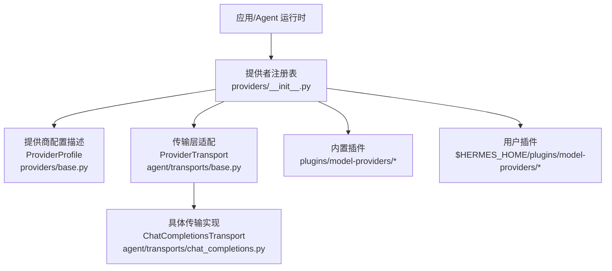
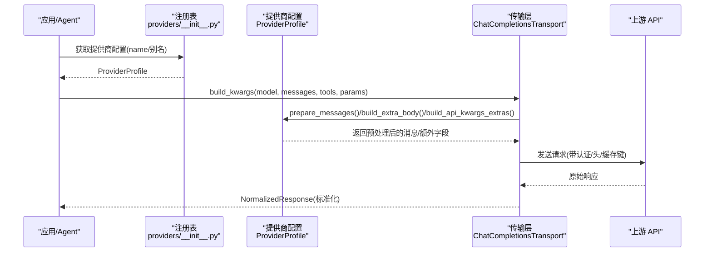
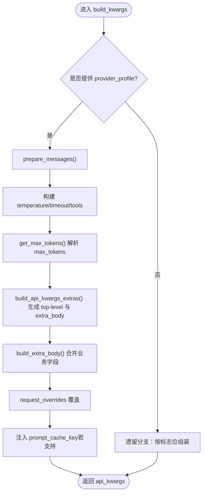
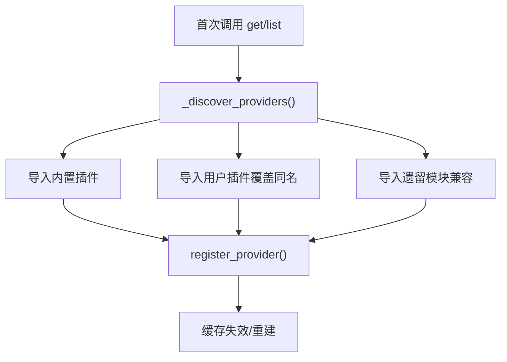
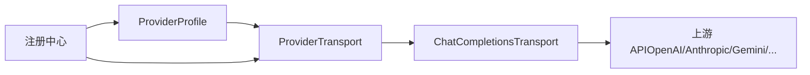

# 自定义模型提供商

<cite>
**本文引用的文件**
- [providers/base.py](file://providers/base.py)
- [providers/__init__.py](file://providers/__init__.py)
- [plugins/model-providers/README.md](file://plugins/model-providers/README.md)
- [plugins/model-providers/custom/__init__.py](file://plugins/model-providers/custom/__init__.py)
- [plugins/model-providers/openrouter/__init__.py](file://plugins/model-providers/openrouter/__init__.py)
- [agent/transports/base.py](file://agent/transports/base.py)
- [agent/transports/chat_completions.py](file://agent/transports/chat_completions.py)
</cite>

## 目录
1. [简介](#简介)
2. [项目结构](#项目结构)
3. [核心组件](#核心组件)
4. [架构总览](#架构总览)
5. [详细组件分析](#详细组件分析)
6. [依赖关系分析](#依赖关系分析)
7. [性能考量](#性能考量)
8. [故障排查指南](#故障排查指南)
9. [结论](#结论)
10. [附录](#附录)

## 简介
本文件面向希望为 Hermes Agent 框架开发并维护“自定义模型提供商”的开发者，提供从接口规范、认证与请求处理、响应格式到集成、测试、部署、发布的全流程文档。重点包括：
- 统一的提供商接口规范（ProviderProfile）
- 认证机制与端点发现
- 请求构建与响应标准化
- 与现有 Hermes Agent 框架的无缝集成方式
- 开发流程、测试方法与部署策略
- 工程化最佳实践（错误处理、日志、监控）
- 如何发布和分享自定义提供商给社区使用

## 项目结构
Hermes 将“模型提供商”抽象为可插拔的插件体系：
- 内置插件位于仓库的 plugins/model-providers 下，每个子目录是一个独立的 ProviderProfile 插件
- 用户插件位于 $HERMES_HOME/plugins/model-providers/<name>/，同名覆盖内置插件（最后写入者胜）
- providers 模块负责懒加载发现与注册，首次调用 get_provider_profile() 或 list_providers() 时扫描并导入所有插件

**图示来源**
- [providers/__init__.py:48-95](file://providers/__init__.py#L48-L95)
- [providers/base.py:38-152](file://providers/base.py#L38-L152)
- [agent/transports/base.py:16-90](file://agent/transports/base.py#L16-L90)
- [agent/transports/chat_completions.py:207-747](file://agent/transports/chat_completions.py#L207-L747)

**章节来源**
- [providers/__init__.py:1-199](file://providers/__init__.py#L1-L199)
- [plugins/model-providers/README.md:1-71](file://plugins/model-providers/README.md#L1-L71)

## 核心组件
- ProviderProfile：声明式描述一个推理提供商的身份、元数据、认证、端点、能力与请求级特性；提供消息预处理、额外请求体、API 参数扩展等钩子
- ProviderTransport：抽象传输层，负责消息/工具转换、构建 API 调用参数、标准化响应
- ChatCompletionsTransport：OpenAI Chat Completions 模式的具体实现，统一处理多提供商差异（温度、最大令牌、推理配置、缓存键等）
- 注册中心：懒发现并注册所有提供商插件，支持用户覆盖内置插件

关键职责边界：
- ProviderProfile 不持有客户端构造、流式传输、凭据轮换、中断处理、重试逻辑；这些由上层 AIAgent 管理
- Transport 专注数据路径转换与标准化，不拥有网络 I/O 细节

**章节来源**
- [providers/base.py:1-152](file://providers/base.py#L1-L152)
- [agent/transports/base.py:1-90](file://agent/transports/base.py#L1-L90)
- [agent/transports/chat_completions.py:207-747](file://agent/transports/chat_completions.py#L207-L747)
- [providers/__init__.py:54-95](file://providers/__init__.py#L54-L95)

## 架构总览
下图展示了从高层到具体的调用链：应用通过注册表获取 ProviderProfile，再经由传输层构建请求并标准化响应。

**图示来源**
- [providers/__init__.py:68-95](file://providers/__init__.py#L68-L95)
- [providers/base.py:117-152](file://providers/base.py#L117-L152)
- [agent/transports/chat_completions.py:356-747](file://agent/transports/chat_completions.py#L356-L747)

## 详细组件分析

### ProviderProfile：统一提供商接口规范
- 身份与元数据：name、aliases、display_name、description、signup_url
- 认证与端点：env_vars、base_url、models_url、auth_type、supports_health_check
- 视觉与缓存能力：supports_vision、supports_vision_tool_messages、supports_prompt_cache_key
- 模型目录：fallback_models、hostname
- 请求级特性：fixed_temperature、default_max_tokens、default_aux_model、default_headers
- 钩子方法：
  - prepare_messages：消息预处理（在 Codex 清理之后、开发者角色替换之前）
  - build_extra_body：合并 extra_body（如 tags、provider preferences、thinking_config 等）
  - build_api_kwargs_extras：拆分 top-level api_kwargs 与 extra_body（用于 reasoning_effort、metadata 等）
  - default_vision_model：默认视觉模型选择
  - get_max_tokens：按模型返回默认输出上限
  - fetch_models：拉取在线模型列表（支持 Bearer 认证与自定义 UA）

典型用法：
- 简单提供商：直接实例化 ProviderProfile 并 register_provider
- 复杂提供商：继承 ProviderProfile 并重写上述钩子以适配特定行为

**章节来源**
- [providers/base.py:38-239](file://providers/base.py#L38-L239)

### 传输层 ProviderTransport 与 ChatCompletionsTransport
- ProviderTransport 定义统一接口：convert_messages、convert_tools、build_kwargs、normalize_response、validate_response、extract_cache_stats、map_finish_reason
- ChatCompletionsTransport 针对 OpenAI 兼容模式：
  - convert_messages：清理内部字段（如 codex_*、tool_name、_前缀标记），保留 Gemini 所需的 extra_content（thought_signature）
  - convert_tools：对 Moonshot/Kimi 进行 JSON Schema 规范化
  - build_kwargs：
    - 优先走 provider_profile 路径（单一入口，避免遗留分支）
    - 温度控制：固定温度、省略温度、或透传调用方设置
    - max_tokens：优先级 ephemeral > user > profile default；支持 per-model 覆盖
    - 推理配置：按提供商差异化处理（Kimi、LM Studio、GitHub Models、Gemini 等）
    - extra_body：聚合 provider preferences、plugins、reasoning、thinking_config 等
    - prompt_cache_key：仅在显式支持的端点注入内容地址键
  - normalize_response：标准化为统一类型，保留 provider_data（如 extra_content）

**图示来源**
- [agent/transports/chat_completions.py:356-747](file://agent/transports/chat_completions.py#L356-L747)

**章节来源**
- [agent/transports/base.py:16-90](file://agent/transports/base.py#L16-L90)
- [agent/transports/chat_completions.py:207-800](file://agent/transports/chat_completions.py#L207-L800)

### 示例：自定义提供商（custom/ollama）
- 场景：本地 Ollama 或 OpenAI 兼容推理端点（vLLM、llama.cpp、GLM-5.2 on ARK 等）
- 特性：
  - ollama_num_ctx → extra_body.options.num_ctx（本地上下文窗口）
  - reasoning_config disabled → top-level reasoning_effort="none" + extra_body.think=False
  - reasoning_config enabled + effort → top-level reasoning_effort（服务端默认生效）
  - fetch_models：当 base_url 存在时复用基类拉取模型列表

注册方式：
- 创建 __init__.py 定义 CustomProfile 并 register_provider(custom)
- 创建 plugin.yaml 清单（name、kind、version、description）

**章节来源**
- [plugins/model-providers/custom/__init__.py:1-104](file://plugins/model-providers/custom/__init__.py#L1-L104)
- [plugins/model-providers/README.md:28-71](file://plugins/model-providers/README.md#L28-L71)

### 示例：OpenRouter 聚合器
- 特性：
  - fetch_models：从公开目录拉取模型（无鉴权），结果缓存
  - build_extra_body：注入 session_id（粘性路由）、provider preferences、pareto-code 插件评分
  - build_api_kwargs_extras：
    - 对 Anthropic 强制推理模型：避免发送禁用思考字段，必要时映射 effort→verbosity
    - xAI Grok 模型：附加 x-grok-conv-id 头部以固定提示缓存后端
    - 其他模型：传递 reasoning_config 到 extra_body.reasoning

**章节来源**
- [plugins/model-providers/openrouter/__init__.py:1-214](file://plugins/model-providers/openrouter/__init__.py#L1-L214)

### 提供商发现与注册机制
- 懒发现：首次调用 get_provider_profile() 或 list_providers() 触发
- 扫描顺序：
  1. 内置插件：plugins/model-providers/*
  2. 用户插件：$HERMES_HOME/plugins/model-providers/*（同名覆盖内置）
  3. 遗留单文件：providers/*.py（向后兼容）
- 注册：每个插件 __init__.py 在导入时调用 register_provider(profile)
- 别名：aliases 映射到 canonical name

**图示来源**
- [providers/__init__.py:147-199](file://providers/__init__.py#L147-L199)

**章节来源**
- [providers/__init__.py:1-199](file://providers/__init__.py#L1-L199)

## 依赖关系分析
- 低耦合高内聚：
  - ProviderProfile 仅描述行为，不持有状态与网络 I/O
  - Transport 专注数据转换与标准化，不关心凭据与重试
  - 注册中心解耦插件发现与使用方
- 外部依赖与集成点：
  - urllib 安全访问（fetch_models）
  - Gemini/OpenAI/GitHub/LM Studio 等特定端点的差异化处理
  - 会话上下文（conversation contextvar）用于粘性路由与缓存键

**图示来源**
- [providers/base.py:38-239](file://providers/base.py#L38-L239)
- [agent/transports/base.py:16-90](file://agent/transports/base.py#L16-L90)
- [agent/transports/chat_completions.py:207-747](file://agent/transports/chat_completions.py#L207-L747)
- [providers/__init__.py:54-95](file://providers/__init__.py#L54-L95)

**章节来源**
- [providers/base.py:38-239](file://providers/base.py#L38-L239)
- [agent/transports/base.py:16-90](file://agent/transports/base.py#L16-L90)
- [agent/transports/chat_completions.py:207-747](file://agent/transports/chat_completions.py#L207-L747)
- [providers/__init__.py:54-95](file://providers/__init__.py#L54-L95)

## 性能考量
- 模型目录缓存：OpenRouter 等聚合器对 fetch_models 结果进行进程内缓存，减少重复网络开销
- 粘性路由与缓存键：
  - OpenRouter 使用 session_id 作为粘性路由键，提升缓存命中率
  - ChatCompletionsTransport 在支持的端点注入 prompt_cache_key，基于静态指令与工具签名计算内容地址键
- 温度与最大令牌优化：
  - 固定温度或省略温度可减少无效参数
  - 合理设置 default_max_tokens 与 per-model 覆盖，避免截断或过度消耗
- 推理配置最小化：
  - 对不支持或强制推理的模型，避免发送多余 reasoning/thinking 字段，降低校验失败风险

[本节为通用指导，无需特定文件引用]

## 故障排查指南
常见问题与定位要点：
- 400/422 未知字段：
  - 检查 convert_messages 是否已清理内部字段（codex_*、tool_name、_前缀标记）
  - 确认 Gemini 的 thinking_config 仅在原生端点或 /openai 兼容路径正确注入
- 思考/推理相关错误：
  - Anthropic 强制推理模型：避免发送禁用思考字段；必要时将 effort 映射到 verbosity
  - Kimi/Tencent TokenHub/LM Studio：按各自要求设置 reasoning_effort 或 thinking 字段
- 模型列表为空：
  - fetch_models 失败会返回 None，需回退到 fallback_models
  - 检查 models_url/base_url 与鉴权头是否正确
- 粘性路由未命中：
  - 确保通过 conversation contextvar 或 session_id 传递上下文，以便注入 session_id/x-grok-conv-id

建议调试步骤：
- 打印最终 api_kwargs（特别是 extra_body 与 top-level 字段）
- 对比不同提供商的 build_api_kwargs_extras 输出
- 验证 normalize_response 中 provider_data 是否保留必要信息（如 extra_content）

**章节来源**
- [agent/transports/chat_completions.py:217-350](file://agent/transports/chat_completions.py#L217-L350)
- [agent/transports/chat_completions.py:562-574](file://agent/transports/chat_completions.py#L562-L574)
- [plugins/model-providers/openrouter/__init__.py:124-192](file://plugins/model-providers/openrouter/__init__.py#L124-L192)
- [providers/base.py:181-239](file://providers/base.py#L181-L239)

## 结论
通过 ProviderProfile 与 ProviderTransport 的分层设计，Hermes Agent 实现了高度可扩展的模型提供商生态。自定义提供商只需声明式描述行为并通过注册中心暴露，即可与现有 Agent 工作流无缝集成。遵循本文的开发流程、测试与部署策略，以及工程化最佳实践，可快速交付稳定、可观测、高性能的自定义提供商插件，并向社区发布共享。

[本节为总结性内容，无需特定文件引用]

## 附录

### 开发流程（从零到一）
- 创建插件目录：plugins/model-providers/<your_provider>/__init__.py 与 plugin.yaml
- 定义 ProviderProfile：
  - 填写 identity、endpoints、capabilities
  - 重写必要的钩子（prepare_messages、build_extra_body、build_api_kwargs_extras、fetch_models）
- 注册：在 __init__.py 末尾调用 register_provider(profile)
- 测试：
  - 单元测试：mock 上游 API，验证 build_kwargs 输出与 normalize_response 输入
  - 集成测试：连接真实端点，验证模型列表、请求/响应格式、错误处理
- 部署：
  - 内置插件随包分发
  - 用户插件放置于 $HERMES_HOME/plugins/model-providers/<name>/，重启后自动发现

**章节来源**
- [plugins/model-providers/README.md:28-71](file://plugins/model-providers/README.md#L28-L71)
- [providers/__init__.py:147-199](file://providers/__init__.py#L147-L199)

### 认证机制与端点发现
- 认证：
  - env_vars 声明所需环境变量
  - auth_type 指定认证类型（api_key、oauth_device_code、oauth_external、copilot、aws_sdk）
  - fetch_models 默认使用 Bearer 鉴权（当提供 api_key）
- 端点发现：
  - models_url 优先，否则 base_url + "/models"
  - 支持自定义 UA 与 default_headers，绕过 WAF 限制

**章节来源**
- [providers/base.py:52-57](file://providers/base.py#L52-L57)
- [providers/base.py:181-239](file://providers/base.py#L181-L239)

### 请求处理与响应格式
- 请求处理：
  - 消息清洗与工具规范化
  - 温度、最大令牌、推理配置的差异化处理
  - extra_body 与 top-level 字段的精确拼接
  - 提示缓存键注入（仅支持端点）
- 响应格式：
  - 标准化为统一类型，保留 provider_data（如 extra_content）
  - finish_reason 映射与 usage 统计提取

**章节来源**
- [agent/transports/chat_completions.py:356-747](file://agent/transports/chat_completions.py#L356-L747)
- [agent/transports/chat_completions.py:749-800](file://agent/transports/chat_completions.py#L749-L800)

### 测试方法与调试技巧
- 单元测试：
  - 验证 ProviderProfile 钩子输出
  - 验证 ChatCompletionsTransport.build_kwargs 在不同场景下的行为
- 集成测试：
  - 使用 mock 服务器或沙箱环境模拟上游 API
  - 覆盖错误路径（超时、4xx/5xx、字段校验失败）
- 调试技巧：
  - 打印最终请求体与响应体
  - 对比不同提供商的 extra_body/top-level 差异
  - 关注 Gemini 的 thinking_config 与 extra_content 的保留/剥离逻辑

**章节来源**
- [agent/transports/chat_completions.py:217-350](file://agent/transports/chat_completions.py#L217-L350)
- [agent/transports/chat_completions.py:562-574](file://agent/transports/chat_completions.py#L562-L574)

### 部署策略与发布分享
- 内置插件：随 hermes-agent 分发
- 用户插件：放置于 $HERMES_HOME/plugins/model-providers/<name>/，同名覆盖内置
- 发布到社区：
  - 提供清晰的 plugin.yaml 与 README
  - 包含安装说明、环境变量、端点配置示例
  - 提供测试用例与故障排查指引

**章节来源**
- [providers/__init__.py:147-199](file://providers/__init__.py#L147-L199)
- [plugins/model-providers/README.md:17-27](file://plugins/model-providers/README.md#L17-L27)

### 工程化最佳实践
- 错误处理：
  - fetch_models 异常静默记录并回退到静态模型列表
  - 严格校验字段，避免向严格网关发送未知字段
- 日志记录：
  - 使用 logger.debug 记录诊断信息（如 fetch_models 失败原因）
- 监控集成：
  - 通过 usage 统计与 finish_reason 上报指标
  - 结合会话上下文（session_id）追踪粘性路由效果

**章节来源**
- [providers/base.py:231-239](file://providers/base.py#L231-L239)
- [agent/transports/chat_completions.py:749-800](file://agent/transports/chat_completions.py#L749-L800)