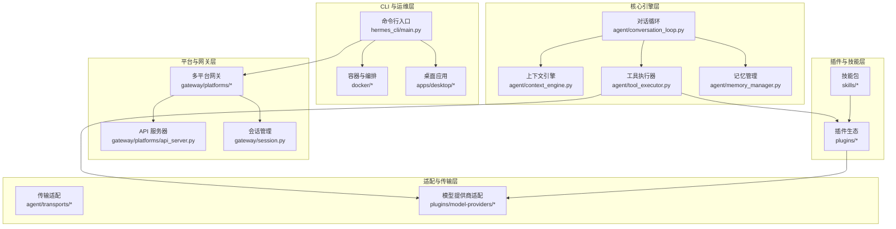
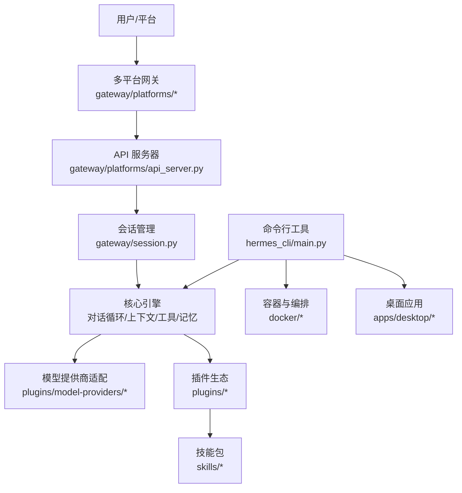
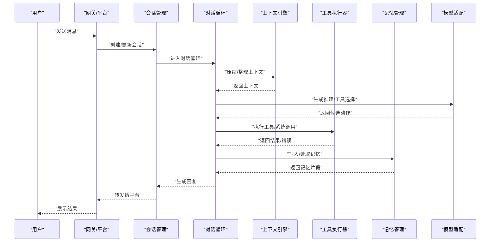
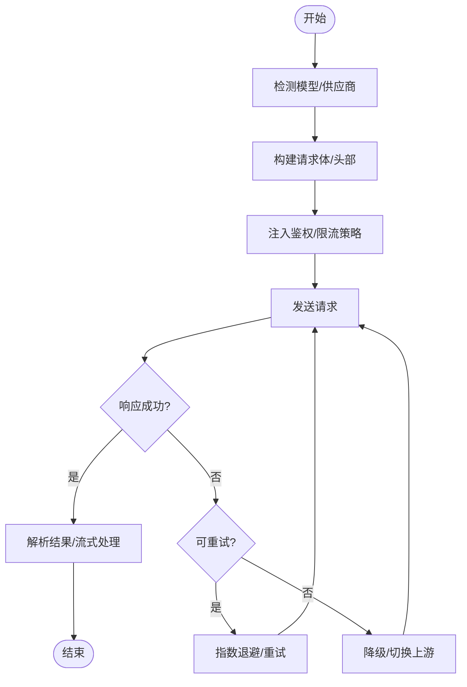
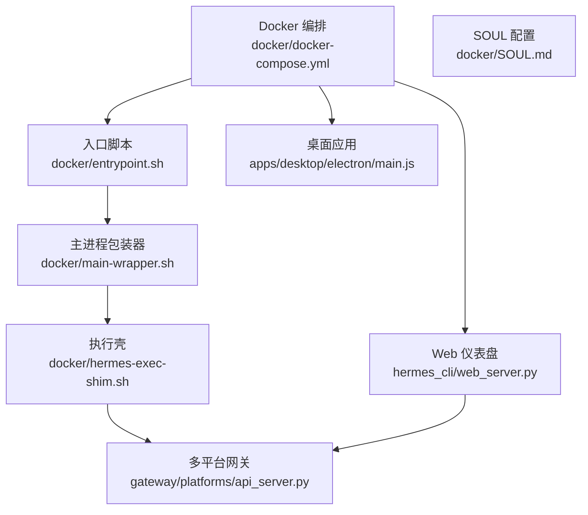
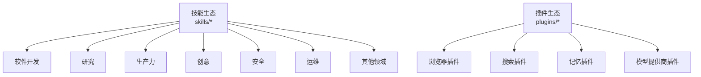
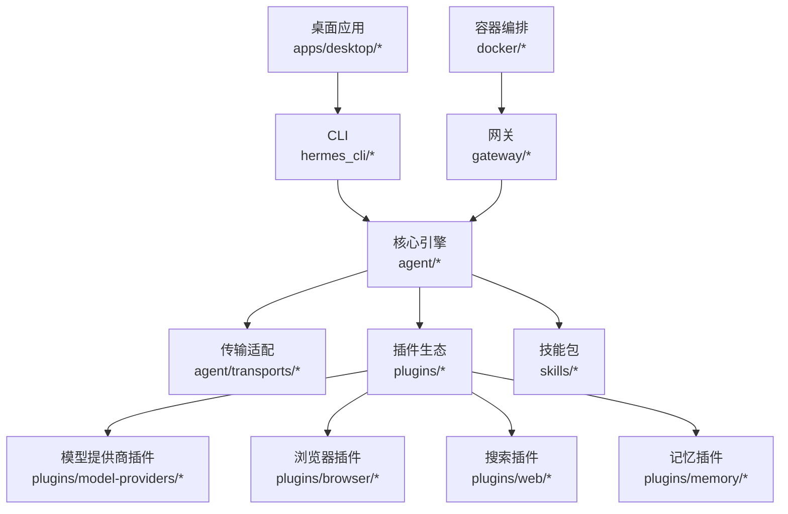

# 项目介绍

<cite>
**本文引用的文件**
- [README.md](file://README.md)
- [README.zh-CN.md](file://README.zh-CN.md)
- [hermes_constants.py](file://hermes_constants.py)
- [hermes_state.py](file://hermes_state.py)
- [agent/conversation_loop.py](file://agent/conversation_loop.py)
- [agent/context_engine.py](file://agent/context_engine.py)
- [agent/tool_executor.py](file://agent/tool_executor.py)
- [agent/memory_manager.py](file://agent/memory_manager.py)
- [gateway/platforms/api_server.py](file://gateway/platforms/api_server.py)
- [gateway/session.py](file://gateway/session.py)
- [hermes_cli/main.py](file://hermes_cli/main.py)
- [hermes_cli/commands.py](file://hermes_cli/commands.py)
- [docker/entrypoint.sh](file://docker/entrypoint.sh)
- [docker/main-wrapper.sh](file://docker/main-wrapper.sh)
- [docker/hermes-exec-shim.sh](file://docker/hermes-exec-shim.sh)
- [docker/SOUL.md](file://docker/SOUL.md)
- [docker/docker-compose.yml](file://docker/docker-compose.yml)
- [docker/docker-compose.windows.yml](file://docker/docker-compose.windows.yml)
- [apps/desktop/electron/main.js](file://apps/desktop/electron/main.js)
- [apps/desktop/src/index.tsx](file://apps/desktop/src/index.tsx)
- [plugins/model-providers/README.md](file://plugins/model-providers/README.md)
- [plugins/browser/README.md](file://plugins/browser/README.md)
- [plugins/web/README.md](file://plugins/web/README.md)
- [plugins/memory/README.md](file://plugins/memory/README.md)
- [skills/software-development/DESCRIPTION.md](file://skills/software-development/DESCRIPTION.md)
- [skills/research/DESCRIPTION.md](file://skills/research/DESCRIPTION.md)
- [skills/productivity/DESCRIPTION.md](file://skills/productivity/DESCRIPTION.md)
- [skills/creative/DESCRIPTION.md](file://skills/creative/DESCRIPTION.md)
- [skills/devops/DESCRIPTION.md](file://skills/devops/DESCRIPTION.md)
- [skills/security/DESCRIPTION.md](file://skills/security/DESCRIPTION.md)
- [skills/mlops/DESCRIPTION.md](file://skills/mlops/DESCRIPTION.md)
- [skills/email/DESCRIPTION.md](file://skills/email/DESCRIPTION.md)
- [skills/github/DESCRIPTION.md](file://skills/github/DESCRIPTION.md)
- [skills/social-media/DESCRIPTION.md](file://skills/social-media/DESCRIPTION.md)
- [skills/media/DESCRIPTION.md](file://skills/media/DESCRIPTION.md)
- [skills/note-taking/DESCRIPTION.md](file://skills/note-taking/DESCRIPTION.md)
- [skills/smart-home/DESCRIPTION.md](file://skills/smart-home/DESCRIPTION.md)
- [skills/data-science/DESCRIPTION.md](file://skills/data-science/DESCRIPTION.md)
- [skills/health/DESCRIPTION.md](file://skills/health/DESCRIPTION.md)
- [skills/gaming/DESCRIPTION.md](file://skills/gaming/DESCRIPTION.md)
- [skills/communication/DESCRIPTION.md](file://skills/communication/DESCRIPTION.md)
- [optional-skills/DESCRIPTION.md](file://optional-skills/DESCRIPTION.md)
- [hermes_cli/models.py](file://hermes_cli/models.py)
- [hermes_cli/model_catalog.py](file://hermes_cli/model_catalog.py)
- [hermes_cli/model_switch.py](file://hermes_cli/model_switch.py)
- [hermes_cli/model_normalize.py](file://hermes_cli/model_normalize.py)
- [hermes_cli/codex_models.py](file://hermes_cli/codex_models.py)
- [hermes_cli/model_tools.py](file://hermes_cli/model_tools.py)
- [hermes_cli/tools_config.py](file://hermes_cli/tools_config.py)
- [hermes_cli/skills_config.py](file://hermes_cli/skills_config.py)
- [hermes_cli/profiles.py](file://hermes_cli/profiles.py)
- [hermes_cli/profile_describer.py](file://hermes_cli/profile_describer.py)
- [hermes_cli/profile_distribution.py](file://hermes_cli/profile_distribution.py)
- [hermes_cli/inventory.py](file://hermes_cli/inventory.py)
- [hermes_cli/kanban.py](file://hermes_cli/kanban.py)
- [hermes_cli/kanban_db.py](file://hermes_cli/kanban_db.py)
- [hermes_cli/kanban_decompose.py](file://hermes_cli/kanban_decompose.py)
- [hermes_cli/kanban_swarm.py](file://hermes_cli/kanban_swarm.py)
- [hermes_cli/kanban_specify.py](file://hermes_cli/kanban_specify.py)
- [hermes_cli/kanban_diagnostics.py](file://hermes_cli/kanban_diagnostics.py)
- [hermes_cli/backup.py](file://hermes_cli/backup.py)
- [hermes_cli/cron.py](file://hermes_cli/cron.py)
- [hermes_cli/timeouts.py](file://hermes_cli/timeouts.py)
- [hermes_cli/psutil_android.py](file://hermes_cli/psutil_android.py)
- [hermes_cli/managed_uv.py](file://hermes_cli/managed_uv.py)
- [hermes_cli/container_boot.py](file://hermes_cli/container_boot.py)
- [hermes_cli/runtime_provider.py](file://hermes_cli/runtime_provider.py)
- [hermes_cli/service_manager.py](file://hermes_cli/service_manager.py)
- [hermes_cli/web_server.py](file://hermes_cli/web_server.py)
- [hermes_cli/dashboard_register.py](file://hermes_cli/dashboard_register.py)
- [hermes_cli/dashboard_auth/login_page.py](file://hermes_cli/dashboard_auth/login_page.py)
- [hermes_cli/dashboard_auth/cookies.py](file://hermes_cli/dashboard_auth/cookies.py)
- [hermes_cli/dashboard_auth/ws_tickets.py](file://hermes_cli/dashboard_auth/ws_tickets.py)
- [hermes_cli/proxy/cli.py](file://hermes_cli/proxy/cli.py)
- [hermes_cli/proxy/server.py](file://hermes_cli/proxy/server.py)
- [hermes_cli/browser_connect.py](file://hermes_cli/browser_connect.py)
- [hermes_cli/clipboard.py](file://hermes_cli/clipboard.py)
- [hermes_cli/tips.py](file://hermes_cli/tips.py)
- [hermes_cli/status.py](file://hermes_cli/status.py)
- [hermes_cli/logs.py](file://hermes_cli/logs.py)
- [hermes_cli/debug.py](file://hermes_cli/debug.py)
- [hermes_cli/doctor.py](file://hermes_cli/doctor.py)
- [hermes_cli/relaunch.py](file://hermes_cli/relaunch.py)
- [hermes_cli/uninstall.py](file://hermes_cli/uninstall.py)
- [hermes_cli/setup.py](file://hermes_cli/setup.py)
- [hermes_cli/build_info.py](file://hermes_cli/build_info.py)
- [hermes_cli/colors.py](file://hermes_cli/colors.py)
- [hermes_cli/banner.py](file://hermes_cli/banner.py)
- [hermes_cli/env_loader.py](file://hermes_cli/env_loader.py)
- [hermes_cli/azure_detect.py](file://hermes_cli/azure_detect.py)
- [hermes_cli/codex_runtime_switch.py](file://hermes_cli/codex_runtime_switch.py)
- [hermes_cli/codex_runtime_plugin_migration.py](file://hermes_cli/codex_runtime_plugin_migration.py)
- [hermes_cli/codex_models.py](file://hermes_cli/codex_models.py)
- [hermes_cli/xai_retirement.py](file://hermes_cli/xai_retirement.py)
- [hermes_cli/mcp_startup.py](file://hermes_cli/mcp_startup.py)
- [hermes_cli/mcp_config.py](file://hermes_cli/mcp_config.py)
- [hermes_cli/mcp_picker.py](file://hermes_cli/mcp_picker.py)
- [hermes_cli/mcp_catalog.py](file://hermes_cli/mcp_catalog.py)
- [hermes_cli/skin_engine.py](file://hermes_cli/skin_engine.py)
- [hermes_cli/memory_setup.py](file://hermes_cli/memory_setup.py)
- [hermes_cli/secret_prompt.py](file://hermes_cli/secret_prompt.py)
- [hermes_cli/secrets_cli.py](file://hermes_cli/secrets_cli.py)
- [hermes_cli/security_audit.py](file://hermes_cli/security_audit.py)
- [hermes_cli/security_advisories.py](file://hermes_cli/security_advisories.py)
- [hermes_cli/timeout.py](file://hermes_cli/timeout.py)
- [hermes_cli/pairing.py](file://hermes_cli/pairing.py)
- [hermes_cli/platforms.py](file://hermes_cli/platforms.py)
- [hermes_cli/plugins.py](file://hermes_cli/plugins.py)
- [hermes_cli/plugins_cmd.py](file://hermes_cli/plugins_cmd.py)
- [hermes_cli/portal_cli.py](file://hermes_cli/portal_cli.py)
- [hermes_cli/prompt_size.py](file://hermes_cli/prompt_size.py)
- [hermes_cli/providers.py](file://hermes_cli/providers.py)
- [hermes_cli/oneshot.py](file://hermes_cli/oneshot.py)
- [hermes_cli/send_cmd.py](file://hermes_cli/send_cmd.py)
- [hermes_cli/session_recap.py](file://hermes_cli/session_recap.py)
- [hermes_cli/voice.py](file://hermes_cli/voice.py)
- [hermes_cli/webhook.py](file://hermes_cli/webhook.py)
- [hermes_cli/claw.py](file://hermes_cli/claw.py)
- [hermes_cli/curses_ui.py](file://hermes_cli/curses_ui.py)
- [hermes_cli/stdio.py](file://hermes_cli/stdio.py)
- [hermes_cli/stdio.py](file://hermes_cli/stdio.py)
- [hermes_cli/stdio.py](file://hermes_cli/stdio.py)
- [hermes_cli/stdio.py](file://hermes_cli/stdio.py)
- [hermes_cli/stdio.py](file://hermes_cli/stdio.py)
- [hermes_cli/stdio.py](file://hermes_cli/stdio.py)
- [hermes_cli/stdio.py](file://hermes_cli/stdio.py)
- [hermes_cli/stdio.py](file://hermes_cli/stdio.py)
- [hermes_cli/stdio.py](file://hermes_cli/stdio.py)
- [hermes_cli/stdio.py](file://hermes_cli/stdio.py)
- [hermes_cli/stdio.py](file://hermes_cli/stdio.py)
- [hermes_cli/stdio.py](file://hermes_cli/stdio.py)
- [hermes_cli/stdio.py](file://hermes_cli/stdio.py)
- [hermes_cli/stdio.py](file://hermes_cli/stdio.py)
- [hermes_cli/stdio.py](file://hermes_cli/stdio.py)
- [hermes_cli/stdio.py](file://hermes_cli/stdio.py)
- [hermes_cli/stdio.py](file://hermes_cli/stdio.py)
- [hermes_cli/stdio.py](file://hermes_cli/stdio.py)
- [hermes_cli/stdio.py](file://hermes_cli/stdio.py)
- [hermes_cli/stdio.py](file://hermes_cli/stdio.py)
- [hermes_cli/stdio.py](file://hermes_cli/stdio.py)
- [hermes_cli/stdio.py](file://hermes_cli/stdio.py)
- [hermes_cli/stdio.py](file://hermes_cli/stdio.py)
- [hermes_cli/stdio.py](file://hermes_cli/stdio.py)
- [hermes_cli/stdio.py](file://hermes_cli/stdio.py)
- [hermes_cli/stdio.py](file://hermes_cli/stdio.py)
- [hermes_cli/stdio.py](file://hermes_cli/stdio.py)
- [hermes_cli/stdio.py](file://hermes_cli/stdio.py)
- [hermes_cli/stdio.py](file://hermes_cli/stdio.py)
- [her......](file://hermes_cli/stdio.py)
</cite>

## 目录
1. [引言](#引言)
2. [项目结构](#项目结构)
3. [核心组件](#核心组件)
4. [架构总览](#架构总览)
5. [详细组件分析](#详细组件分析)
6. [依赖关系分析](#依赖关系分析)
7. [性能考虑](#性能考虑)
8. [故障排查指南](#故障排查指南)
9. [结论](#结论)
10. [附录](#附录)

## 引言
Hermes Agent 是一个面向未来的自改进 AI 助手系统，旨在通过“内置学习循环”持续优化自身行为与表现，并以“跨平台部署能力”和“多模型支持”为核心优势，为个人开发者、企业团队与研究机构提供可扩展、可治理、可演进的智能体基础设施。它不仅是一个工具集合，更是一个“可自我迭代”的智能体平台：通过对话上下文压缩、轨迹学习、工具执行反馈与记忆增强，实现“用得越多越聪明”的闭环。

Hermes 的设计哲学强调：
- 可靠性：严格的错误分类、重试与限流策略，确保在复杂场景下的稳定运行。
- 可扩展性：模块化插件体系、MCP（Model Context Protocol）集成与多平台网关，适配从桌面到云端的多种环境。
- 可治理性：透明的工具调用、权限控制与审计日志，满足安全合规要求。
- 可演进性：内置学习循环与技能/工具生态，支持持续的功能扩展与能力升级。

与其他 AI 助手相比，Hermes 的独特之处在于：
- 内置学习循环：通过上下文压缩、轨迹学习与人工反馈，形成“使用—总结—优化”的闭环。
- 多模型统一抽象：对 OpenAI、Anthropic、Google、Azure、Bedrock 等多家模型提供一致的适配层，降低切换成本。
- 跨平台部署：支持容器、桌面应用、Web 仪表盘与多平台网关，覆盖本地开发、边缘计算与云端服务。
- 生态开放：丰富的技能与插件生态，涵盖研发、创作、生产力、安全、运维等多个领域。

## 项目结构
Hermes 采用分层与功能域结合的组织方式：
- 核心引擎层：对话循环、上下文压缩、工具执行、记忆管理等。
- 适配与传输层：对多家模型厂商的适配器与传输协议封装。
- 平台与网关层：多平台消息网关、HTTP API、桌面应用与 Web 仪表盘。
- CLI 与运维层：命令行工具、安装脚本、容器编排与服务管理。
- 插件与技能层：围绕浏览器、搜索、内存、模型提供商等领域的插件，以及按领域划分的技能包。

**图表来源**
- [agent/conversation_loop.py](file://agent/conversation_loop.py)
- [agent/context_engine.py](file://agent/context_engine.py)
- [agent/tool_executor.py](file://agent/tool_executor.py)
- [agent/memory_manager.py](file://agent/memory_manager.py)
- [gateway/platforms/api_server.py](file://gateway/platforms/api_server.py)
- [gateway/session.py](file://gateway/session.py)
- [hermes_cli/main.py](file://hermes_cli/main.py)
- [docker/entrypoint.sh](file://docker/entrypoint.sh)
- [apps/desktop/electron/main.js](file://apps/desktop/electron/main.js)
- [plugins/model-providers/README.md](file://plugins/model-providers/README.md)
- [skills/software-development/DESCRIPTION.md](file://skills/software-development/DESCRIPTION.md)

**章节来源**
- [README.md](file://README.md)
- [README.zh-CN.md](file://README.zh-CN.md)

## 核心组件
- 对话循环（Conversation Loop）
  - 负责驱动一轮轮对话，协调上下文压缩、工具调度与结果处理，确保长程交互的连贯性与效率。
  - 关键职责：消息路由、工具选择与执行、上下文窗口管理、异常恢复与重试。
  - 参考路径：[对话循环实现](file://agent/conversation_loop.py)

- 上下文引擎（Context Engine）
  - 提供上下文压缩、历史摘要与引用管理，避免超长提示导致的性能与成本问题。
  - 关键职责：令牌预算控制、压缩算法选择、媒体与代码片段处理。
  - 参考路径：[上下文引擎实现](file://agent/context_engine.py)

- 工具执行器（Tool Executor）
  - 统一调度外部工具与插件，执行搜索、浏览器操作、文件处理、系统命令等任务。
  - 关键职责：工具定义解析、参数校验、并发控制、结果归类与可视化。
  - 参考路径：[工具执行器实现](file://agent/tool_executor.py)

- 记忆管理（Memory Manager）
  - 集成多种记忆提供方，支持短期与长期记忆的协同，提升个性化与一致性体验。
  - 关键职责：记忆写入/读取、去重与压缩、隐私保护与持久化。
  - 参考路径：[记忆管理实现](file://agent/memory_manager.py)

- 模型适配与传输（Transports & Providers）
  - 对接多家模型供应商，屏蔽差异并提供统一接口；支持流式响应、鉴权与速率限制。
  - 关键职责：请求构建、头部注入、错误映射、重试与退避。
  - 参考路径：[传输适配](file://agent/transports/)，[模型提供商插件](file://plugins/model-providers/README.md)

- 多平台网关（Gateway）
  - 支持 Slack、Telegram、邮件、Webhook 等平台的消息接入与回传，统一会话状态与事件流。
  - 关键职责：平台协议适配、消息分发、身份验证与权限控制。
  - 参考路径：[API 服务器](file://gateway/platforms/api_server.py)，[会话管理](file://gateway/session.py)

- 命令行工具（CLI）
  - 提供安装、配置、备份、迁移、诊断与服务管理等全生命周期运维能力。
  - 关键职责：子命令解析、环境探测、容器启动、服务注册与健康检查。
  - 参考路径：[CLI 入口](file://hermes_cli/main.py)，[常用命令](file://hermes_cli/commands.py)

**章节来源**
- [agent/conversation_loop.py](file://agent/conversation_loop.py)
- [agent/context_engine.py](file://agent/context_engine.py)
- [agent/tool_executor.py](file://agent/tool_executor.py)
- [agent/memory_manager.py](file://agent/memory_manager.py)
- [gateway/platforms/api_server.py](file://gateway/platforms/api_server.py)
- [gateway/session.py](file://gateway/session.py)
- [hermes_cli/main.py](file://hermes_cli/main.py)
- [hermes_cli/commands.py](file://hermes_cli/commands.py)

## 架构总览
Hermes 的整体架构围绕“对话循环”展开，向上连接多平台网关与 CLI，向下对接模型适配层与插件生态，形成“输入—推理—行动—反馈”的闭环。

**图表来源**
- [gateway/platforms/api_server.py](file://gateway/platforms/api_server.py)
- [gateway/session.py](file://gateway/session.py)
- [hermes_cli/main.py](file://hermes_cli/main.py)
- [agent/conversation_loop.py](file://agent/conversation_loop.py)
- [plugins/model-providers/README.md](file://plugins/model-providers/README.md)
- [docker/entrypoint.sh](file://docker/entrypoint.sh)
- [apps/desktop/electron/main.js](file://apps/desktop/electron/main.js)

## 详细组件分析

### 对话循环（Conversation Loop）
对话循环是 Hermes 的中枢，负责将“输入—推理—行动—反馈”串联为一个可自我优化的流程。其典型工作流如下：

- 设计要点
  - 上下文压缩：在有限的上下文窗口内保留关键信息，减少冗余与噪声。
  - 工具选择：基于任务类型与可用工具动态决策，支持链式与并行执行。
  - 记忆融合：将历史对话与知识库结合，提升个性化与一致性。
  - 错误处理：对工具失败、网络抖动与模型限流进行降级与重试。

- 参考路径
  - [对话循环实现](file://agent/conversation_loop.py)
  - [上下文引擎实现](file://agent/context_engine.py)
  - [工具执行器实现](file://agent/tool_executor.py)
  - [记忆管理实现](file://agent/memory_manager.py)

**图表来源**
- [agent/conversation_loop.py](file://agent/conversation_loop.py)
- [agent/context_engine.py](file://agent/context_engine.py)
- [agent/tool_executor.py](file://agent/tool_executor.py)
- [agent/memory_manager.py](file://agent/memory_manager.py)

**章节来源**
- [agent/conversation_loop.py](file://agent/conversation_loop.py)
- [agent/context_engine.py](file://agent/context_engine.py)
- [agent/tool_executor.py](file://agent/tool_executor.py)
- [agent/memory_manager.py](file://agent/memory_manager.py)

### 多模型支持与适配
Hermes 通过“传输适配层”与“模型提供商插件”实现对多家模型的统一接入，具备以下能力：
- 统一接口：屏蔽不同厂商的 API 差异，提供一致的请求/响应格式。
- 流式输出：支持增量返回，改善用户体验。
- 鉴权与限流：自动注入认证头、处理速率限制与退避策略。
- 多源路由：根据成本、延迟与可用性动态选择最佳上游。

- 参考路径
  - [传输适配实现](file://agent/transports/)
  - [模型提供商插件](file://plugins/model-providers/README.md)

**图表来源**
- [agent/transports/chat_completions.py](file://agent/transports/chat_completions.py)
- [plugins/model-providers/README.md](file://plugins/model-providers/README.md)

**章节来源**
- [agent/transports/chat_completions.py](file://agent/transports/chat_completions.py)
- [plugins/model-providers/README.md](file://plugins/model-providers/README.md)

### 跨平台部署与运行时
Hermes 支持多种运行环境与部署形态：
- 容器化：通过入口脚本与包装器实现进程生命周期管理与资源隔离。
- 桌面应用：基于 Electron 的桌面客户端，提供本地化与离线能力。
- Web 仪表盘：通过 CLI 启动 Web 服务，实现可视化配置与监控。
- 多平台网关：统一接入 Slack、Telegram、邮件、Webhook 等平台。

- 参考路径
  - [容器编排](file://docker/docker-compose.yml)
  - [入口脚本](file://docker/entrypoint.sh)
  - [主进程包装器](file://docker/main-wrapper.sh)
  - [执行壳](file://docker/hermes-exec-shim.sh)
  - [SOUL 配置](file://docker/SOUL.md)
  - [桌面应用入口](file://apps/desktop/electron/main.js)
  - [Web 服务器](file://hermes_cli/web_server.py)
  - [API 服务器](file://gateway/platforms/api_server.py)

**图表来源**
- [docker/docker-compose.yml](file://docker/docker-compose.yml)
- [docker/entrypoint.sh](file://docker/entrypoint.sh)
- [docker/main-wrapper.sh](file://docker/main-wrapper.sh)
- [docker/hermes-exec-shim.sh](file://docker/hermes-exec-shim.sh)
- [docker/SOUL.md](file://docker/SOUL.md)
- [apps/desktop/electron/main.js](file://apps/desktop/electron/main.js)
- [hermes_cli/web_server.py](file://hermes_cli/web_server.py)
- [gateway/platforms/api_server.py](file://gateway/platforms/api_server.py)

**章节来源**
- [docker/docker-compose.yml](file://docker/docker-compose.yml)
- [docker/entrypoint.sh](file://docker/entrypoint.sh)
- [docker/main-wrapper.sh](file://docker/main-wrapper.sh)
- [docker/hermes-exec-shim.sh](file://docker/hermes-exec-shim.sh)
- [docker/SOUL.md](file://docker/SOUL.md)
- [apps/desktop/electron/main.js](file://apps/desktop/electron/main.js)
- [hermes_cli/web_server.py](file://hermes_cli/web_server.py)
- [gateway/platforms/api_server.py](file://gateway/platforms/api_server.py)

### 技能与插件生态
Hermes 将能力拆分为“技能”和“插件”两个维度：
- 技能（Skills）：按领域组织的能力集合，如软件开发、研究、生产力、创意、安全、运维等。
- 插件（Plugins）：对浏览器、搜索、内存、模型提供商等的扩展，提供即插即用的工具集。

- 参考路径
  - [技能生态概览](file://skills/software-development/DESCRIPTION.md)
  - [研究技能](file://skills/research/DESCRIPTION.md)
  - [生产力技能](file://skills/productivity/DESCRIPTION.md)
  - [创意技能](file://skills/creative/DESCRIPTION.md)
  - [安全技能](file://skills/security/DESCRIPTION.md)
  - [运维技能](file://skills/devops/DESCRIPTION.md)
  - [浏览器插件](file://plugins/browser/README.md)
  - [搜索插件](file://plugins/web/README.md)
  - [记忆插件](file://plugins/memory/README.md)
  - [模型提供商插件](file://plugins/model-providers/README.md)

**图表来源**
- [skills/software-development/DESCRIPTION.md](file://skills/software-development/DESCRIPTION.md)
- [skills/research/DESCRIPTION.md](file://skills/research/DESCRIPTION.md)
- [skills/productivity/DESCRIPTION.md](file://skills/productivity/DESCRIPTION.md)
- [skills/creative/DESCRIPTION.md](file://skills/creative/DESCRIPTION.md)
- [skills/security/DESCRIPTION.md](file://skills/security/DESCRIPTION.md)
- [skills/devops/DESCRIPTION.md](file://skills/devops/DESCRIPTION.md)
- [plugins/browser/README.md](file://plugins/browser/README.md)
- [plugins/web/README.md](file://plugins/web/README.md)
- [plugins/memory/README.md](file://plugins/memory/README.md)
- [plugins/model-providers/README.md](file://plugins/model-providers/README.md)

**章节来源**
- [skills/software-development/DESCRIPTION.md](file://skills/software-development/DESCRIPTION.md)
- [skills/research/DESCRIPTION.md](file://skills/research/DESCRIPTION.md)
- [skills/productivity/DESCRIPTION.md](file://skills/productivity/DESCRIPTION.md)
- [skills/creative/DESCRIPTION.md](file://skills/creative/DESCRIPTION.md)
- [skills/security/DESCRIPTION.md](file://skills/security/DESCRIPTION.md)
- [skills/devops/DESCRIPTION.md](file://skills/devops/DESCRIPTION.md)
- [plugins/browser/README.md](file://plugins/browser/README.md)
- [plugins/web/README.md](file://plugins/web/README.md)
- [plugins/memory/README.md](file://plugins/memory/README.md)
- [plugins/model-providers/README.md](file://plugins/model-providers/README.md)

## 依赖关系分析
Hermes 的依赖关系体现了清晰的分层与解耦：
- 上层依赖下层：网关与 CLI 依赖核心引擎；核心引擎依赖适配层与插件生态。
- 横向扩展：通过插件与技能实现功能扩展，不侵入核心逻辑。
- 外部依赖：容器运行时、桌面框架、平台 SDK、模型提供商 API。

**图表来源**
- [hermes_cli/main.py](file://hermes_cli/main.py)
- [agent/conversation_loop.py](file://agent/conversation_loop.py)
- [agent/transports/chat_completions.py](file://agent/transports/chat_completions.py)
- [plugins/model-providers/README.md](file://plugins/model-providers/README.md)
- [plugins/browser/README.md](file://plugins/browser/README.md)
- [plugins/web/README.md](file://plugins/web/README.md)
- [plugins/memory/README.md](file://plugins/memory/README.md)
- [docker/docker-compose.yml](file://docker/docker-compose.yml)
- [apps/desktop/electron/main.js](file://apps/desktop/electron/main.js)

**章节来源**
- [hermes_cli/main.py](file://hermes_cli/main.py)
- [agent/conversation_loop.py](file://agent/conversation_loop.py)
- [agent/transports/chat_completions.py](file://agent/transports/chat_completions.py)
- [plugins/model-providers/README.md](file://plugins/model-providers/README.md)
- [plugins/browser/README.md](file://plugins/browser/README.md)
- [plugins/web/README.md](file://plugins/web/README.md)
- [plugins/memory/README.md](file://plugins/memory/README.md)
- [docker/docker-compose.yml](file://docker/docker-compose.yml)
- [apps/desktop/electron/main.js](file://apps/desktop/electron/main.js)

## 性能考虑
- 上下文压缩与令牌预算：通过上下文引擎与迭代预算控制，避免超长提示带来的延迟与成本。
- 工具执行并发：工具执行器支持并行与串行组合，结合队列与限流，平衡吞吐与稳定性。
- 流式响应：传输适配层对流式输出进行缓冲与合并，减少网络往返与渲染抖动。
- 记忆访问优化：记忆管理对热点数据进行缓存与去重，降低重复检索开销。
- 运行时隔离：容器与进程包装器确保资源边界与优先级，避免相互干扰。

[本节为通用性能建议，无需特定文件引用]

## 故障排查指南
- 常见问题定位
  - 模型调用失败：检查鉴权头、速率限制与退避策略是否生效；查看重试与降级逻辑。
  - 工具执行异常：确认工具定义、参数校验与权限设置；查看工具结果分类与错误归因。
  - 上下文溢出：调整压缩策略或减少历史片段；检查媒体与代码片段的令牌估算。
  - 记忆写入失败：核对记忆提供方可用性与配置；检查隐私与去重策略。
  - 网关连接问题：验证平台凭据与回调地址；检查会话状态与事件投递。
  - 容器/桌面启动失败：查看入口脚本与包装器日志；确认端口占用与权限。

- 排查工具与入口
  - CLI 诊断：使用 doctor、logs、status 等命令快速定位问题。
  - 仪表盘：通过 Web 服务查看实时状态与指标。
  - 日志与审计：启用详细日志与审计开关，记录关键事件与错误堆栈。

**章节来源**
- [hermes_cli/doctor.py](file://hermes_cli/doctor.py)
- [hermes_cli/logs.py](file://hermes_cli/logs.py)
- [hermes_cli/status.py](file://hermes_cli/status.py)
- [hermes_cli/debug.py](file://hermes_cli/debug.py)
- [hermes_cli/web_server.py](file://hermes_cli/web_server.py)

## 结论
Hermes Agent 以“自改进”为核心理念，通过对话循环、上下文压缩、工具执行与记忆融合，构建了可自我优化的智能体闭环。依托多模型统一抽象与跨平台部署能力，Hermes 能够在复杂多变的现实场景中保持稳定与高效。对于初学者，Hermes 提供直观的 CLI 与桌面应用入口；对于有经验的开发者，Hermes 提供开放的插件与技能生态、完善的可观测性与治理能力，便于二次开发与深度定制。

[本节为总结性内容，无需特定文件引用]

## 附录
- 技术愿景
  - 成为“可自我迭代”的智能体基础设施，持续提升理解、推理与行动能力。
  - 打造“可治理、可审计、可演进”的 AI 助手平台，满足企业级需求。
- 应用场景
  - 个人助理：自动化日常任务、知识管理与创作辅助。
  - 团队协作：跨平台消息网关、项目看板与会议管道。
  - 研究探索：文献检索、实验记录与报告生成。
  - 安全运营：威胁情报、漏洞扫描与应急处置。
- 目标用户
  - 开发者与工程师：需要智能编码、调试与运维辅助。
  - 研究人员与学生：需要资料检索、笔记整理与论文写作。
  - 产品经理与运营：需要需求分解、任务编排与进度跟踪。
  - 安全与运维团队：需要态势感知、事件处置与知识沉淀。

[本节为概念性内容，无需特定文件引用]