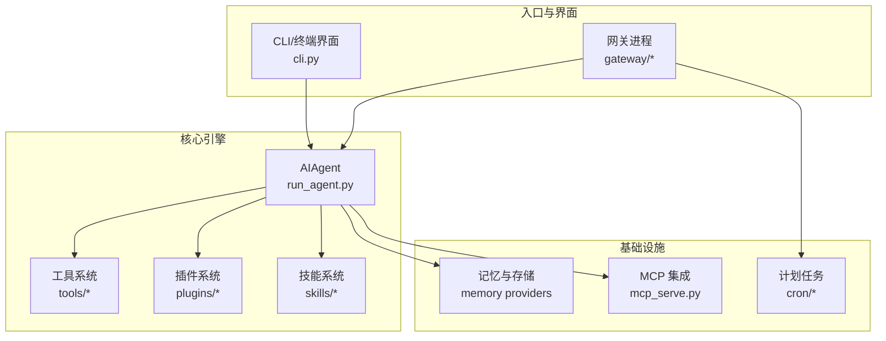
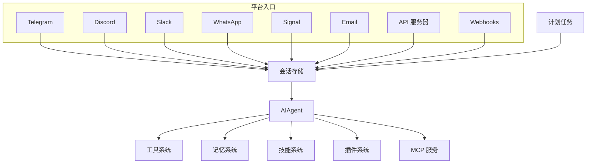
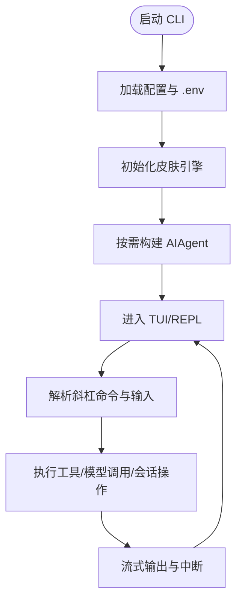
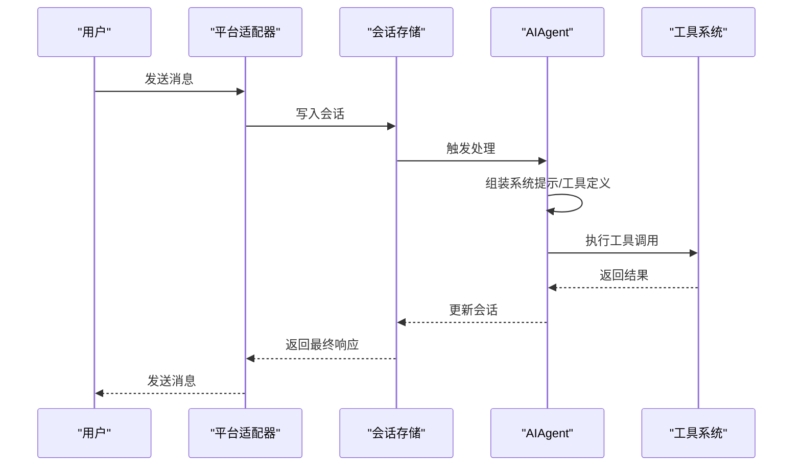
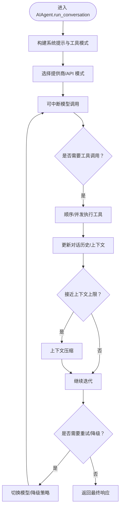
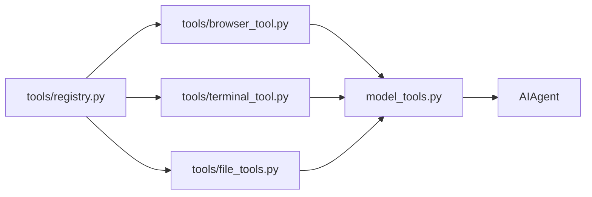
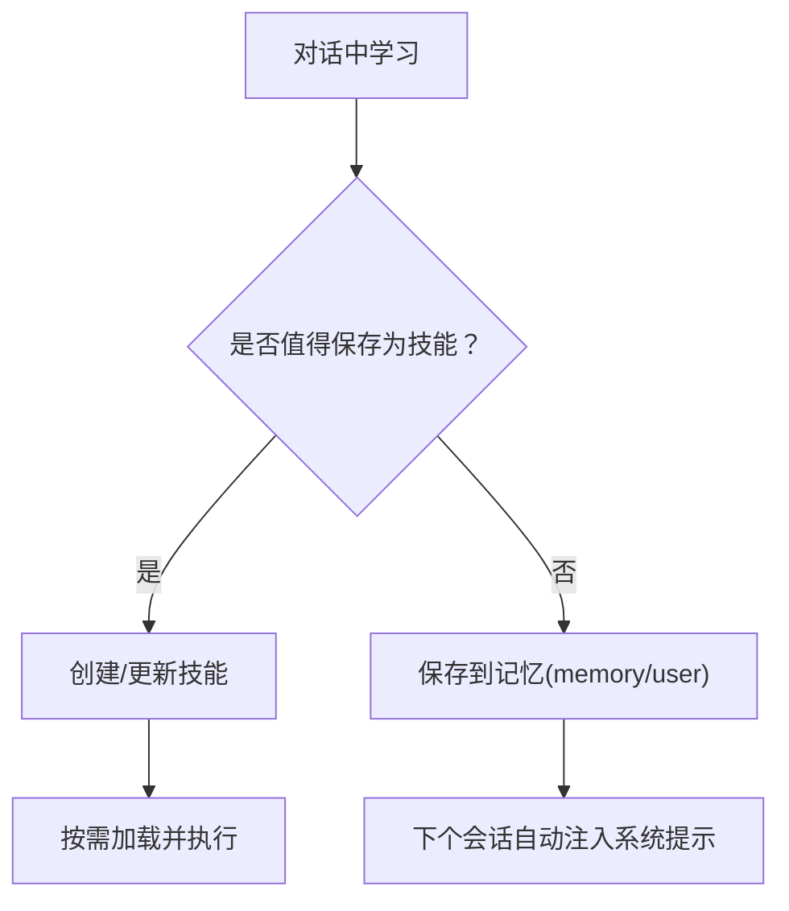
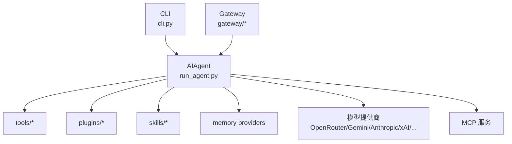

# 项目概述

<cite>
**本文档引用的文件**
- [README.md](file://README.md)
- [hermes_bootstrap.py](file://hermes_bootstrap.py)
- [cli.py](file://cli.py)
- [run_agent.py](file://run_agent.py)
- [agent/__init__.py](file://agent/__init__.py)
- [website/docs/developer-guide/architecture.md](file://website/docs/developer-guide/architecture.md)
- [website/docs/developer-guide/agent-loop.md](file://website/docs/developer-guide/agent-loop.md)
- [website/docs/user-guide/features/memory.md](file://website/docs/user-guide/features/memory.md)
- [website/docs/user-guide/features/memory-providers.md](file://website/docs/user-guide/features/memory-providers.md)
- [website/docs/user-guide/messaging/index.md](file://website/docs/user-guide/messaging/index.md)
- [website/docs/developer-guide/gateway-internals.md](file://website/docs/developer-guide/gateway-internals.md)
- [website/docs/reference/tools-reference.md](file://website/docs/reference/tools-reference.md)
- [website/i18n/zh-Hans/docusaurus-plugin-content-docs/current/guides/work-with-skills.md](file://website/i18n/zh-Hans/docusaurus-plugin-content-docs/current/guides/work-with-skills.md)
- [website/i18n/zh-Hans/docusaurus-plugin-content-docs/current/guides/tips.md](file://website/i18n/zh-Hans/docusaurus-plugin-content-docs/current/guides/tips.md)
- [tests/agent/test_models_dev.py](file://tests/agent/test_models_dev.py)
- [tests/hermes_cli/test_gemini_provider.py](file://tests/hermes_cli/test_gemini_provider.py)
</cite>

## 目录
1. [引言](#引言)
2. [项目结构](#项目结构)
3. [核心组件](#核心组件)
4. [架构总览](#架构总览)
5. [详细组件分析](#详细组件分析)
6. [依赖分析](#依赖分析)
7. [性能考虑](#性能考虑)
8. [故障排查指南](#故障排查指南)
9. [结论](#结论)
10. [附录](#附录)

## 引言
Hermes Agent 是由 Nous Research 开发的“自改进 AI 助手”。其核心价值主张在于内置的“学习循环”：能够从经验中创建技能、在使用中自我改进、主动持久化知识、搜索过往对话、构建跨会话加深的用户建模，并支持多平台接入与多终端后端运行。项目强调“平台无关的核心、可观测的执行、可中断的处理”，并通过模块化设计实现松耦合与可扩展。

Hermes 支持任意模型与工具，提供 CLI 与网关两种入口，覆盖 Telegram、Discord、Slack、WhatsApp、Signal、邮件等 20+ 平台，具备计划任务调度、子代理并行、跨平台会话延续、研究级轨迹生成与压缩等功能。安装与配置通过一键脚本完成，支持本地、Docker、SSH、Singularity、Modal、Daytona 等多种终端后端，亦可在闲置时实现无服务器持久化与按需唤醒。

**章节来源**
- [README.md:15-27](file://README.md#L15-L27)
- [README.md:103-119](file://README.md#L103-L119)

## 项目结构
Hermes 采用分层与模块化组织方式：
- 入口与 CLI：hermes 命令行界面，提供 TUI、工具集选择、富格式输出与交互式 REPL。
- 网关与平台适配：统一的网关进程，负责多平台消息接入、会话存储与调度。
- Agent 核心：run_agent.py 中的 AIAgent 类，负责对话循环、工具调用、上下文压缩、重试与降级。
- 工具系统：tools/ 下的各类工具与工具集注册机制，支持浏览器、终端、文件、多媒体、语音、视频、图像生成等。
- 插件与技能：plugins/ 与 skills/ 提供能力扩展与可复用工作流。
- 配置与环境：hermes_cli/config、hermes_cli/env_loader、.env 与配置文件协同，桥接 CLI/Gateway/Agent 的运行参数。
- 文档与国际化：website/docs 与 i18n 提供详尽的开发者与用户指南。

**图表来源**
- [website/docs/user-guide/messaging/index.md:48-107](file://website/docs/user-guide/messaging/index.md#L48-L107)

**章节来源**
- [README.md:31-78](file://README.md#L31-L78)
- [website/docs/developer-guide/architecture.md:254-278](file://website/docs/developer-guide/architecture.md#L254-L278)

## 核心组件
- CLI 与 TUI：提供多行编辑、斜杠命令补全、会话历史、中断重定向与工具输出流式展示。
- 网关与平台适配：统一的消息入口，支持 20+ 平台，具备会话存储、定时器、安全策略与电路断路器。
- AIAgent：对话循环核心，负责系统提示组装、API 模式选择、可中断模型调用、工具执行、上下文压缩、迭代预算与内存刷新。
- 工具系统：工具注册与发现机制，按工具集动态装配，支持并发执行与路径重叠检测。
- 技能系统：程序性知识的自动生成与改进，支持跨平台启用/禁用与 Hub 安装。
- 记忆系统：两类记忆（Agent 个人笔记与用户画像）自动注入系统提示，容量有限并支持合并与替换。
- 终端后端：本地、Docker、SSH、Singularity、Modal、Daytona，支持容器资源与持久化。
- 研究与批处理：轨迹生成、压缩与训练准备，便于下一代工具调用模型的训练。

**章节来源**
- [README.md:19-27](file://README.md#L19-L27)
- [website/docs/user-guide/features/memory.md:41-105](file://website/docs/user-guide/features/memory.md#L41-L105)
- [website/docs/developer-guide/agent-loop.md:7-39](file://website/docs/developer-guide/agent-loop.md#L7-L39)

## 架构总览
Hermes 的总体架构围绕“平台无关的核心引擎 + 多入口 + 松耦合扩展”的设计原则展开。CLI 与网关共享同一 AIAgent 实现，平台差异由入口与适配器处理；工具系统通过注册机制自动发现；记忆与技能提供长期知识与流程复用；计划任务与子代理增强自动化与并行能力。

**图表来源**
- [website/docs/user-guide/messaging/index.md:48-107](file://website/docs/user-guide/messaging/index.md#L48-L107)

**章节来源**
- [website/docs/developer-guide/architecture.md:254-278](file://website/docs/developer-guide/architecture.md#L254-L278)
- [website/docs/developer-guide/gateway-internals.md:144-172](file://website/docs/developer-guide/gateway-internals.md#L144-L172)

## 详细组件分析

### CLI 与 TUI（hermes 命令）
- 设计目标：提供真实终端界面，支持多行编辑、斜杠命令、会话历史、中断重定向、工具输出流式展示。
- 关键特性：配置加载（用户/项目级）、环境变量桥接、皮肤引擎、工具预览长度、延迟 SDK 补丁以优化冷启动。
- 安全与体验：隐藏启动日志、加载 .env、按平台导出终端后端参数、可选脱敏敏感信息。

**图表来源**
- [cli.py:354-698](file://cli.py#L354-L698)

**章节来源**
- [cli.py:15-120](file://cli.py#L15-L120)
- [cli.py:354-698](file://cli.py#L354-L698)

### 网关与平台适配
- 平台适配器：Telegram、Discord、Slack、WhatsApp、Signal、Matrix、Mattermost、Email、SMS、DingTalk、Feishu/Lark、WeCom、Weixin、BlueBubbles、QQ、Yuanbao、Microsoft Teams、Google Chat、LINE、ntfy 等。
- 架构：每个平台适配器负责接收消息、路由至会话存储、触发 AIAgent 处理；网关内置计划任务每 60 秒扫描待执行任务。
- 安全：默认拒绝未在白名单或未通过 DM 配对的用户；支持管理员/普通用户分级与命令权限控制；支持电路断路器与暂停/恢复。

**图表来源**
- [website/docs/user-guide/messaging/index.md:48-107](file://website/docs/user-guide/messaging/index.md#L48-L107)

**章节来源**
- [website/docs/user-guide/messaging/index.md:17-500](file://website/docs/user-guide/messaging/index.md#L17-L500)
- [website/docs/developer-guide/gateway-internals.md:144-172](file://website/docs/developer-guide/gateway-internals.md#L144-L172)

### AIAgent 对话循环（run_agent.py）
- 职责：组装系统提示与工具模式、选择正确提供商/API 模式、可中断模型调用、顺序或并发执行工具、维护对话历史、压缩上下文、重试与降级、跟踪迭代预算、在上下文丢失前刷新持久化记忆。
- 两个入口：chat() 与 run_conversation()，后者返回消息、元数据与用量统计。
- 设计原则：提示稳定性、可观测执行、可中断、平台无关核心、松耦合、配置隔离。

**图表来源**
- [website/docs/developer-guide/agent-loop.md:7-39](file://website/docs/developer-guide/agent-loop.md#L7-L39)

**章节来源**
- [website/docs/developer-guide/agent-loop.md:1-39](file://website/docs/developer-guide/agent-loop.md#L1-L39)
- [run_agent.py:1-200](file://run_agent.py#L1-L200)

### 工具系统与工具集
- 注册机制：tools/registry.py 无依赖，被所有工具文件在导入时调用 registry.register() 自动发现。
- 工具集：按功能分组（如 browser、terminal、web、image 等），通过 toolsets.py 解析与装配。
- 浏览器工具集：包含 browser_navigate、browser_snapshot、browser_click、browser_type、browser_console、browser_vision 等，支持页面导航、快照、点击、输入、控制台与视觉分析。

**图表来源**
- [website/docs/developer-guide/architecture.md:265-276](file://website/docs/developer-guide/architecture.md#L265-L276)
- [website/docs/reference/tools-reference.md:17-30](file://website/docs/reference/tools-reference.md#L17-L30)

**章节来源**
- [website/docs/developer-guide/architecture.md:254-278](file://website/docs/developer-guide/architecture.md#L254-L278)
- [website/docs/reference/tools-reference.md:17-30](file://website/docs/reference/tools-reference.md#L17-L30)

### 记忆与技能系统
- 记忆：两类目标（memory 与 user），自动注入系统提示，容量有限并支持合并与替换；会话期间修改即时落盘但不改变当前会话的系统提示注入。
- 技能：程序性知识，按需加载，适合 5 步以上且会重复执行的任务；支持跨平台启用/禁用与 Hub 安装；建议聚焦具体场景，让 Agent 主动创建技能。

**图表来源**
- [website/i18n/zh-Hans/docusaurus-plugin-content-docs/current/guides/work-with-skills.md:246-282](file://website/i18n/zh-Hans/docusaurus-plugin-content-docs/current/guides/work-with-skills.md#L246-L282)
- [website/docs/user-guide/features/memory.md:41-105](file://website/docs/user-guide/features/memory.md#L41-L105)

**章节来源**
- [website/docs/user-guide/features/memory.md:41-105](file://website/docs/user-guide/features/memory.md#L41-L105)
- [website/i18n/zh-Hans/docusaurus-plugin-content-docs/current/guides/work-with-skills.md:246-282](file://website/i18n/zh-Hans/docusaurus-plugin-content-docs/current/guides/work-with-skills.md#L246-L282)

### 终端后端与运行环境
- 支持本地、Docker、SSH、Singularity、Modal、Daytona；非本地后端默认不导出 CWD，避免错误的主机工作目录记录。
- 环境变量桥接：CLI 将终端配置映射到环境变量（如 TERMINAL_ENV、TERMINAL_CWD、TERMINAL_TIMEOUT 等），确保工具与运行时感知一致。

**章节来源**
- [cli.py:560-634](file://cli.py#L560-L634)
- [run_agent.py:67-89](file://run_agent.py#L67-L89)

### Windows UTF-8 启动引导（hermes_bootstrap.py）
- 目标：修复 Windows 上 Python stdio 与子进程编码问题，设置 PYTHONUTF8 与 PYTHONIOENCODING，重新配置 stdout/stderr 为 UTF-8。
- 行为：仅在 Windows 生效，POSIX 系统保持原样；幂等，可多次调用。

**章节来源**
- [hermes_bootstrap.py:1-130](file://hermes_bootstrap.py#L1-L130)

## 依赖分析
- 组件内聚与解耦：工具注册在导入期完成，无需手动维护清单；平台差异集中在入口与适配器，核心 Agent 保持稳定。
- 外部依赖与集成点：OpenAI SDK（延迟导入以优化冷启动）、MCP 服务、模型提供商（OpenRouter、Anthropic、Gemini、xAI、MiniMax 等）、浏览器云服务、语音/图像/视频生成服务。
- 风险与循环依赖：通过注册模式与配置桥接避免硬依赖；测试覆盖提供回归保障。

**图表来源**
- [website/docs/developer-guide/architecture.md:265-276](file://website/docs/developer-guide/architecture.md#L265-L276)
- [tests/hermes_cli/test_gemini_provider.py:99-160](file://tests/hermes_cli/test_gemini_provider.py#L99-L160)
- [tests/agent/test_models_dev.py:43-91](file://tests/agent/test_models_dev.py#L43-L91)

**章节来源**
- [website/docs/developer-guide/architecture.md:254-278](file://website/docs/developer-guide/architecture.md#L254-L278)
- [tests/hermes_cli/test_gemini_provider.py:99-160](file://tests/hermes_cli/test_gemini_provider.py#L99-L160)
- [tests/agent/test_models_dev.py:43-91](file://tests/agent/test_models_dev.py#L43-L91)

## 性能考虑
- 提示稳定性：保持系统提示不变可命中 LLM 前缀缓存，降低后续消息成本。
- 工具并发：工具批量可并行执行，减少端到端等待时间。
- 上下文压缩：接近上下文上限时自动压缩，避免截断与失败。
- 冷启动优化：OpenAI SDK 延迟导入、HTTPx 删除钩子中和、最小化导入链。
- 运行时隔离：容器与持久化后端在闲置时休眠，按需唤醒，节省成本。

**章节来源**
- [website/i18n/zh-Hans/docusaurus-plugin-content-docs/current/guides/tips.md:128-132](file://website/i18n/zh-Hans/docusaurus-plugin-content-docs/current/guides/tips.md#L128-L132)
- [cli.py:734-792](file://cli.py#L734-L792)

## 故障排查指南
- 网关平台异常：检查 gateway 日志与 circuit breaker 状态，确认上游健康后再恢复；使用 /platform list 查看状态与最后原因。
- 安全与访问控制：若被拒，检查允许用户列表与 DM 配对；必要时调整 allowlist 或开启允许所有用户（不推荐）。
- 环境变量与配置：确认 .env 与配置文件桥接是否生效；使用 hermes doctor 排查常见问题。
- 记忆与技能：记忆为冻结快照，会话中修改不会立即反映在系统提示中，需等待下个会话；技能过大可能影响加载成本，建议聚焦具体场景。

**章节来源**
- [website/docs/user-guide/messaging/index.md:475-500](file://website/docs/user-guide/messaging/index.md#L475-L500)
- [website/i18n/zh-Hans/docusaurus-plugin-content-docs/current/guides/tips.md:124-126](file://website/i18n/zh-Hans/docusaurus-plugin-content-docs/current/guides/tips.md#L124-L126)

## 结论
Hermes Agent 通过“平台无关的核心引擎 + 多入口 + 松耦合扩展”的架构，实现了从 CLI 到多平台网关的一致体验，结合工具系统、记忆与技能、计划任务与子代理，形成可自改进的智能体闭环。其设计兼顾易用性与可扩展性，既适合初学者快速上手，也为有经验的开发者提供了深入定制的空间。

## 附录
- 快速安装与入门：Linux/macOS/WSL2/Termux 与 Windows（PowerShell）一键安装；安装后即可启动聊天。
- 文档与社区：完整文档站点、Discord 社区、Skills Hub、贡献指南与 Issues 页面。
- 迁移与兼容：支持从 OpenClaw 自动迁移设置、记忆、技能与密钥；提供门户订阅简化多工具配置。

**章节来源**
- [README.md:31-78](file://README.md#L31-L78)
- [README.md:147-174](file://README.md#L147-L174)
- [README.md:202-217](file://README.md#L202-L217)