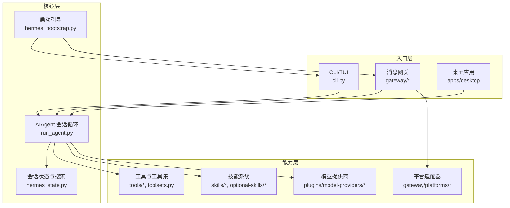
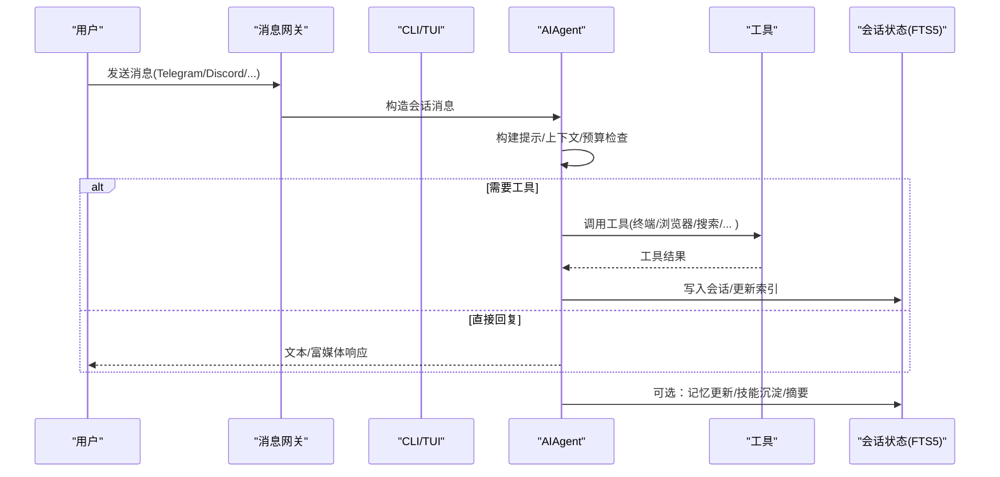
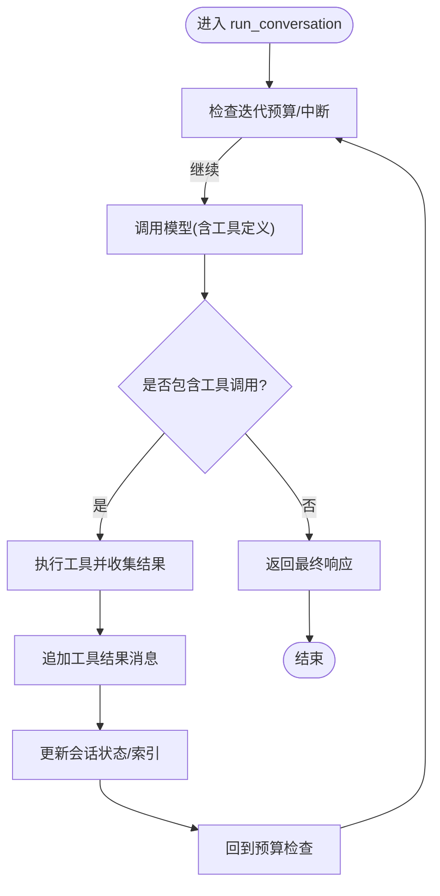
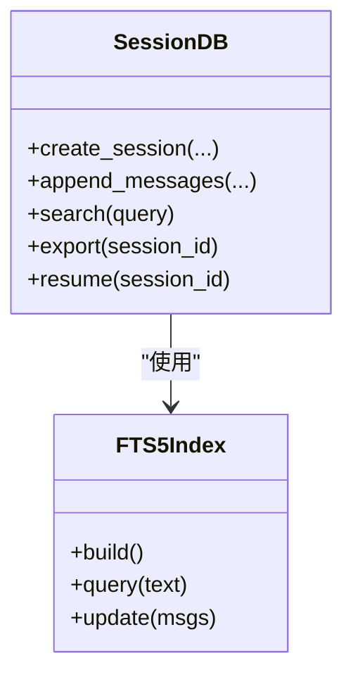
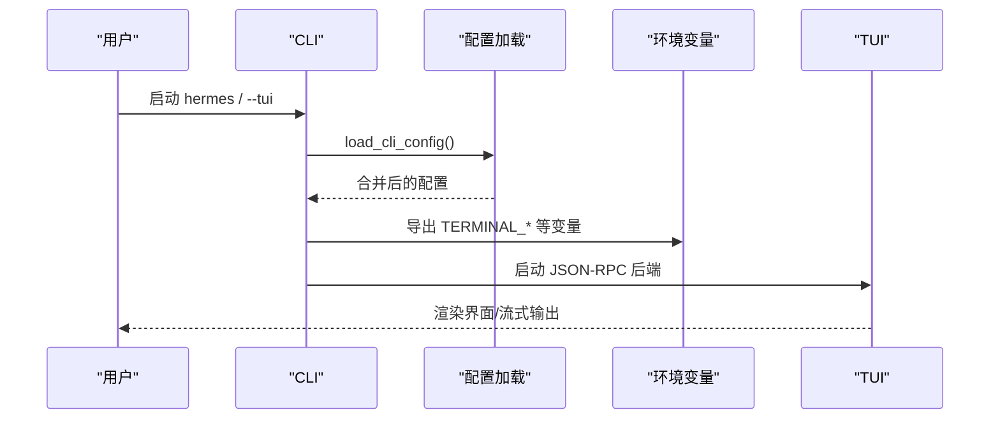
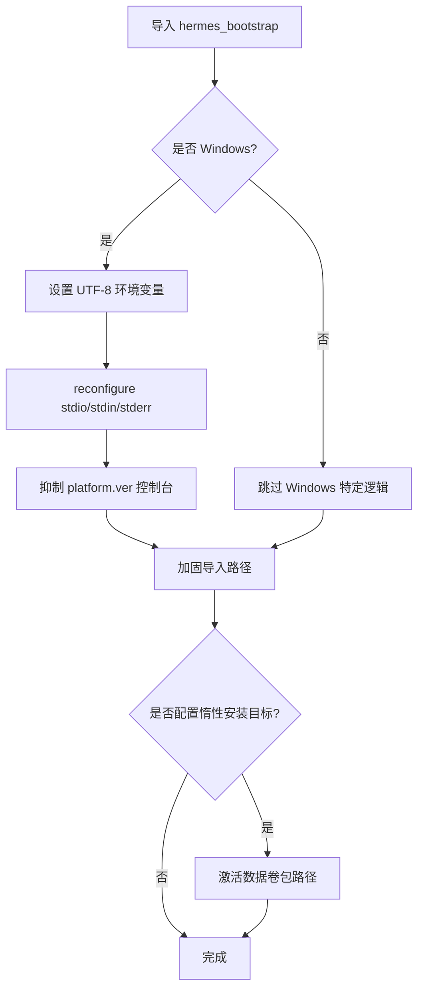
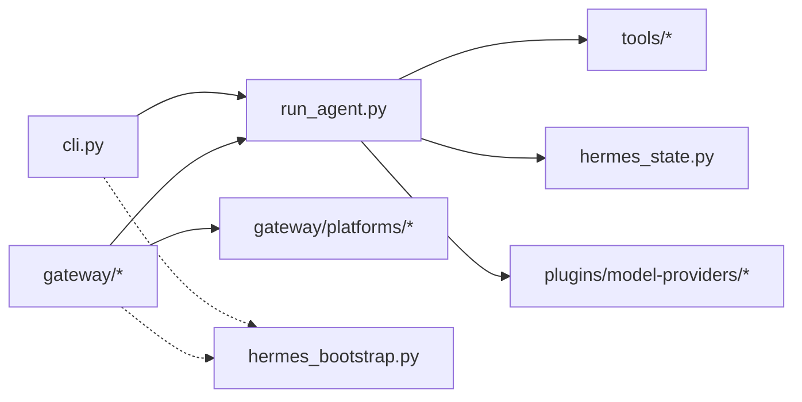

# 项目概述

<cite>
**本文引用的文件**
- [README.md](file://README.md)
- [AGENTS.md](file://AGENTS.md)
- [cli.py](file://cli.py)
- [run_agent.py](file://run_agent.py)
- [hermes_state.py](file://hermes_state.py)
- [hermes_bootstrap.py](file://hermes_bootstrap.py)
</cite>

## 目录
1. [简介](#简介)
2. [项目结构](#项目结构)
3. [核心组件](#核心组件)
4. [架构总览](#架构总览)
5. [详细组件分析](#详细组件分析)
6. [依赖关系分析](#依赖关系分析)
7. [性能考量](#性能考量)
8. [故障排查指南](#故障排查指南)
9. [结论](#结论)
10. [附录](#附录)

## 简介
Hermes Agent 是一个自改进的 AI 代理，具备“内置学习循环”的独特能力：从经验中创建技能、在使用过程中持续改进技能、持久化知识、搜索过往对话并构建用户模型。它可在 $5 VPS、GPU 集群或近乎零成本的无服务器基础设施上运行；同时支持 Telegram、Discord、Slack、WhatsApp、Signal 等多平台消息集成，并提供灵活的模型提供商切换（无需代码改动）。通过 CLI、TUI、桌面应用与网关进程，用户可以在任意终端或常用聊天工具中与同一智能体交互。

## 项目结构
仓库采用“核心窄腰、能力在边缘”的设计：核心负责会话循环、工具编排、状态持久化与跨平台适配；具体能力以插件、技能、工具集和平台适配器扩展。关键入口包括：
- 交互式 CLI/TUI：提供富文本界面、斜杠命令、流式输出与中断重定向
- 消息网关：统一接入多平台消息通道，集中路由到同一 Agent 核心
- Agent 核心：会话循环、工具调用、记忆/上下文压缩、轨迹保存等
- 状态存储：SQLite + FTS5 全文检索，支撑跨会话回忆与搜索
- 启动引导：Windows UTF-8 引导与环境加固，确保跨平台稳定运行

图表来源
- [cli.py:409-793](file://cli.py#L409-L793)
- [run_agent.py:412-596](file://run_agent.py#L412-L596)
- [hermes_state.py:1-15](file://hermes_state.py#L1-L15)
- [hermes_bootstrap.py:1-48](file://hermes_bootstrap.py#L1-L48)

章节来源
- [README.md:19-31](file://README.md#L19-L31)
- [AGENTS.md:263-309](file://AGENTS.md#L263-L309)

## 核心组件
- AIAgent 会话循环：封装完整的对话轮次、工具调用迭代、预算与中断控制、上下文压缩与轨迹保存。对外暴露简洁接口用于单轮或多轮对话。
- 会话状态与搜索：基于 SQLite 的会话数据库，WAL 模式支持并发读写，FTS5 全文索引实现跨会话快速检索与 LLM 摘要召回。
- CLI/TUI 与网关：CLI 提供富交互体验；网关统一接入多平台消息通道，将事件分发至 Agent 核心；TUI 通过 JSON-RPC 与后端通信，渲染转录、活动与审批。
- 启动引导：Windows 下强制 UTF-8 编码、抑制控制台闪烁、修复导入路径冲突，确保各入口稳定运行。

章节来源
- [run_agent.py:412-596](file://run_agent.py#L412-L596)
- [hermes_state.py:1-15](file://hermes_state.py#L1-L15)
- [cli.py:409-793](file://cli.py#L409-L793)
- [hermes_bootstrap.py:1-48](file://hermes_bootstrap.py#L1-L48)

## 架构总览
Hermes 的核心是“会话驱动”的闭环：用户输入进入网关或 CLI，解析为会话消息，Agent 循环决定是否需要调用工具；工具执行后结果回写会话，必要时触发记忆更新、技能生成或上下文压缩；最终响应通过原渠道返回。状态持久化保障跨会话连续性，搜索与用户建模增强长期记忆。

图表来源
- [run_agent.py:412-596](file://run_agent.py#L412-L596)
- [hermes_state.py:1-15](file://hermes_state.py#L1-L15)

## 详细组件分析

### AIAgent 会话循环
- 职责：管理模型调用、工具调用迭代、预算与中断、上下文压缩、轨迹保存、错误分类与恢复。
- 关键点：
  - 会话初始化参数丰富，支持平台、用户/聊天标识、回调、检查点、凭据池等。
  - 会话 DB 行懒创建，记录来源、模型配置、系统提示与工作目录（仅本地 CLI 有效）。
  - 上下文引擎过渡钩子：on_session_end/on_session_reset/on_session_start/carry_over_new_session_context，便于压缩器或插件维护状态。
  - 重置会话统计：token 用量、API 调用计数、成本估算、上下文压缩器等。

图表来源
- [run_agent.py:412-596](file://run_agent.py#L412-L596)

章节来源
- [run_agent.py:412-596](file://run_agent.py#L412-L596)

### 会话状态与搜索（SQLite + FTS5）
- 设计要点：
  - WAL 模式提升并发读性能，适合网关多平台场景。
  - FTS5 虚拟表提供全量消息全文检索，支持跨会话召回与 LLM 摘要。
  - 会话拆分由压缩触发，通过 parent_session_id 链组织。
  - 安全限制：resume/export 的消息数量上限可配置，避免内存压力。
  - 压缩锁机制：基于 PID 的租约检测，防止僵尸进程占用导致阻塞。

图表来源
- [hermes_state.py:1-15](file://hermes_state.py#L1-L15)
- [hermes_state.py:163-200](file://hermes_state.py#L163-L200)

章节来源
- [hermes_state.py:1-15](file://hermes_state.py#L1-L15)
- [hermes_state.py:163-200](file://hermes_state.py#L163-L200)

### CLI/TUI 与配置加载
- CLI 配置加载顺序：用户配置 > 项目配置 > 默认值；环境变量覆盖；受管范围叠加。
- 终端环境映射：将 terminal.* 配置桥接为 TERMINAL_* 环境变量，供工具与沙箱使用。
- TUI：Node Ink 前端通过 JSON-RPC 与 Python tui_gateway 通信，渲染转录、工具活动、审批与斜杠命令。

图表来源
- [cli.py:409-793](file://cli.py#L409-L793)

章节来源
- [cli.py:409-793](file://cli.py#L409-L793)

### 启动引导（Windows 与导入加固）
- Windows UTF-8 引导：设置 PYTHONUTF8/PYTHONIOENCODING，reconfigure stdio，避免 UnicodeEncodeError。
- 抑制 platform.ver 控制台闪烁：避免子进程调用导致的窗口闪烁与解码崩溃。
- 导入路径加固：移除当前目录污染，优先加载 Hermes 源码根，避免同名包遮蔽。
- 不可变镜像惰性安装目标激活：将数据卷上的惰性安装包加入 sys.path，保证跨运行可导入。

图表来源
- [hermes_bootstrap.py:1-48](file://hermes_bootstrap.py#L1-L48)
- [hermes_bootstrap.py:59-122](file://hermes_bootstrap.py#L59-L122)
- [hermes_bootstrap.py:168-226](file://hermes_bootstrap.py#L168-L226)

章节来源
- [hermes_bootstrap.py:1-48](file://hermes_bootstrap.py#L1-L48)
- [hermes_bootstrap.py:59-122](file://hermes_bootstrap.py#L59-L122)
- [hermes_bootstrap.py:168-226](file://hermes_bootstrap.py#L168-L226)

## 依赖关系分析
- 入口依赖：CLI/TUI 与网关均依赖 AIAgent 会话循环；AIAgent 依赖工具系统与状态存储。
- 平台与提供商：网关通过平台适配器接入消息通道；Agent 通过提供商插件选择模型后端。
- 状态与搜索：Agent 在每轮结束后写入会话状态，FTS5 索引支持后续检索。
- 启动引导：所有入口模块应在最顶部导入 hermes_bootstrap，以确保环境一致性与稳定性。

图表来源
- [cli.py:409-793](file://cli.py#L409-L793)
- [run_agent.py:412-596](file://run_agent.py#L412-L596)
- [hermes_state.py:1-15](file://hermes_state.py#L1-L15)
- [hermes_bootstrap.py:1-48](file://hermes_bootstrap.py#L1-L48)

章节来源
- [AGENTS.md:339-349](file://AGENTS.md#L339-L349)

## 性能考量
- 会话缓存与压缩：长会话复用提示前缀缓存，接近上下文阈值时自动压缩，减少 API 成本与延迟。
- 并发与 I/O：SQLite WAL 模式提升并发读取；FTS5 索引加速全文检索；工具执行可并行批处理（按路径隔离）。
- 资源限制：迭代预算、超时与重试退避策略，避免无限循环与资源耗尽。
- 日志与诊断：结构化日志与轨迹保存，便于离线分析与训练数据生成。

[本节为通用指导，不直接分析具体文件]

## 故障排查指南
- 常见问题定位：
  - 会话过大无法恢复：检查 sessions.max_resume_messages 配置，必要时导出会话。
  - 工具执行失败：查看终端工具错误是否被脱敏；确认环境变量与凭据正确。
  - 平台断连：网关重连会向适配器传递 is_reconnect 参数，确保适配器签名兼容。
  - Windows 乱码：确认已导入 hermes_bootstrap，启用 UTF-8 与抑制控制台闪烁。
- 建议步骤：
  - 使用 hermes doctor 诊断环境与依赖。
  - 查看 ~/.hermes/logs/ 下的 agent.log、errors.log、gateway.log。
  - 对异常会话进行导出与审查，结合 FTS5 搜索定位问题。

章节来源
- [hermes_state.py:114-157](file://hermes_state.py#L114-L157)
- [tests/tools/test_terminal_error_redaction.py:1-119](file://tests/tools/test_terminal_error_redaction.py#L1-L119)
- [tests/gateway/test_adapter_connect_is_reconnect_contract.py:1-145](file://tests/gateway/test_adapter_connect_is_reconnect_contract.py#L1-L145)
- [hermes_bootstrap.py:59-122](file://hermes_bootstrap.py#L59-L122)

## 结论
Hermes Agent 以“会话驱动+内置学习循环”为核心，实现了从经验到技能的自动化沉淀与持续优化，并通过多平台消息集成与灵活模型提供商支持，满足从个人助理到团队协作的广泛场景。其“窄腰宽边”的架构使核心稳定、扩展性强，配合 SQLite+FTS5 的状态管理与跨会话搜索，为用户提供持久、可回忆的智能体验。无论部署在低成本 VPS、GPU 集群还是无服务器环境，Hermes 都能以一致的体验提供服务。

[本节为总结性内容，不直接分析具体文件]

## 附录
- 快速开始：
  - 安装与首次对话：参考 README 中的安装脚本与 hermes 命令。
  - 选择模型与工具：使用 hermes model 与 hermes tools 配置。
  - 启动网关：hermes gateway setup/start 接入 Telegram/Discord/Slack/WhatsApp/Signal。
- 实际部署示例：
  - $5 VPS：安装后运行 hermes gateway，绑定域名与 HTTPS，使用 cron 定时任务维持活跃。
  - GPU 集群：配置高性能模型提供商与推理后端，开启并行工具与批量轨迹生成。
  - 无服务器：使用 Daytona/Modal/Vercel Sandbox 等后端，利用持久化数据卷保持会话与技能。

章节来源
- [README.md:35-118](file://README.md#L35-L118)
- [README.md:143-159](file://README.md#L143-L159)
- [AGENTS.md:263-309](file://AGENTS.md#L263-L309)